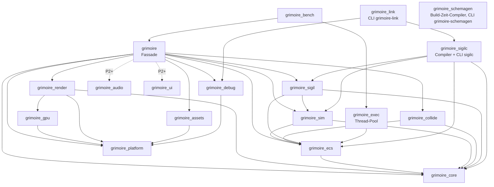

# Crate-Verträge — Phase P0/P1

> **Freigabestand WP1.2:** Abschnitte, Unterabschnitte und Listenpunkte mit dem Vermerk *Freigegeben (WP1.2).* sind
> der Vertrag für Phase P1 (Plan 0002, WP1.2 und WP1.3). Freigegeben durch den PO am 2026-09-15 (V-1 bis V-21);
> Merge nach adversarialem Review und grüner CI auf drei Betriebssystemen. Die Einzelentscheidungen V-1 bis V-20
> und die mit V-21 im Ganzen übernommenen vorläufigen Entscheidungen stehen im Spiel-Repo unter
> `docs/plans/0002-vertragsfreigabe-wp1.2.md`. Bis zum Merge sind diese Texte nicht bindend (§2b). Texte ohne den
> Vermerk gelten unverändert.

> **Agenten-Hinweis:** Dieses Dokument ist die verbindliche Schnittstellen-Spezifikation der
> Grimoire-Crates. Öffentliche APIs weichen nur mit Begründung im Commit und gleichzeitiger
> Aktualisierung dieses Dokuments ab. Anforderungs-Hintergrund: Spiel-Repo `docs/prd/0002`,
> `0013`, `0017`, `0018`; Grundsatzentscheidungen: Spiel-Repo `docs/adr/0002`–`0005`.

> *Freigegeben (WP1.2).* **Ergänzung P1:** Gemergte Verträge ändern sich ausschließlich
> nach dem Vertragsänderungs-Protokoll (§2b). Zusätzlicher Anforderungs-Hintergrund: Spiel-Repo
> `docs/prd/0003`, `0004`, `0016` sowie Plan 0002 (WP1.2, WP1.3, WP1.7); Grundsatzentscheidungen bis Spiel-Repo
> `docs/adr/0009`; Engine-Entscheidungen unter `docs/adr/` (u. a. 0004, 0005, 0006 und 0008
> „Crate-Map-Erweiterung P1“).

## 1. Schichten und erlaubte Abhängigkeiten

*Freigegeben (WP1.2).* Der Abschnitt ersetzt die P0-Fassung vollständig; deren Aussagen zu
`winit`, `wgpu`, `grimoire_core` und `grimoire_exec` bleiben inhaltlich erhalten.

Grundlage: Engine-ADR-0008 „Crate-Map-Erweiterung P1“ (akzeptiert am 2026-09-15, Nummer bis zum Merge vorläufig) und Engine-ADR-0006
(Executor-Crate). Die Tabelle unter dem Diagramm ist abschließend; das Diagramm zeigt nur die vorhandenen Kanten.



`grimoire_schemagen` steht ohne Pfeil im Diagramm: Es hat keine `grimoire_*`-Kante (nicht einmal
eine Dev-Kante), sondern liest nur `schema/*.gschema` und schreibt in die besitzenden Crates
`grimoire_debug` und `grimoire_assets` (als eingecheckten, generierten Quelltext, keine
Cargo-Kante) sowie nach `docs/formats/` (Projekt-ADR-0011, Engine-ADR-0008 Nachtrag).

| Crate | Art | Determinismus-Menge (`clippy.toml`) | Erlaubte Engine-Kanten (normal, Build) | Ausdrücklich verboten (jede Kantenart) |
|-------|-----|-------------------------------------|----------------------------------------|----------------------------------------|
| `grimoire_core` | Laufzeit, Blatt (ADR-0005) | ja | — | jede Engine-Crate |
| `grimoire_platform` | Laufzeit | nein | `core` | alle übrigen Engine-Crates |
| `grimoire_gpu` | Laufzeit | nein | `platform`, `core` | alle übrigen Engine-Crates |
| `grimoire_render` | Laufzeit | nein | `gpu`, `platform`, `core` | `sigil`, `ecs`, `sim`, `collide`, `assets`, `debug`, Werkzeug-Crates |
| `grimoire_ecs` | Laufzeit | ja | `core` | `platform`, `exec`, `rayon`, Werkzeug-Crates |
| `grimoire_sim` | Laufzeit | ja | `ecs`, `core` | `platform`, `exec`, `rayon`, Werkzeug-Crates |
| `grimoire_collide` | Laufzeit | ja | `ecs`, `core` | `sim`, `sigil`, `render`, `platform`, `exec`, `rayon`, Werkzeug-Crates |
| `grimoire_sigil` | Laufzeit | ja | `sim`, `ecs`, `core` | `render`, `collide`, `assets`, `debug`, `platform`, `exec`, `rayon`, Werkzeug-Crates |
| `grimoire_assets` | Laufzeit | nein | `platform`, `core` | `sigil`, `ecs`, `sim`, `render`, `debug`, Werkzeug-Crates |
| `grimoire_debug` | Laufzeit | nein | `platform`, `core` | `ecs`, `sim`, `render`, `sigil`, `collide`, `assets`, Werkzeug-Crates |
| `grimoire_audio`, `grimoire_ui` | Platzhalter (P2) | offen | keine bis zum P2-Crate-Map-ADR | — |
| `grimoire` (Fassade) | Laufzeit | ja | `core`, `ecs`, `sim`, `platform`, `render`, `collide`, `sigil`, `assets`, `debug` | `exec`, `rayon`, Werkzeug-Crates |
| `grimoire_exec` | Laufzeit-Zusatz (Engine-ADR-0006) | nein | `ecs`; Dev: `grimoire`, `sim`, `core`, `sigil`, `collide` (die letzten beiden für das Hash-Gate, PO-Entscheid V-1, §11.7) | Werkzeug-Crates; keine Crate der Determinismus-Menge hängt von ihr ab |
| `grimoire_sigilc` | Werkzeug: Bibliothek + CLI `sigilc` | ja | `sigil`, `sim`, `ecs`, `core` (`sim`/`ecs` für `sigilc simulate`, Plan 0002 WP5.6) | `platform`, `render`, `assets`, `debug`, `exec`, `rayon`, andere Werkzeug-Crates |
| `grimoire_link` | Werkzeug: CLI `grimoire-link` | nein | `debug` (Feature `tcp`), `sigilc`; weitere Laufzeit-Crates erlaubt | `bench` |
| `grimoire_bench` | Werkzeug: Benchmarks, JSON-Schemata (§15) | nein | jede Laufzeit-Crate, `exec` | `sigilc`, `link` |
| `grimoire_schemagen` | Werkzeug: Build-Zeit-Schema-Compiler, CLI `grimoire-schemagen` (Projekt-ADR-0011) | nein, keine `clippy.toml` | keine (dependency-frei, auch keine Dev-Kante) | jede Engine-Crate (Laufzeit- wie Werkzeug-Crates) |

- Normale und Build-Kanten zeigen nur nach unten. Kein Crate kennt ein Spiel; das Standalone-Gate prüft
  `Cargo.toml`, `crates/**` und — sobald die C#-Suite dort liegt (P-1) — `tools/**`.
- Kanten zu `grimoire_core` sind jeder Engine-Crate erlaubt (abhängigkeitsfreie Blatt-Crate, Engine-ADR-0005);
  gezeichnet sind nur die vorhandenen. `grimoire_core` bleibt auf stabiles Hashing und deterministische
  Mathematik beschränkt und nimmt keine Render-, Sigil- oder Format-Typen auf.
- `winit`-Typen existieren nur in `grimoire_platform`; `wgpu`-Typen nur in `grimoire_gpu` und
  `grimoire_render` (Engine-ADR zur GPU-Kapselungsgrenze).
- **Laufzeit- und Werkzeug-Crates:** Werkzeug-Crates (`grimoire_sigilc`, `grimoire_link`, `grimoire_bench`) sind
  nie Abhängigkeit einer Laufzeit-Crate, auch nicht als Dev-Abhängigkeit. Einzige Kante zwischen Werkzeugen ist
  `grimoire_link → grimoire_sigilc`. `grimoire_link` und `grimoire_bench` dürfen weitere Laufzeit-Crates nutzen,
  ohne dass ein neues ADR nötig ist; `grimoire_sigilc` hängt nur an Crates der Determinismus-Menge.
- **Dev-Kanten:** Crates außerhalb der Determinismus-Menge dürfen per Dev-Abhängigkeit nach oben zeigen
  (Gate-Tests von `grimoire_exec` auf `grimoire`, `grimoire_sim`, `grimoire_core`, `grimoire_sigil`, `grimoire_collide`).
  Dev-Kanten von Crates der Determinismus-Menge zeigen nur auf Engine-Crates dieser Menge, nie auf `rayon`,
  `rayon-core`, `grimoire_exec`
  (§3) oder Werkzeug-Crates. Tests der Laufzeit-Crates nutzen eingecheckte, von `sigilc` erzeugte Unit-Fixtures;
  ein Test in `grimoire_sigilc` prüft, dass die Fixtures aktuell sind.
- `grimoire_exec` liegt außerhalb der Determinismus-Menge und ist die einzige Thread-Quelle der Simulation
  (Engine-ADR-0006); keine Determinismus-Crate hängt von ihr ab. Spiele binden sie neben der Fassade ein,
  wenn sie mehrere Threads nutzen.
- **Sigil ↔ Render:** `grimoire_render` kennt `grimoire_sigil` nicht und umgekehrt. Sigil liefert neutrale
  Kennungen als eigenen Typ (`BulletVisual`, §11.2), `grimoire_render` definiert eigene Felder und Konstanten in
  `BulletInstance` (§6); die Fassade bildet ab (`grimoire::adapters::sigil_render`, §9.1). Es gibt keine
  gemeinsame Typ-Crate.
- **Debug und Assets:** `grimoire_debug` hat keine Kante zu `grimoire_ecs`, `grimoire_sim`, `grimoire_render`,
  `grimoire_sigil` oder `grimoire_collide`. Protokoll, Transporte und Profiler-Datenmodell arbeiten mit Bytes,
  Zahlen und `Duration`; die Kante zu `grimoire_platform` bleibt erlaubt, wird in v1 aber nicht gebraucht.
  Uhrzugriff, Anbindung des Profilers an den Schedule-Beobachter (§7.2), Overlay-Zeichnen und das Anwenden von
  Swaps liegen in der Fassade (§9.7). `grimoire_assets` hängt außer an `grimoire_platform` (für `FileSystem`) und
  `grimoire_core` nur an der Drittcrate `sha2` und kennt weder `grimoire_sigil` noch `grimoire_render` noch
  `grimoire_ecs`: Sigil-Einträge eines Packs liefert `AssetSource` als Bytes, dekodiert wird in der Fassade (§12).
- `grimoire_assets` und `grimoire_debug` liegen außerhalb der Determinismus-Menge und tragen keine `clippy.toml`.
  Ihre Ausgaben wirken nur über die Fassade auf die Simulation: als Content-Swap an einer Tick-Grenze (§9.7, §11.8).
- **`grimoire_sigilc`** gehört zur Determinismus-Menge (§3), liegt nicht im Laufzeitpfad und ist die einzige
  Quelle von Binär-Units (vorläufig, PO-Entscheidung P-2 in Sammelsitzung B). Es leitet `UnitId`s nach derselben
  Regel wie `AssetId::from_path` (§12) über `StableHasher` ab und braucht dafür keine Kante zu `grimoire_assets`.
- **`grimoire_bench`** trägt bewusst keine `clippy.toml`: Es ist die einzige Engine-Crate, die für Benchmarks die
  Wanduhr liest, und misst mit 1 und N Threads über `grimoire_exec`. Wanduhrwerte gelangen nie in Zustands- oder
  Subsystem-Hashes. Ihre Bibliothek enthält die JSON-Schema-Typen für Bench-Ergebnisse und Golden Master (§15).
- **`grimoire_link`** aktiviert das Feature `tcp` von `grimoire_debug` fest und nutzt `sigilc` als Bibliothek.
  In P1 ist es kein Release-Artefakt (P-14); gebaut wird aus dem Tag.
- **`grimoire_schemagen`** (additiv, *Nachtrag WP8.1 zu Engine-ADR-0008 — vom PO freigegeben am 2026-09-16, V-20*):
  Build-Zeit-Schema-Compiler (Projekt-ADR-0011, Option 2e), der `schema/*.gschema` liest und Rust-Codec
  sowie `docs/formats/*.md`-Feldtabellen für `grimoire_debug` und `grimoire_assets` erzeugt. Er ist
  bewusst dependency-frei (keine `grimoire_*`-Kante, auch keine Dev-Kante) und trägt keine `clippy.toml`,
  weil nichts, was er erzeugt, zur Laufzeit läuft. Sein Ausgang landet als eingecheckter, generierter
  Quelltext in den besitzenden Crates, nicht über eine Cargo-Kante.
- **`tools/`** (C#-Suite, P-1): kein Cargo-Mitglied und keine Cargo-Kante. Die Suite hängt nur über
  Formatdokumente (`docs/formats/`), Golden-Fixtures und die JSON-Ausgaben von `sigilc` an der Engine.
- Abbildungen zwischen `grimoire_sigil`, `grimoire_collide`, `grimoire_render`, `grimoire_assets` und
  `grimoire_debug` liegen ausschließlich in der Fassade (Adapter-Tabelle in §9.1).
- Neue Kanten nur per Crate-Map-ADR und gleichzeitiger Änderung dieser Tabelle (§2 Regel 15). Ein Kanten-Check
  in der CI vergleicht normale, Build- und Dev-Kanten jedes Workspace-Mitglieds mit der Tabelle (Umsetzung WP1.3).

## 2. Regeln für alle Crates

1. Code, Kommentare und Doc-Kommentare auf Englisch; Design-Dokumente auf Deutsch.
2. Jede öffentliche Einheit ist dokumentiert (`missing_docs`); Kommentare erklären Einschränkungen, nicht Offensichtliches.
3. Grün vor jedem Commit: `cargo fmt`, `cargo clippy -p <crate> --all-targets -- -D warnings`, `cargo test -p <crate>`.
4. Neue Drittabhängigkeiten nur über `[workspace.dependencies]` und mit Begründung im Commit.
5. `unsafe` nur mit lokalem `#[allow(unsafe_code)]`, `// SAFETY:`-Begründung und Test, der die Invariante prüft.
6. Fehler als `thiserror`-Enum pro Crate. Kein `unwrap`/`expect` in Bibliothekscode, außer bei bewiesener Invariante mit Kommentar.
7. Kein `todo!()`/`unimplemented!()` in abgeschlossenem Code (`clippy::todo`).
8. Commits: Conventional Commits (`feat(ecs): …`, `test(sim): …`), Englisch.

*Freigegeben (WP1.2): Regeln 9–15.*

9. **Fremde Bytes:** Jeder Decoder für Eingaben von außen — Binär-Units, Packs und ihr Manifest, Replays,
   IPC-Frames, JSON aus Werkzeugen — liefert bei fehlerhafter Eingabe einen Fehler (`#[non_exhaustive]`-Enum der
   Crate) und nie einen Panic. Jede Längen- oder Anzahlangabe wird vor der Allokation gegen die verbleibende
   Eingabelänge und eine dokumentierte Obergrenze geprüft (Muster: §8, Replay-Binärformat Version 1). Pflicht sind
   Property-Tests mit beliebigen Bytes sowie mit abgeschnittenen und einzeln veränderten gültigen Eingaben; das
   Fuzzing folgt im Red-Team-Schritt.
10. **Binärformate:** Little-Endian, Felder fester Breite, am Anfang Magic und `u32`-Version; Zeichenketten und
    Blöcke längenpräfixiert mit Obergrenze; keine Iterationsreihenfolge ungeordneter Container in den Bytes. Jedes
    Format hat ein Dokument `docs/formats/<format>.md` in diesem Repo (nach P-9) und byteweise
    Golden-Fixtures unter Versionskontrolle; in P1 sind das `sigil.md` (§11.1), `pack.md` (§12),
    `debug-protocol.md` (§13), `replay.md` (§8.1), `bench-result.md` und `golden-master.md` (§15). Eine
    Formatänderung erhöht die Version. Nach der SemVer-Politik ist sie inkompatibel, wenn ältere Versionen danach
    nicht mehr lesbar sind, sonst additiv (§2b; etwa Replay v2 neben v1, §8.1). Welche älteren Versionen lesbar
    bleiben, legt der Abschnitt des Formats fest. Nachrichtenströme (Debug-Protokoll, §13) tragen Magic und
    Version nicht je Frame, sondern versionieren im Handshake; für ihre Frames gelten Längenpräfix und Obergrenzen.
11. **JSON-Schnittstellen** (Bench-Ergebnisse, Golden Master, Harness-Berichte, Profiler-Export, JSON-Spiegel des
    Debug-Protokolls, `sigilc --json`):
    - `u64`-Hashes, -IDs und Seeds stehen als Zeichenkette aus genau 16 kleingeschriebenen Hexziffern ohne Präfix,
      nie als JSON-Zahl (Genauigkeitsverlust über 2^53 in C#- und JavaScript-Konsumenten); 20- und 32-Byte-Werte
      als 40 bzw. 64 Hexziffern.
    - Ganzzahlen als JSON-Zahl nur mit Betrag ≤ 2^53 − 1, sonst liefert der Schreiber einen Fehler. Kein NaN, kein
      Unendlich. UTF-8 ohne BOM.
    - Jedes Dokument trägt `schema_version` (Ganzzahl), Engine-Schemata zusätzlich die Kennung `schema` (§15).
      Objektschlüssel werden beim Schreiben in fester Reihenfolge ausgegeben.
12. **Trait-Verträge** (§2a): Ein Subsystem mit austauschbarer Implementierung veröffentlicht einen objektsicheren
    Trait, eine Null-Implementierung ohne `todo!()`/`unimplemented!()` und eine generische Konformanz-Suite
    (`pub mod conformance` hinter dem nicht standardmäßigen Feature `conformance`). Jede Implementierung ruft die
    Suite in ihren eigenen Tests auf. Die Suite prüft nur Eigenschaften, die jede Implementierung einschließlich
    der Null-Implementierung erfüllen muss; implementierungsspezifisches Verhalten prüfen Verhaltens-Vertragstests
    der jeweiligen Implementierung. Konsumenten nennen keine konkrete Implementierung eines anderen Subsystems;
    ausgenommen sind die Fassade, die Implementierungen verdrahtet, sowie Tests.
13. **Wachsende öffentliche Typen:** Neue öffentliche Structs mit öffentlichen Feldern, die später wachsen können
    (Statistiken, Konfigurationen, Kanal-Sammlungen), und neue Fehler-Enums sind ab ihrem ersten Release
    `#[non_exhaustive]` und bieten `Default` oder einen Konstruktor. Ausgenommen sind Instanz-Layouts mit festem
    `repr(C)` und Größen-Test (`SpriteInstance`, `BulletInstance`); deren Änderung ist immer inkompatibel.
    Von der Konstruktor-Pflicht ausgenommen sind außerdem reine Ausgabetypen, die nur die besitzende Crate erzeugt
    und Konsumenten nur lesen (P1: `StageInfo`, `SystemInfo`, `BulletColumns`, `SwapReport`, `ScopeTotal`). Sie sind
    `#[non_exhaustive]` ohne `Default` und ohne Konstruktor und tragen im Vertrag den Vermerk „nur von
    <Crate/Funktion> erzeugt“. Nicht darunter fallen Typen, die Implementierungen eines öffentlichen Traits außerhalb
    der Crate liefern müssen (etwa `AssetEntry` für `AssetSource`, §12).
    Bestehende P0-Typen werden nicht nachträglich markiert, weil schon die Markierung inkompatibel wäre; sie
    wachsen nicht, sondern bekommen neue Nachbartypen (§6, `StageFrame`).
14. **Cargo-Features** sind additiv und standardmäßig aus: `fixtures` (Fassade: Spieler-Proxy, §9.5),
    `debug-link` (Fassade: Debug-Link-Anbindung, aktiviert `grimoire_debug/tcp`, §9.7), `tcp` (`grimoire_debug`:
    TCP-Transport mit IO-Thread, §13), `conformance` (Crates mit Trait-Verträgen). Distributions-Builds eines
    Spiels aktivieren `debug-link` nie. Kein Feature ändert Zustand, Systemliste, Stufenplan oder Hash eines Laufs,
    der die zugehörigen Plugins oder Transporte nicht nutzt, und keines zieht `rayon` oder `grimoire_exec` in eine
    Crate der Determinismus-Menge. Die CI baut und testet den Workspace ohne Features und mit `--all-features`
    (Umsetzung mit den Skeletten in WP1.3, Laufzeit nach OP-5 bewertet); echte Socket-Tests bleiben hinter
    `GRIMOIRE_SOCKET_TESTS=1`. Cargo vereinigt die Features aller gewählten Workspace-Mitglieder: Weil
    `grimoire_link` das Feature `tcp` von `grimoire_debug` fest aktiviert (§1), baut jeder `--workspace`-Lauf
    `grimoire_debug` mit `tcp`, auch der Lauf „ohne Features“. Die Auslieferungskonfiguration eines Spiels
    (Fassade ohne `debug-link`, `grimoire_debug` ohne `tcp`) prüft deshalb ein eigener, paketgewählter Schritt ohne
    `grimoire_link`: `cargo clippy -p grimoire_debug -p grimoire --all-targets --locked -- -D warnings` und
    `cargo test -p grimoire_debug -p grimoire --locked` (Umsetzung WP1.3,
    Laufzeit nach OP-5 bewertet).
15. **Crate-Kanten:** Neue Kanten zwischen Engine-Crates und neue Engine-Crates nur über ein Engine-ADR zur
    Crate-Map (Engine-ADR-0008 und Nachfolger) mit gleichzeitiger Änderung der Tabelle in §1. Neue
    Drittabhängigkeiten folgen weiterhin Regel 4.

## 2a. Trait-Entscheid je Subsystem (P1)

*Freigegeben (WP1.2).*

PRD-0002 FR-02 verlangt Verträge als Traits, FR-15 Null- bzw. Headless-Implementierungen, PRD-0018 FR-01 Tests
gegen die Verträge. Für jedes Subsystem, das P1 schneidet oder erweitert, legt die Tabelle fest, ob ein Trait
existiert, welche Implementierungen P1 liefert und was Konformanz- und Verhaltenstests prüfen (§2 Regel 12).
Hier stehen nur die Trait-Köpfe; vollständige Signaturen und Semantik stehen im genannten Abschnitt, der bei
Abweichungen gilt.

| Subsystem | Vertrag | Implementierungen in P1 | Null-/Test-Implementierung | Konformanz-Suite (alle Implementierungen) | Verhaltenstests (nur echte Implementierung) | Determinismus | Details |
|-----------|---------|-------------------------|----------------------------|-------------------------------------------|---------------------------------------------|---------------|---------|
| Rendering | Trait `Renderer` (P0) plus bereitgestellte Methoden `supports_stage`, `render_stage` | `WgpuRenderer` | `NullRenderer` (zeichnet nichts, zählt je Kanal wie `WgpuRenderer`) | leere Frames und Kanäle, Nullgrößen und ungültige Instanzen ohne Panic; `supports_stage` konsistent mit `render_stage` | Offscreen-Szenen (`bullets_on_top`), Pass-Reihenfolge gleich `RenderLayer::ORDER`, Abweisung fremder Palettenräume | außerhalb; liest nur `&`-Eingaben | §6 |
| Kollision | Trait `CollisionQuery` | `SpatialGrid`, Referenz `BruteForceQuery` | `NullCollision` | `out` wird geleert und aufsteigend nach `ColliderKey` ohne Duplikate gefüllt; `LayerMask::NONE` findet nichts; entartete Formen (Radius 0, Kapsel mit Länge 0) ohne Panic | `SpatialGrid` gleich `BruteForceQuery` (Property), goldener Ergebnis-Hash, Bench im Budget | Determinismus-Menge | §14 |
| Assets | Trait `AssetSource` | `PackReader`, `MemorySource` | `EmptyAssetSource` | `entries()` aufsteigend und eindeutig; `read` gelingt genau für enthaltene IDs, sonst `NotFound`; wiederholtes `read` liefert gleiche Bytes; gleicher Inhalt ergibt gleichen `content_hash` | Golden-Pack, Fehleingaben liefern Fehler (§2 Regel 9), Manifest-Prüfung, `HashMismatch` | außerhalb; Sigil-Einträge wirken nur über `SigilContent` (§11.8) | §12 |
| Debug-Transport | Trait `DebugTransport` | `InProcessTransport`, `TcpServerTransport` (Feature `tcp`) | `NullTransport` | nie blockierend; Reihenfolge bleibt, kein Frame verdoppelt; Abriss mitten im Frame ohne Panic; Überlänge schließt die Verbindung; Null: nie verbunden | Handshake samt Versionskonflikt und Frist, Loopback-Bindung, Müll-Bytes, `Drop` ohne Hängen (Sockets nur mit `GRIMOIRE_SOCKET_TESTS=1`) | außerhalb; Wirkung nur über die Fassade an Tick-Grenzen | §13 |
| Ausführung (bestehend, Engine-ADR-0006) | Trait `Executor` | `ThreadPoolExecutor` | `SequentialExecutor`, `PermutedExecutor` | jede Aufgabe genau einmal, kein verschluckter Panic | Hash-Gate mit 1, 2 und N Threads | Trait in `grimoire_ecs`, Pool außerhalb | §7, §10 |
| Profiler-Hook | Trait `SystemObserver` | Profiler-Beobachter der Fassade | `NoopObserver` | liest nur; Stufenplan unverändert; Hashes mit und ohne Beobachter identisch | Scope-Zuordnung, Budgets, Export (WP6.3); Subsystem-Hashes (OF-18.1) | Trait in `grimoire_ecs`, Uhr nur in der Fassade | §7.2, §9.7 |
| Plattform (bestehend) | `PlatformWindow`, `Clock`, `FileSystem`, `AppHandler` | `SystemClock`, `StdFileSystem`, `run_desktop` | `ManualClock`, `MemoryFileSystem`, `run_headless` | unverändert | unverändert | außerhalb | §5 |
| Audio, UI | Platzhalter | — | — | Trait-Entscheid mit dem P2-Vertrag | — | — | §16 |

```rust
// Nur Köpfe. Eigentümer der vollständigen Signaturen sind die genannten Abschnitte.

// grimoire_collide (§14)
pub trait CollisionQuery: Send + Sync {                   // objektsicher
    fn len(&self) -> usize;
    fn is_empty(&self) -> bool { self.len() == 0 }       // bereitgestellt
    fn overlapping(&self, shape: &Shape, mask: LayerMask, out: &mut Vec<Hit>);
    fn graze_ring(&self, ring: &GrazeRing, mask: LayerMask, out: &mut Vec<Hit>);
}
pub struct SpatialGrid;          // Resource; impl CollisionQuery
pub struct BruteForceQuery<'a>;  // Referenz für Konformanz- und Property-Tests
pub struct NullCollision;        // leert `out`, liefert nie Treffer

// grimoire_assets (§12)
pub trait AssetSource: Send + Sync {                      // objektsicher
    fn name(&self) -> &str;
    fn entries(&self) -> &[AssetEntry];                   // aufsteigend nach AssetId, eindeutig
    fn read(&self, id: AssetId) -> Result<Cow<'_, [u8]>, AssetError>;   // unbekannt → AssetError::NotFound(id)
    fn content_hash(&self) -> ContentHash;                // bereitgestellt
}
pub struct PackReader;           // impl AssetSource
pub struct MemorySource;         // impl AssetSource
pub struct EmptyAssetSource;     // Null-Implementierung

// grimoire_debug (§13)
pub trait DebugTransport: Send {                          // objektsicher; nie in einer Simulationsstufe benutzt
    fn poll(&mut self, inbox: &mut Vec<Frame>) -> Result<(), TransportError>;   // nicht blockierend
    fn send(&mut self, frame: &Frame) -> Result<(), TransportError>;            // nicht blockierend
    fn is_connected(&self) -> bool;
    fn disconnect(&mut self);
}
pub struct InProcessTransport;   // pair() -> (Self, Self)
#[cfg(feature = "tcp")] pub struct TcpServerTransport;   // bindet ausschließlich an 127.0.0.1
pub struct NullTransport;        // nie verbunden

// grimoire_ecs (§7.2)
pub trait SystemObserver { /* fünf bereitgestellte Methoden */ }
pub struct NoopObserver;

// grimoire_render (§6) — P0-Typen unverändert; Stage-Kanäle als Nachbartypen
#[non_exhaustive] pub struct StageFrame;   // base: RenderFrame plus Bullet-, Marker- und Debug-Kanal (ab WP2.2 Kamera, Meshes, Lichter)
#[non_exhaustive] pub struct StageStats;   // base: RenderStats plus Zähler des Bullet-Kanals
pub trait Renderer {
    // resize, render, backend_name: P0, unverändert
    fn supports_stage(&self) -> bool { false }
    fn render_stage(&mut self, frame: &StageFrame) -> Result<StageStats, RenderError>;   // bereitgestellt
}
```

**Semantik:**
- Alle Traits sind objektsicher. `CollisionQuery` und `AssetSource` sind `Send + Sync`, damit sie aus Block-Closures
  (`Fn + Sync`) und parallelen Systemen nutzbar sind (§7, Send-Grenze). `DebugTransport` ist `Send` und wird nur
  außerhalb von Simulationsstufen benutzt. `SystemObserver` braucht weder `Send` noch `Sync`, weil er nur auf dem
  aufrufenden Thread von `Schedule::run_observed` läuft (§7.2).
- Null-Implementierungen sind deterministisch, allokationsfrei im Aufruf und panicfrei. Einzige Ausnahme ist der
  `debug_assert!` der Palettenraumprüfung, den `NullRenderer::render_stage` wie `WgpuRenderer` nur mit
  `debug_assertions` auslöst (§6); Konformanz-Tests mit fremdem Palettenraum sind deshalb auch gegen `NullRenderer`
  `#[cfg_attr(debug_assertions, should_panic)]`. `NullCollision` leert `out`.
  Goldens, die mit einer Null-Implementierung entstehen, hängen nicht von deren Instanz ab.
- Neue Trait-Methoden sind nur als bereitgestellte Methoden mit Standard-Implementierung erlaubt. Eine neue Pflichtmethode
  bricht externe Implementierungen und ist inkompatibel (§2b).
- `Renderer::supports_stage` und `Renderer::render_stage` regelt §6. `RenderError` bekommt dafür keine neue Variante
  (P0-Enum ohne `#[non_exhaustive]`).
- Die Konformanz-Suiten (`grimoire_collide::conformance`, `grimoire_assets::conformance`,
  `grimoire_debug::conformance`, `grimoire_render::conformance`, `grimoire_ecs::conformance` für `Executor` und
  `SystemObserver`) gehören zur öffentlichen API; die Testdateien der Crates (§7, §7.2, §10, §12, §13, §14) rufen
  sie gegen jede Implementierung auf. Eine Verschärfung, die eine bisher konforme
  Implementierung scheitern lassen kann, ist inkompatibel (§2b).

**Begründete Abweichung: konkrete Typen ohne Trait**

ECS-Ressourcen und Komponenten bleiben konkrete Typen. §3 verlangt `Clone + StableHash` für jede Komponente und
Ressource, und `Resource` ist `'static + Send + Sync + Clone + StableHash` (§7). Ein `Box<dyn Trait>` ist weder
`Clone` noch `StableHash`. Hätte ein Trait-Objekt ein eigenes Hash-Layout, würde ein Tausch der Implementierung
Zustands-Hashes und Goldens stumm ändern, und Snapshots könnten ihn nicht klonen. Formattypen bleiben konkret,
weil ihre Wahrheit das dokumentierte Byteformat ist und es keine Verhaltensvarianten gibt.

| Typ | Crate | Art | Warum kein Trait | Vertragstests an der öffentlichen API |
|-----|-------|-----|------------------|---------------------------------------|
| `BulletPool` | `grimoire_sigil` | Ressource (SoA mit Slots) | Hash- und Snapshot-Zustand; die FIFO-Freiliste gehört zum Hash-Layout | Spawn, Despawn, Clear mit Typfilter in ≤ 1 Tick, FIFO-Wiederverwendung, Snapshot-Roundtrip mit aktiven Bullets, goldener Pool-Hash (§11.3) |
| `SpatialGrid` | `grimoire_collide` | Ressource, Simulationszustand (§14); implementiert zusätzlich `CollisionQuery` | Liegt der Zustand in der Welt, gilt dieselbe Hash-/Snapshot-Begründung | Konformanz-Suite, Brute-Force-Property, goldener Ergebnis-Hash |
| `SigilContent` (Content-Epoche), `AimTarget`, `Emitter`, `ClearRequest`; `GrazeProbe`, `GrazeHits`; Komponenten des Spieler-Proxys | `grimoire_sigil`; Fassade (Adapter, Feature `fixtures`) | Ressourcen, Komponenten | reine Daten bzw. geteilte, unveränderliche Bibliothek | Hash-Tests; Replay fester `TickInput`s mit unterschiedlichen Kameraparametern ergibt identische Hashes (§9.4) |
| `BehaviorRegistry` | `grimoire_sigil` | unveränderliche Konfiguration außerhalb der Welt (§8.4) | Behaviors sind reine Funktionen per stabiler `BehaviorId` ohne Zustand; ihr Fingerprint aus Version, IDs und Namen geht in den Content-Manifest-Hash | zwei Welten mit gleichen Einträgen in anderer Registrierungsreihenfolge ergeben identische Hashes (§11.5) |
| `SigilUnit`, Pack v1, `Replay` v2, Debug-Nachrichten v1, `BenchResult`, `GoldenMaster` | `grimoire_sigil`, `grimoire_assets`, `grimoire_sim`, `grimoire_debug`, `grimoire_bench` | Formattypen | Byteformat bzw. Schema in `docs/formats/` ist die Wahrheit | Golden-Fixtures, Roundtrip, Fehleingaben liefern Fehler (§2 Regel 9) |

**Zugriff auf konkrete Ressourcen** (präzisiert den Plan-Wortlaut „nur über Systeme der Fassade“ für den
parallelen Scheduler; PO-Entscheid V-2):
- Zustandsbehaftete Ressourcen mit innerer Invariante (`BulletPool`, `SigilContent`, `SpatialGrid`) haben keine
  öffentlichen Felder. Gelesen wird über die lesende API der besitzenden Crate mit deklariertem Zugriff
  (`Access::read_resource::<R>()`), auch aus Systemen eines Spiels. Reine Datenressourcen ohne Invariante
  (`AimTarget`, `GrazeProbe`, `GrazeHits`, Konfigurationen) dürfen öffentliche Felder haben.
- Zustandsbehaftete Ressourcen verändern nur Methoden der besitzenden Crate in Systemen, die diese Crate oder die
  Fassade registriert, oder dokumentierte Anforderungen wie `ClearRequest` (§11.4). Die Position dieser Systeme in
  der Systemliste ist dokumentiert, weil die Liste Stufen und Hashes bestimmt (§7).
- Welche Schreibwege (exklusives System, Blöcke, verzögerte Befehle) für große Ressourcen erlaubt sind, legt der
  Abschnitt der besitzenden Crate fest (§11.6, §9.6).

## 2b. Vertragsänderungs-Protokoll

*Freigegeben (WP1.2).*

Gilt für gemergte Verträge: dieses Dokument, die Formatdokumente unter `docs/formats/`, Golden-Fixtures der
Formate, Konformanz-Suiten und die Crate-Map (§1). Stränge bauen nur gegen gemergte Verträge. Ein ungemergter
Vertragstext ist nicht bindend, auch nach der PO-Freigabe (Vermerk *Entwurf …* oder *Freigegeben …*); wer ihn braucht, arbeitet mit
Delta-Notizen im eigenen Worktree und mergt nicht dagegen.

**Einstufung** (steht in jeder PR-Beschreibung):

| Stufe | Bedeutung | Beispiele | Versionsfolge (SemVer-Politik vor 1.0; in P1 Patch-Versionen `0.1.x`, P-7) |
|-------|-----------|-----------|----------------------------------------|
| K — Klarstellung | Wortlaut ändert sich, Signaturen, Semantik, Formate und Hashes nicht | Mehrdeutigkeit aufgelöst, Verweis ergänzt | keine |
| A — additiv | Neue Elemente, alte Programme und Daten bleiben gültig | neue bereitgestellte Trait-Methode, neuer `#[non_exhaustive]`-Typ, neue Nachricht in einer freien ID des Debug-Protokolls (§13), neue Formatversion, solange ältere lesbar bleiben (Replay v2 neben `InputLog` v1, §8.1) | PATCH |
| I — inkompatibel | alles, was die SemVer-Politik als inkompatibel nennt, dazu: geänderte `QUERY_BLOCK_SIZE`, Hash-Layouts, Strom-Nummern (§8.3), Formatversionen, nach denen ältere Formate nicht mehr lesbar sind, `repr(C)`-Layouts, verschärfte Konformanz-Suiten, neue Pflichtmethoden, neue Crate-Kanten | `BulletInstance`-Layout nach dem Bullet-Darstellungs-ADR | MINOR (in P1 also `0.2.0`), CHANGELOG mit Migrationshinweis |

**Ablauf:**

1. **Bedarf melden:** Wer eine Änderung braucht, meldet sie mit Begründung und baut bis zum Merge weiter gegen den
   gemergten Vertrag.
2. **Vertrags-PR:** Ein PR enthält gemeinsam den Vertragstext (dieses Dokument und gegebenenfalls
   `docs/formats/`), die Signaturänderung im Code, die angepasste Konformanz-Suite bzw. die angepassten
   Vertragstests und bei Stufe A oder I den CHANGELOG-Eintrag unter `[Unreleased]`. Weil reine Doku-Commits wegen
   `paths-ignore` keine CI auslösen, enthält ein PR der Stufe A oder I immer Code- oder Teständerungen. Nötige
   Golden-Erneuerungen stehen in eigenen Commits nach den Regeln in `CONTRIBUTING.md`; die Entscheidung trifft der
   PO.
3. **PR-Beschreibung:** geänderte Abschnitte, Einstufung, Begründung, betroffene Crates und Stränge,
   Migrationshinweis, Folgen für Goldens, ADR-Bedarf. Ein akzeptiertes ADR ändert kein Vertrags-PR; ein Konflikt
   damit braucht ein neues ADR.
4. **Hinweis an betroffene Stränge:** Vor dem Merge erhält jeder betroffene Strang den Link zum PR. Nach dem Merge
   rebasen die Stränge vor ihrem nächsten Merge und führen die Konformanz-Suiten gegen ihre Implementierungen aus.
   Der Merge trägt einen Eintrag in das Änderungsprotokoll unten ein.
5. **Gate:** adversariales Review durch einen separaten Review-Agenten (Mehrdeutigkeiten, Verstöße gegen §1,
   Determinismus-Lücken, zustandsbehaftete Behaviors, Panics bei fehlerhaften Eingaben, Einstufung), PO-Freigabe
   (Stufen A und I gebündelt in der nächsten Sammelsitzung, Stufe K nach dem Review ohne PO-Freigabe; PO-Entscheid
   V-20), CI auf Windows, Linux und macOS grün und bis zum Ende überwacht.
   Ein roter Lauf wird vor jeder Weiterarbeit analysiert.
6. **Parallele Vertrags-PRs:** Die Merge-Reihenfolge je Meilenstein gilt; der später gemergte PR rebased und passt
   Text und Suiten an. ADR-Nummern werden beim Merge vergeben.
7. **Beim Merge** entfallen die Entwurfs- und Freigabevermerke der gemergten Abschnitte.

**Fristen mit Sonderregel:**
- Änderungen an `BulletInstance` nach den Render-Spikes nur per Vertrags-PR und vor dem Start der Render-Extraktion
  der Sigil-Laufzeit (WP5.3).
- `QUERY_BLOCK_SIZE` wird durch den P1-Bench festgelegt, bevor Pattern- und Kollisions-Goldens eingefroren werden;
  eine spätere Änderung ist Stufe I.

**Änderungsprotokoll der Verträge:**

| Datum | Abschnitte | PR | Stufe | Betroffene Stränge | Goldens erneuert |
|-------|------------|----|-------|--------------------|------------------|
| 2026-09-15 | §6, §11.1, §11.3, §13, §14 | #3 | K | — | nein |
| 2026-09-15 | §11.1, §11.2 | #3 | A (PO-Entscheid V-20) | — | nein |
| 2026-09-15 | §8.4, §11.5 | #3 | A (PO-Entscheid V-20) | — | nein (WP5 noch nicht umgesetzt) |
| 2026-09-15 | §6 (Kamera-, Mesh-, Material- und Licht-Kanäle) | #6 | A (PO-Entscheid V-20) | Render-A (WP2.3–WP2.6), Render-B (WP3) | nein |
| 2026-09-16 | §6 (Zähler `meshes_rejected_unregistered`) | #9 | A (PO-Entscheid V-20) | Render-A (WP2.3–WP2.6), Render-B (WP3) | nein |
| 2026-09-16 | §6 (Registrierung bleibt renderer-spezifisch) | #9 | K | — | nein |

## 3. Determinismus-Regeln (Simulationsseite: `core`, `ecs`, `sim`, `collide`, `sigil`; Compiler `sigilc`; Fassade `grimoire`)

*Freigegeben (WP1.2): Überschrift (Compiler `sigilc`), der zweite Einleitungsabsatz und die
markierten Punkte. Alle übrigen Punkte gelten unverändert.*

Erzwungen durch `clippy.toml` in diesen Crates, zusätzlich im Review geprüft. Die Fassade trägt dieselbe Datei,
weil ihre Hauptschleife, `InputMap::sample` und das Beispiel `sim_loop` (Vorlage für Spiele) `TickInput` und
Systeme in die Simulation speisen; ihre Wanduhr liest sie nur über `PlatformContext::clock`.

*Freigegeben (WP1.2).* `grimoire_sigilc` trägt dieselbe Datei, weil seine Ausgabe (Binär-Units)
in Content-Hash, Golden Master und Replays eingeht und auf Windows, Linux und macOS byte-identisch sein muss
(Engine-ADR-0004, Engine-ADR-0008). Die Sperren gelten dort auch für die CLI `sigilc`: Sie kompiliert auf einem
Thread und rechnet Literale und Einheiten nur mit Operationen um, die Engine-ADR-0004 erlaubt. Den byteweisen
Vergleich der Units auf drei Plattformen ersetzt das nicht, es macht plattformabhängige Operationen aber schon im
Clippy-Lauf sichtbar. Der CI-Job `docs` erfasst `grimoire_sigilc` automatisch, weil `check-thread-source.sh` alle
`crates/*/clippy.toml` prüft.

- Keine `HashMap`/`HashSet` (Iterationsreihenfolge). Lookups über `TypeId` sind nur mit `BTreeMap` und nie iterierend für Hash/Ordnung erlaubt.
- Keine Wanduhr (`Instant::now`/`elapsed`, `SystemTime::now`/`elapsed`); Simulationszeit ist der Tick-Zähler.
- Keine Transzendentalfunktionen aus `std`, weder für `f32` noch für `f64` (`sin`, `cos`, `atan2`, `exp`, `powf`, `sinh`, `log10`, `cbrt`, …) — stattdessen `grimoire_core::math::dmath`. Kein `mul_add`, kein `powi` (laut `std`-Doku nicht deterministisch).
- Kein `f32::min`/`max` und kein `f64::min`/`max` (Nullvorzeichen bei `(+0.0, -0.0)` wechselt zwischen Debug und Release) — stattdessen `dmath::min`/`dmath::max`; `clamp` bleibt erlaubt.
- Keine Threads in Determinismus-Crates (`std::thread::spawn`, `thread::Builder::spawn`/`spawn_scoped`, `thread::scope` gesperrt), keine Adressen/`TypeId`s in Hashes oder Reihenfolgen. **Einzige Thread-Quelle der Simulation** ist `grimoire_exec` (rayon, eigener Pool mit fester Thread-Anzahl, nie der globale Pool) hinter dem Trait `grimoire_ecs::Executor` (Engine-ADR-0006, Baustein 6). Keine Crate mit dieser `clippy.toml` hängt von `rayon`, `rayon-core` oder `grimoire_exec` ab — weder als normale noch als Build- oder Dev-Abhängigkeit, auch nicht optional hinter einem Feature. Der CI-Job `docs` prüft das mit `.github/scripts/check-thread-source.sh` (`cargo tree -e normal,build,dev --target all --all-features` je Crate mit `clippy.toml`, Positivkontrolle an `grimoire_exec`, Identität der `clippy.toml`).
- *Freigegeben (WP1.2).* **Threads außerhalb der Simulation (abschließende Liste):**
  Engine-ADR-0006 regelt nur Simulations-Threads und nimmt Render-Thread, Asset-Laden und Werkzeuge ausdrücklich
  aus seinem Scope aus. Außerhalb der Simulation entstehen Threads nur an diesen Stellen:
  1. im IO-Thread `grimoire-debug-io` von `grimoire_debug::TcpServerTransport` (Feature `tcp` von
     `grimoire_debug`, in der Fassade nur über `debug-link`, §13);
  2. in Threads, die Drittcrates in `grimoire_platform`, `grimoire_gpu` und `grimoire_render` selbst anlegen
     (winit, wgpu).

  Asset-Laden in Threads braucht ein eigenes Engine-ADR. Die Werkzeug-Crates starten in v1 keine eigenen Threads;
  `grimoire_bench` misst mehrere Threads über `grimoire_exec`. Jeder weitere Eintrag ändert diesen Vertrag.
  - Kein Datum eines solchen Threads erreicht die Simulation direkt. Der IO-Thread übergibt Frames über einen
    begrenzten `std::sync::mpsc::sync_channel`. Nur die Fassade liest ihn, auf dem Thread der Hauptschleife und
    ausschließlich zwischen zwei `Simulation::step` — nie aus einer Stufe und nie über einen `CommandBuffer`.
  - Ein Debug-Link-Befehl wirkt auf den Zustand nur als Content-Swap an einer Tick-Grenze (§11.8). Der Swap ändert
    die Content-Epoche und macht die Sitzung nicht golden (§8.1). Stats, Log und Profiler-Daten wirken nie auf den
    Zustand.
  - Die Fassade startet selbst keinen Thread (§9, Executor), sie ruft nur `TcpServerTransport::bind` auf; ihre
    `clippy.toml` bleibt unverändert, weil der Bann nur Aufrufe im eigenen Code sperrt.
  - **Maschinelle Prüfung** (Umsetzung WP1.3): `.github/scripts/check-thread-source.sh` wird erweitert. `git grep`
    nach `thread::spawn`, `thread::Builder` und `thread::scope` in `crates/**/*.rs` darf nur in
    `crates/grimoire_exec/` und `crates/grimoire_debug/src/tcp.rs` treffen; Tests unter `grimoire_exec/tests` und
    `grimoire_debug/tests` sind erlaubt. `cargo tree -e features` stellt sicher, dass `grimoire_debug/tcp` nur über
    `grimoire/debug-link` oder `grimoire_link` aktiv wird.
- Die Sperren gelten für `--all-targets`, also auch in Tests und Benchmarks; bewusste Ausnahmen tragen `#[allow(clippy::disallowed_methods)]` mit Begründung.
- Jede Komponente und Ressource ist `Clone + StableHash`, damit Welten hashbar und snapshotbar sind.
- **Ausführungsunabhängigkeit:** Kein Zustand und kein Hash hängt von Executor, Thread-Anzahl, ausführendem Thread oder Fertigstellungsreihenfolge ab. `Executor::threads()` dient nur der Diagnose. Das folgt aus §7 (unveränderliche Welt je Stufe, Anwendung der Befehlspuffer in Listenreihenfolge, feste Blöcke) und wird vom Hash-Gate (§8) geprüft.
- **Reduktionen** über datenparallele Blöcke (Summen, Min/Max, gesammelte Ereignisse, Befehlspuffer) werden auf dem aufrufenden Thread in Blockreihenfolge gefaltet, innerhalb eines Blocks in dichter Reihenfolge; Assoziativität wird nie vorausgesetzt (Engine-ADR-0004). Eine bestehende Faltung über eine ganze Query wird nicht durch Blöcke ersetzt, weil sich ihre Klammerung und damit der Hash ändert.
- **Zufall** in parallelen Systemen und Blöcken nur über `derive_rng` mit fest pro System vergebenem Strom bzw. `derive_block_rng` mit dem Blockindex (§8); ein gemeinsam fortgeschalteter Generator ist dort verboten.

Nur im Review prüfbar (Engine-ADR 0004):

- NaN gelangt nie in Simulationszustand. Code verzweigt nie auf Vorzeichen oder Payload eines möglichen NaN (`to_bits`, `total_cmp`, `is_sign_negative`, `copysign`) — beides ist plattform- und optimierungsabhängig.
  Debug-Builds prüfen das Verbot an jedem Hash-Punkt zusätzlich zur Laufzeit: `Simulation::state_hash` bricht mit Panic samt Tick ab, wenn der gehashte Zustand ein NaN enthält (`StableHasher::saw_nan`). Golden-Tests und `replay`-Checkpoints schlagen damit an. Release-Builds und NaN, das vor dem nächsten Hash wieder verschwindet, bleiben Review-Aufgabe.
- Clippy ignoriert nicht auflösbare Pfade in `clippy.toml` stillschweigend: Neue Einträge werden mit einer temporären Lint-Probe verifiziert; die sechs `clippy.toml` (fünf Simulations-Crates und Fassade) bleiben identisch.
- *Freigegeben (WP1.2).* Mit `grimoire_sigilc` (Engine-ADR-0008) werden es sieben identische
  `clippy.toml` (fünf Simulations-Crates, Compiler `grimoire_sigilc` und Fassade). Ihr Kopfkommentar nennt alle
  sieben Crates und wird in allen Dateien gleichzeitig geändert; `check-thread-source.sh` meldet zusätzlich die
  erwartete Anzahl. `grimoire_platform`, `grimoire_gpu`, `grimoire_render`, `grimoire_assets`, `grimoire_debug`,
  `grimoire_exec`, `grimoire_link` und `grimoire_bench` tragen bewusst keine.
- Parallele Systeme und Block-Closures verändern keinen Simulationszustand über innere Veränderlichkeit (`Mutex`, `RwLock`, Atomics, `OnceLock`, `Cell`); Komponenten und Ressourcen enthalten keine. Diagnose ohne Wirkung auf den Zustand ist erlaubt.
- Deklarationen sind vollständig und nicht übermäßig: Eine fehlende fällt nur im Debug-Build oder im Hash-Gate auf, eine überflüssige Schreib- oder Strukturdeklaration zerlegt Stufen unnötig.
- *Freigegeben (WP1.2).* Profiler-, Stats- und Beobachter-Code (`SystemObserver`, §7.2) liest die
  Welt nur. Keine seiner Ausgaben (Zeiten, Zähler, Subsystem-Hashes) fließt in Komponenten, Ressourcen, `TickInput`
  oder Systementscheidungen zurück.
- *Freigegeben (WP1.2).* Präsentationszustand bleibt außerhalb der Welt: Kamera (`Camera2D`,
  `Camera25D`), Zeigerposition, Viewport, `alpha` und daraus interpolierte Positionen. Keine Komponente und keine
  Ressource enthält ihn; kein System liest ihn. Nur `quantize_aim`/`sample_aim` in der Fassade übersetzen ihn in
  `i16`-Achsen eines `InputFrame`, und erst dieser Wert ist determinismusrelevant. Geprüft wird das über das
  Replay-Gate mit unterschiedlichen Kameraparametern (§9.4, WP2.4).

## 4. `grimoire_core` — fertig

| Element | Vertrag |
|---------|---------|
| `StableHasher` | `new`, `with_seed`, `write_{u8…u64,i8…i64,usize,isize,bool,f32,f64,bytes,str}`, `finish` (setzt nicht zurück), `ALGORITHM_VERSION = 1`; `write_f32`/`write_f64` bitgenau, jedes NaN wird als kanonisches `0x7fc0_0000` bzw. `0x7ff8_0000_0000_0000` eingespeist; `saw_nan()` meldet, ob ein NaN eingespeist wurde (nicht Teil des Hashes, von `PartialEq` ignoriert); Version 1 eingefroren durch `tests/stable_hash_golden.rs` |
| `StableHash` | `fn stable_hash(&self, &mut StableHasher)`; Impls für Primitive, `str`, `String`, `()`, Slices (längenpräfixiert), Arrays, `Vec`, `Option`, Tupel bis 8, `&T`, `Box<T>`, `Vec2` |
| `hash_of(&T) -> u64` | Hash eines Wertes mit frischem Hasher |
| `impl_stable_hash!(Typ { feld, … })` | Makro für Structs |
| `math::dmath` | `sin cos tan asin acos atan atan2 exp ln powf hypot sqrt min max`, Konstanten `PI TAU FRAC_PI_2`; `min`/`max` liefern bei gleichen Operanden (auch `±0.0`) den ersten, NaN wie `std` |
| `Vec2` | Konstanten `ZERO ONE X Y`; `new splat from_angle dot perp_dot length(_squared) distance(_squared) normalize_or_zero perp angle rotate lerp to_array`, Operatoren `+ - * / neg` und Zuweisungsvarianten |

## 5. `grimoire_platform`

**Vorhandene Verträge (nicht ändern):** `PlatformWindow`, `WindowConfig`, `PhysicalSize`,
`PlatformEvent`, `RawInputEvent`, `KeyCode`, `MouseButton`, `Clock`, `SystemClock`, `ManualClock`,
`AppHandler`, `PlatformContext`, `AppResult`, `PlatformError`, `FileSystem`, `StdFileSystem`,
`MemoryFileSystem`, `run_desktop`, `run_headless`.

**Begrenztes Lesen (Ergänzung P1):** *Freigegeben (WP1.2).* `FileSystem` erhält eine
bereitgestellte Methode, additiv nach §2a (neue Trait-Methoden nur mit Standard-Implementierung); die Liste oben
bleibt sonst unverändert.

```rust
fn read_limited(&self, path: &Path, max_len: u64) -> io::Result<Vec<u8>>;   // bereitgestellt
```

- Ist die Datei länger als `max_len`, liefert die Methode einen Fehler der Art `io::ErrorKind::FileTooLarge`.
- Die Standard-Implementierung ruft `read` und prüft danach die Länge. Fremde Implementierungen bleiben so
  kompatibel, schützen den Speicher aber nicht.
- `StdFileSystem` überschreibt sie: Datei öffnen, höchstens `max_len.saturating_add(1)` Byte lesen
  (`take(max_len.saturating_add(1))`, kein Überlauf bei `u64::MAX`), bei mehr Bytes ablehnen. Das deckt auch eine
  Datei ab, die zwischen Prüfen und Lesen wächst.
- `MemoryFileSystem` prüft die gespeicherte Länge vor dem Kopieren.
- Tests in `fs.rs` für beide Implementierungen: genau `max_len` Byte gelingt, `max_len + 1` liefert `FileTooLarge`,
  und `max_len = u64::MAX` liest die ganze Datei ohne Überlauf (Debug und Release).

**Re-Export `raw_window_handle` (SemVer-Kopplung):** `grimoire_platform` re-exportiert `pub use raw_window_handle;`
(Version 0.6), weil `PlatformWindow: HasWindowHandle + HasDisplayHandle` die Traits in der öffentlichen API verlangt.
Über `grimoire::platform` und `PlatformWindow` im Prelude der Fassade gehört `raw-window-handle` damit zur
SemVer-Oberfläche von `grimoire_platform` und `grimoire`: Ein Wechsel auf eine inkompatible Version (0.7) ist für
beide ein Breaking Change.

**Fensterplatzierung (Ergänzung P0):** `WindowConfig` hat zusätzlich `monitor: MonitorChoice`
(`Default`, `Primary`, `Secondary` = erster nicht-primärer Monitor, `Index(n)`; nicht verfügbare
Wahl → Betriebssystem platziert) und `focus_on_open: bool` (`false` = Fenster öffnet ohne den Fokus
zu übernehmen). Das Fenster wird auf dem gewählten Monitor zentriert. Für Entwicklung und Tests
überschreiben die Umgebungsvariablen `GRIMOIRE_WINDOW_MONITOR` (`default|primary|secondary|<index>`)
und `GRIMOIRE_WINDOW_FOCUS` (`0|1|false|true`) die Konfiguration jedes Programms. Konvention für
lokale Fenster-Läufe auf dem Entwicklungsrechner: `GRIMOIRE_WINDOW_MONITOR=secondary` und
`GRIMOIRE_WINDOW_FOCUS=0`.

**Frame-Taktung (Ergänzung P0):** `PlatformEvent::Occluded(bool)` meldet, dass das Fenster vollständig
verdeckt ist bzw. wieder sichtbar wird (nicht unter Windows und Wayland; ein minimiertes Fenster meldet dort
ein leeres `Resized`). `PlatformContext::frame_not_presented()` (Standard-Implementierung ohne Wirkung) meldet
dem Runner einen Frame, der nichts präsentiert hat. Der Desktop-Runner fordert nach jedem Frame sofort den
nächsten an und überlässt die Taktung der Präsentation (vsync). Solange das Fenster verdeckt ist oder eine
leere Zeichenfläche hat, sowie ab drei nicht präsentierten Frames in Folge, fordert er den nächsten Frame erst
nach 100 ms an (`ControlFlow::WaitUntil`), statt einen Kern auszulasten; `frame` läuft in diesem Takt weiter.
Sobald das Fenster wieder sichtbar ist oder ein Frame präsentiert, gilt wieder volle Geschwindigkeit.
`run_headless` ignoriert die Meldung.

**Lebenszyklus:** `init` genau einmal (Desktop: nachdem das Fenster existiert) → Events stets vor dem
nächsten Frame → `frame` fortlaufend → `shutdown` genau einmal nach erfolgreichem `init`.
Schlägt `init` fehl, endet der Lauf mit `PlatformError::AppInit` ohne `shutdown`.
Schließt der Nutzer das Fenster, wird `CloseRequested` an die App zugestellt, danach endet die Schleife.

**Beenden unter macOS (Ergänzung P0):** Das Standardmenü von winit 0.30 schickt bei „Beenden" (Cmd+Q)
`terminate:` an AppKit. winit beendet die Schleife dann in `applicationWillTerminate:` (`exiting` →
`shutdown`), danach ruft AppKit `exit()` auf. `run_desktop` kehrt in diesem Fall nicht zurück, `CloseRequested`
wird nicht zugestellt, Destruktoren von App, Renderer und Plugins laufen nicht, und Code nach dem Aufruf entfällt.
`AppHandler::shutdown` ist deshalb der einzige Haken, der bei jedem geordneten Ende der Schleife läuft (auch nach
Cmd+Q); Fehler darin werden geloggt, weil niemand einen Rückgabewert liest. Beendet das Betriebssystem den Prozess
selbst (Sitzungsende unter Windows, `SIGTERM` oder `SIGINT`, Strg+C in einer Konsole), läuft `shutdown` nicht:
winit 0.30.13 behandelt weder `WM_ENDSESSION` noch Signale.

**Umgesetzt:**
- `run_desktop` mit `winit` 0.30 (`ApplicationHandler`): Fenster in `resumed` genau einmal erzeugen,
  als `Arc` in einer eigenen `PlatformWindow`-Implementierung kapseln; winit-Events auf
  `PlatformEvent` abbilden (`KeyCode` über physische Tasten); `frame` bei `RedrawRequested`,
  danach neuen Redraw anfordern (kontinuierliche Schleife); Fokusverlust melden; `exiting` → `shutdown`.
- `run_headless`: `ManualClock`, `window()` liefert `None`, genau `frames` Frames, früher Abbruch bei `request_exit`.
- `StdFileSystem::write_atomic`: Temp-Datei im Zielordner → schreiben → `sync_all` → `rename`
  (ersetzt auf allen Plattformen); Elternordner anlegen; Temp-Datei bei Fehler entfernen.
- `MemoryFileSystem`: vollständige Implementierung für Tests.
- Beispiel `examples/window.rs`: Fenster, loggt Events, `Escape` beendet.

## 6. `grimoire_gpu` und `grimoire_render`

`grimoire_gpu` ist in P0 frei gestaltbar, solange nur `grimoire_render` es nutzt. Pflicht:
Kontext für ein Fenster (`Arc<dyn PlatformWindow>`), Offscreen-Kontext ohne Fenster,
optionaler Software-Fallback, Surface-Resize und Umgang mit `Lost`/`Outdated`, RGBA-Readback.

**Software-Adapter erzwingen (Ergänzung P0):** `GRIMOIRE_GPU_ADAPTER=software` (oder `cpu`)
beschränkt jede Kontext-Instanz auf das Backend mit dem CPU-Adapter der Plattform (Windows: DX12 →
WARP, Linux: Vulkan → lavapipe) und akzeptiert ausschließlich einen Adapter vom Typ CPU; sonst
`GpuError::NoAdapter`. Damit laufen Render-Tests auf dem Entwicklungsrechner, ohne die Hardware-GPU
zu belasten. `auto` (Standard) folgt `ContextOptions`.

**`grimoire_render` — vorhandene Verträge (nicht ändern):** `SpriteInstance` (40 Byte, `repr(C)`),
`shape::{CIRCLE, QUAD}`, `Camera2D` (+ `view_projection`, `screen_to_world`), `RenderFrame`,
`RenderStats`, `RendererConfig`, `RenderError`, `Renderer` (objektsicher), `NullRenderer`,
`WgpuRenderer::{new_for_window, new_offscreen, read_offscreen_rgba}`.

**Umgesetzt:** Instanzierter Sprite-Pass mit **einem** Draw-Call für alle Sprites;
WGSL-Shader mit kantengeglättetem Kreis (Signed Distance) und Rechteck, Rotation, Alpha-Blending;
wachsender Instanzpuffer ohne Neuallokation pro Frame; Kamera-Uniform; `resize` mit Nullgrößen;
Offscreen-Test (roter Kreis in der Mitte, Ecke = Clear-Farbe) der ohne GPU mit klarer Meldung
übersprungen wird; Beispiel `examples/instancing.rs` mit ≥ 10.000 bewegten Sprites und FPS im Fenstertitel.

**Fehlgeschlagenes `resize` (Ergänzung P0):** Lehnt `wgpu` die neue Größe ab (etwa über
`max_texture_dimension_2d` des Geräts oder bei Speichermangel), behält `WgpuRenderer` den Fehler: Jeder folgende
`render`-Aufruf liefert ihn als `RenderError::OutOfMemory` bzw. `RenderError::Backend` (nie als `SurfaceLost`),
bis ein weiteres `resize` ihn ersetzt; eine Nullgröße löscht ihn, eine gültige Größe konfiguriert neu. Die
Fassade beendet den Lauf damit wie bei jedem anderen Render-Fehler, statt dauerhaft ein schwarzes Fenster
zu zeigen. Bewusst kein Wiederholen mit auf das Gerätelimit begrenzter Größe: Eine Surface, die kleiner als das
Fenster ist, würde je Backend unterschiedlich skaliert oder verworfen und den Fehler nur verdecken. Der Vertrag
von `Renderer::resize` verlangt allgemein, dass unbrauchbare Größen als Fehler aus `render` kommen. Geprüft durch
den Offscreen-Test `failed_resize_is_returned_from_every_render_until_a_resize_succeeds`.

**GPU-Tests ohne Adapter (Ergänzung P0):** Die Meldung beim Überspringen ist eine GitHub-Actions-Warnung
(`::warning::`), die direkt auf stdout geschrieben wird, damit die Ausgabeerfassung von libtest sie nicht
verschluckt. Mit `GRIMOIRE_REQUIRE_GPU_ADAPTER=1` (oder `true`) scheitern die Tests stattdessen. Die CI setzt
die Variable unter Windows (WARP) und Linux (lavapipe); macOS-Runner dürfen ohne Metal überspringen. Unter Windows
und Linux läuft außerdem ein zweiter Schritt `cargo test --workspace --test offscreen` mit
`GRIMOIRE_GPU_ADAPTER=software`, der den erzwungenen CPU-Adapter der lokalen Testläufe belegt; `--workspace`
statt `-p grimoire_render` hält die Feature-Auflösung gleich, sodass der Schritt die Artefakte des Testschritts
wiederverwendet.

**Bühnen-Frame, Ebenenreihenfolge und Bullet-Kanal (Ergänzung P1, Vertrag Sigil↔Render)**

*Freigegeben (WP1.2).*

Dieser Abschnitt ist der **einzige Eigentümer** von `BulletInstance`, den Palettenraum-Konstanten, der
Ebenenreihenfolge und des Erweiterungswegs des Frames (Plan 0002 WP1.2). WP2.2 fügt Kamera-, Mesh- und
Lichtkanäle (`Camera25D`, `MeshInstance`, `PbrMaterial` [Basisfarbe, Metallic, Roughness, Emissive; optionale
Texturreferenzen für Basisfarbe, Normalen und Occlusion-Roughness-Metallic; glTF-kompatibel; Konsequenz aus
Spiel-ADR-0014, Wechsel von Toon/Cel-Shading zu PBR], `PointLight`, Key-Light, Ambient) nach denselben Regeln
als weitere Felder von `StageFrame` hinzu; für `Camera25D::screen_to_ground` gilt zusätzlich die
Arithmetik-Regel aus §9.4 (Determinismus). `BulletInstance` definiert WP2.2 nicht neu. Anpassungen nach dem Spike
OF-3.3 (WP3.2) kommen nur per Vertrags-PR (§2b) und vor dem Start von WP5.3. Die vollständigen Signaturen dieser
Kanäle stehen im nächsten Unterabschnitt.

**Trait-Entscheid „Renderer-Erweiterung“ (PRD-0002 FR-02, §2a):** Die P0-Typen bleiben unverändert. `RenderFrame`,
`RenderStats` und `RendererConfig` haben nur öffentliche Felder und kein `#[non_exhaustive]`. Ein neues Feld bräche
deshalb jede Konstruktion per Struct-Literal, im Engine-Repo etwa in `examples/instancing.rs`, in
`tests/offscreen.rs` und im Test-Renderer der Hauptschleife. Eine neue Pflichtmethode bräche jede fremde
`Renderer`-Implementierung. Neue Kanäle kommen deshalb in einen eigenen, nicht erschöpfenden Frame-Typ, und
`Renderer` erhält bereitgestellte Methoden.

```rust
#[non_exhaustive]
pub struct StageFrame {                          // Clone, Debug, PartialEq, Default; new() == default()
    pub base: RenderFrame,                       // Clear-Farbe, Camera2D, Welt-Sprites (P0-Semantik unverändert)
    pub bullets: Vec<BulletInstance>,            // Ebene 6
    pub marker_sprites: Vec<SpriteInstance>,     // Ebene 7: Spieler-Marker, spielernahe HUD-Ringe
    pub debug_sprites: Vec<SpriteInstance>,      // Debug/UI, z. B. Stats-Overlay (§9.7, WP6.4)
}                                                // clear(&mut self): leert alle Instanzlisten; Allokationen, Kamera, Clear-Farbe bleiben
#[non_exhaustive]
pub struct StageStats {                          // Copy, Debug, PartialEq, Eq, Default
    pub base: RenderStats,                       // sprites_drawn: alle Sprite-Kanäle; draw_calls: alle Pässe
    pub bullets_drawn: u32,
    pub bullets_rejected_palette_space: u32,     // PRD-0003 Regel 4
    pub bullets_rejected_invalid: u32,           // Index außerhalb der Tabellen, nicht endliche Werte, radius <= 0
}
pub trait Renderer {                             // P0-Methoden resize, render, backend_name unverändert; bleibt objektsicher
    fn supports_stage(&self) -> bool { false }                                           // bereitgestellt
    fn render_stage(&mut self, frame: &StageFrame) -> Result<StageStats, RenderError>;  // bereitgestellt, siehe Semantik
}
#[repr(C)]
pub struct BulletInstance {                      // Clone, Copy, Debug, PartialEq, Default, bytemuck::{Pod, Zeroable}; 24 Byte
    pub position: [f32; 2],                      // bereits interpolierte Mitte auf der Spielebene, Welteinheiten
    pub radius: f32,                             // sichtbarer Radius, Welteinheiten
    pub rotation: f32,                           // Bogenmaß gegen den Uhrzeigersinn, 0 = +X
    pub silhouette: u16,                         // Index in die Silhouettentabelle des Bullet-Passes
    pub palette: u16,                            // Index in die Palette des Palettenraums
    pub palette_space: u8,                       // Konstante aus palette_space
    pub glow: u8,                                // 0 = kein Glow … 255 = voll, linear
    pub flags: u16,                              // reserviert, in P1 immer 0
}
pub mod palette_space {
    pub const UNASSIGNED: u8 = 0;
    pub const HOSTILE: u8 = 1;                   // gegnerische Projektile, einziger Raum des Bullet-Passes
    pub const FRIENDLY: u8 = 2;                  // eigene Projektile (Sprite-/Mesh-Kanäle)
}
pub const BULLET_PASS_PALETTE_SPACE: u8 = palette_space::HOSTILE;
pub enum RenderLayer { World, Vfx, PostFxResolve, Telegraphy, Bullets, PlayerMarker, DebugUi }
                                                 // Copy, Eq, Ord (= Zeichenreihenfolge), Hash, Debug; const ORDER: [RenderLayer; 7]
```

**Semantik:**
- **Bereitgestellte Methoden:** `render_stage` ruft `render(&frame.base)` auf und liefert dessen `RenderStats` in
  `StageStats::base`, alle übrigen Zähler sind 0. Ein Renderer ohne eigene Implementierung zeichnet weder den
  Bullet-, noch den Marker-, noch den Debug-Kanal; das ist kein Fehler. `supports_stage()` liefert standardmäßig
  `false` und macht das sichtbar; die Fassade meldet es einmal im Log (§9.3). `WgpuRenderer` und `NullRenderer`
  überschreiben beide Methoden (`supports_stage() == true`). `render` bleibt der P0-Pfad und zeichnet nur
  `RenderFrame`.
- **`NullRenderer::render_stage`** zeichnet nichts. Palettenraum- und Gültigkeitsprüfung wendet er aber genauso an
  und liefert dieselben Zähler wie `WgpuRenderer`, damit Headless-Tests die Extraktion prüfen können. Seine
  öffentlichen Felder bleiben unverändert; `frames_rendered`, `last_sprite_count` (Länge von `base.sprites`) und
  `last_size` zählen weiter.
- **Ebenenreihenfolge (fest verdrahtet, WP3.5):** `RenderLayer::ORDER` = `World` (Ebenen 1–3: `base.sprites`, ab
  WP2.2 Meshes) → `Vfx` (in P1 leer) → `PostFxResolve` (in P1 leer) → `Telegraphy` (Ebene 4, reserviert, in P1
  ohne Kanal) → `Bullets` (Ebene 6) → `PlayerMarker` (Ebene 7) → `DebugUi`. Die Reihenfolge ist nicht
  konfigurierbar. Kein Effekt nach `PostFxResolve` tönt, blurrt oder überdeckt Ebene 4 oder 6 (PRD-0003 Regel 1).
  Glow zeichnet der Bullet-Pass selbst, nie über Post-FX. Innerhalb eines Kanals gilt die Listenreihenfolge;
  spätere Einträge liegen oben. Die Abweichung vom Ebenendiagramm in PRD-0003 (Post-FX dort nach Ebene 7) zieht
  WP11.6 nach. Ein Strukturtest vergleicht die vom Pass-Graph protokollierte Pass-Reihenfolge mit `ORDER`; die
  Offscreen-Szene `bullets_on_top` (WP3.6) prüft das Bild.
- **Palettenraum (PRD-0003 Regel 4):** Der Bullet-Pass zeichnet nur Instanzen mit
  `palette_space == BULLET_PASS_PALETTE_SPACE`. Jede andere Instanz wird verworfen und in
  `bullets_rejected_palette_space` gezählt. Im Debug-Build bricht zusätzlich ein `debug_assert!` ab
  (``bullet instance {i} uses palette space {n}; the bullet pass accepts only palette space 1``); Tests mit fremdem
  Palettenraum sind deshalb `#[cfg_attr(debug_assertions, should_panic)]`. Das gilt auch für `NullRenderer` und die
  Suite `grimoire_render::conformance`; es ist die in §2a genannte Ausnahme vom panicfreien Null-Verhalten. Eigene
  Projektile laufen über Sprite-
  oder (ab WP2.2) Mesh-Kanäle mit `FRIENDLY`-Paletten. Die Zahlenwerte sind vorläufig bis zur Stilbibel v0
  (WP2.7, P-11).
- **Gültigkeit:** Eine Instanz mit `silhouette` oder `palette` außerhalb der Tabellen des Passes, mit nicht endlicher
  `position`, `radius` oder `rotation` oder mit `radius <= 0` wird verworfen und in `bullets_rejected_invalid`
  gezählt, ohne Panic und ohne Debug-Abbruch. Umfang und Inhalt der Silhouettentabelle und der Paletten je Raum legt
  WP3.5 nach dem OF-3.3-ADR fest. `flags` wird in P1 ignoriert; Produzenten setzen 0.
  *Klarstellung — Reihenfolge:* Die Palettenraum-Prüfung geht der Gültigkeitsprüfung voraus. Eine Instanz in einem
  fremden Palettenraum wird sofort verworfen und in `bullets_rejected_palette_space` gezählt, ohne zusätzlich auf
  ungültige Geometrie geprüft oder in `bullets_rejected_invalid` mitgezählt zu werden; beide Zähler schließen sich
  je Instanz gegenseitig aus.
- **Position:** Die Fassade interpoliert je Bullet `previous + (current − previous) · alpha` mit `StepPlan::alpha`
  (`grimoire::adapters::sigil_render`, §9.1, WP5.3). Der Renderer interpoliert nie und liest keinen
  Simulationszustand; kein Wert fließt in die Simulation zurück. Bei frisch gespawnten Bullets ist
  `previous == current` (§11.3).
- **Kennungen:** `grimoire_render` kennt `grimoire_sigil` nicht und umgekehrt. Sigil liefert neutrale Kennungen
  (`BulletVisual`, §11.2), die die Fassade über eine Abbildungstabelle in `silhouette`, `palette`, `palette_space`
  und `glow` übersetzt. In P1 ist diese Abbildung die Identität mit Bereichsprüfung; nicht abbildbare Kennungen zählt
  die Extraktion und übergibt sie nicht. `rotation` kommt aus der Flugrichtung, `radius` aus `BulletType::radius`.
- **Layout:** `repr(C)`, 24 Byte, ohne Polsterbytes. Ein Test friert Größe und Feldoffsets ein (0, 8, 12, 16, 18,
  20, 21, 22). Das Layout ist vorläufig bis zum OF-3.3-ADR (WP3.2); danach ändert es sich nur per Vertrags-PR vor
  WP5.3.
- **Leistung:** 10.000 Instanzen je Frame ohne Allokation je Frame (wachsender Instanzpuffer wie beim Sprite-Pass).
  Das Layout ist eine flache Kopie ohne Indirektion und erlaubt die Extraktion in höchstens 0,5 ms bei 10.000
  Bullets (PRD-0004 NFR, WP5.3). `wgpu`-Typen erscheinen nicht in der API (Engine-ADR-0002).

**Kamera-, Mesh-, Material- und Licht-Kanäle: Render-Vertrag v1 (Ergänzung P1, WP2.2)**

*Freigegeben (PO, 2026-09-15; Stufe A nach PO-Entscheid V-20, §2b), einschließlich `ground_to_screen` und der
Lesart, dass WP2.2 nur Lichtwerte prüft und die Licht-Anzahl (Low 32 / High 256) erst WP3.4 begrenzt. Das
adversariale Review fand keine Blocker; offen vor WP3.4/WP3.5 bleibt, wie verbindlich `PointLight::is_bullet_light`
aus dem Bullet-Kanal abgeleitet wird (PO-Entscheid ausstehend).*

Additiv zu den P0-Typen (`Camera2D`, `SpriteInstance`, `RenderFrame` bleiben unverändert) und zum Bullet-Kanal
oben. Realistischer PBR-Look statt Toon/Cel-Shading (Spiel-ADR-0014); Materialien sind glTF-Metallic-Roughness-
kompatibel. Umgesetzt in `grimoire_render::stage3d` (neues Modul); `StageFrame` und `StageStats` wachsen additiv
um die Felder und Zähler unten (contract §2 Regel 13, beide bereits `#[non_exhaustive]`). Dafür bekommt
`grimoire_render` erstmals eine (in §1 bereits erlaubte, jetzt gezeichnete) normale Kante auf `grimoire_core`, nur
für `grimoire_core::math::{Vec2, dmath}` — keine neuen Render-, Sigil- oder Formattypen wandern dorthin.

```rust
// grimoire_render::stage3d — Köpfe, vollständige Semantik unten.

// Handles: einfache ID-Wrapper wie `UnitId`/`AssetId` (§11.1/§12), kein Trait-Objekt, keine Registrierung
// in P1 (Registrierung ist WP2.3). Copy, Eq, Ord, Hash, Debug, Default.
pub struct MeshHandle(pub u32);
pub struct MaterialHandle(pub u32);      // Index in `StageFrame::materials`
pub struct TextureHandle(pub u32);

#[non_exhaustive]                        // wie jeder neue P1-Render-Typ: Default statt Konstruktor
pub struct Camera25D {                   // Debug, Clone, Copy, PartialEq
    pub target: [f32; 2],                // Boden-Zielpunkt, wie `Camera2D::center`
    pub tilt_degrees: f32,                // 90 = senkrecht von oben; Serienlook 60.0..=75.0 (PRD-0003 FR-03), nicht erzwungen
    pub fov_y_degrees: f32,
    pub distance: f32,                    // Kameraabstand vom Ziel entlang der Blickrichtung
    pub look_ahead_max: f32,              // Parameter für WP2.4, hier nur transportiert
    pub look_ahead_smoothing: f32,        // Zeitkonstante der WP2.4-Feder, hier nur transportiert
}
impl Camera25D {
    pub fn screen_to_ground(&self, pixel: [f32; 2], viewport: [f32; 2]) -> Option<[f32; 2]>;   // Strahl-Ebene-Schnitt, §9.4
    pub fn ground_to_screen(&self, ground: [f32; 2], viewport: [f32; 2]) -> Option<[f32; 2]>;  // Umkehrung, additiv über §9.4 hinaus
}

#[non_exhaustive]
pub struct MeshInstance {                // Debug, Clone, Copy, PartialEq
    pub mesh: MeshHandle,
    pub material: MaterialHandle,        // Index in `StageFrame::materials`
    pub transform: [[f32; 4]; 4],        // Spaltenmajor wie `Camera2D::view_projection`
    pub layer: RenderLayer,              // P1 akzeptiert nur `RenderLayer::World`
}

#[non_exhaustive]
pub struct PbrMaterial {                 // Debug, Clone, Copy, PartialEq; glTF `pbrMetallicRoughness`
    pub base_color_factor: [f32; 4],     // je Kanal 0.0..=1.0
    pub metallic_factor: f32,            // 0.0..=1.0, glTF-Default 1.0
    pub roughness_factor: f32,           // 0.0..=1.0, glTF-Default 1.0
    pub emissive_factor: [f32; 3],       // je Kanal 0.0..=1.0 (glTF-Kern, keine HDR-Erweiterung in P1)
    pub alpha_mode: AlphaMode,
    pub base_color_texture: Option<TextureHandle>,                     // sRGB-kodiert, beim Abtasten linearisiert
    pub normal_texture: Option<TextureHandle>,                         // linear, Tangentenraum, OpenGL-Konvention (+Y)
    pub occlusion_roughness_metallic_texture: Option<TextureHandle>,   // linear; R=Occlusion, G=Roughness, B=Metallic
}
pub enum AlphaMode { Opaque, Mask { cutoff: f32 }, Blend }             // cutoff 0.0..=1.0; kein `#[non_exhaustive]` (§2 Regel 13 gilt nur für Structs mit öffentlichen Feldern und Fehler-Enums)

#[non_exhaustive]
pub struct PointLight {                  // Debug, Clone, Copy, PartialEq
    pub position: [f32; 3],
    pub color: [f32; 3],                  // linear, >= 0.0
    pub intensity: f32,                   // >= 0.0
    pub range: f32,                       // > 0.0
    pub is_bullet_light: bool,            // FR-15-Haken, siehe unten
}
#[non_exhaustive]
pub struct DirectionalLight { pub direction: [f32; 3], pub color: [f32; 3], pub intensity: f32 }   // Key-Light
pub enum AmbientLight {                  // kein `#[non_exhaustive]`, s.o.
    Flat { color: [f32; 3], intensity: f32 },
    Hemisphere { sky_color: [f32; 3], ground_color: [f32; 3], intensity: f32 },
}
#[non_exhaustive]
pub struct BulletLightCap { pub floor_contribution: f32 }   // 0.0..=1.0, PRD-0003 Regel 5 / FR-15

// StageFrame (§6 oben) wächst additiv um:
//   pub camera_25d: Option<Camera25D>,        pub meshes: Vec<MeshInstance>,
//   pub materials: Vec<PbrMaterial>,          pub point_lights: Vec<PointLight>,
//   pub key_light: Option<DirectionalLight>,  pub ambient: AmbientLight,
//   pub bullet_light_cap: BulletLightCap,
// StageStats (§6 oben) wächst additiv um Zähler: meshes_drawn, meshes_rejected_layer,
//   meshes_rejected_invalid, meshes_rejected_unregistered (WP2.3, PO-Entscheid V-20
//   2026-09-16, siehe unten), materials_rejected_invalid, point_lights_drawn,
//   point_lights_rejected_invalid, bullet_point_lights_drawn, key_light_rejected_invalid (bool),
//   ambient_rejected_invalid (bool), bullet_light_cap_invalid (bool).
```

**Semantik:**

- **Koordinaten:** Wie beim Bullet-Kanal X nach rechts, Y vom Betrachter weg (Bodenebene, `Z = 0`); neu ist die
  Höhenachse Z nach oben. `Camera25D` blickt nie frei (kein Gieren/Rollen, PRD-0003 Non-Goal): sie neigt sich nur
  um `tilt_degrees` gegen die Horizontale und folgt sonst nur `target` (und ab WP2.4 dem Look-Ahead).
- **`Camera25D::screen_to_ground`/`ground_to_screen`:** Strahl-Ebene-Schnitt mit der Bodenebene bzw. seine
  Umkehrung, ohne volle View-Projection-Matrix (die braucht Nah-/Fern-Ebenen und ist Sache von WP2.3/WP2.4, wenn
  der Tiefenpuffer und das renderseitige Following feststehen). Randfälle **ohne NaN**: Horizont, Strahl parallel
  zur Ebene, Blick über den Horizont, leerer oder negativer Viewport und nicht-endliche Eingaben liefern alle
  `None`, nie NaN — geprüft per Tabellentest über einen weiten Pixel-Bereich und gezielte Grenzfälle. Für beide
  Funktionen und die davon genutzten Basisvektoren gilt zusätzlich zu §9.4 die Arithmetik-Regel aus Engine-ADR-0004
  (nur Grundrechenarten, `f32::sqrt`, `grimoire_core::math::dmath`; kein `std`-Trig, kein `mul_add`/`powi`, kein
  `f32::min`/`max`), obwohl `grimoire_render` keine Determinismus-`clippy.toml` trägt — geprüft im Review.
  `ground_to_screen` ist additiv über den in §9.4 geforderten Umfang hinaus (dort ist nur `screen_to_ground`
  Vertrag), aber dieselbe Kamera-Basis liefert beide Richtungen konsistent und ermöglicht den Roundtrip-Test.
- **`MeshInstance`:** `layer` akzeptiert in P1 nur `RenderLayer::World` (Ebenen 1-3 teilen sich Sprites und
  Meshes); jeder andere Wert wird verworfen und gezählt (`meshes_rejected_layer`), analog zur
  Palettenraum-Prüfung der Bullets, aber ohne deren `debug_assert!` — hier gibt es keine vorbestehende harte
  Invariante, nur diese neue WP2.2-eigene Validierung. Eine Instanz mit nicht-endlichem `transform` oder einem
  `material`-Index außerhalb von `StageFrame::materials` bzw. auf ein ungültiges Material wird ebenfalls verworfen
  und gezählt (`meshes_rejected_invalid`), ohne Panic. `mesh` prüft P1 nicht gegen eine Registrierung — die gibt es
  erst ab WP2.3.
- **`PbrMaterial`:** Validierung (`is_valid`) prüft Wertebereiche (`base_color_factor`, `metallic_factor`,
  `roughness_factor`, `emissive_factor` je 0.0..=1.0; `AlphaMode::Mask.cutoff` 0.0..=1.0) und Endlichkeit, nie
  Panic. Ungültige Materialien werden gezählt (`materials_rejected_invalid`), unabhängig davon, ob und wie viele
  `MeshInstance`s sie referenzieren (keine Doppelzählung mit `meshes_rejected_invalid`).
- **`PointLight`/`DirectionalLight`/`AmbientLight`:** `is_valid` prüft Endlichkeit und Vorzeichen (`color`,
  `intensity` >= 0.0; `range` > 0.0; `DirectionalLight::direction` zusätzlich ungleich Null), nie Panic. Ungültige
  Punktlichter werden gezählt (`point_lights_rejected_invalid`) statt gezeichnet; ein ungültiges `key_light` bzw.
  `ambient` setzt das jeweilige Bool-Flag. Ein Zähl-**Budget** (`Low 32`/`High 256`, PRD-0003 FR-11) gehört nach
  Plan 0002 WP3.4 zum Clustered-Forward+-Pass und ist bewusst **nicht** Teil dieses Vertrags — `RendererConfig`
  bleibt unverändert (§6, kein `#[non_exhaustive]`, ein neues Feld wäre inkompatibel), WP3.4 muss dafür einen
  eigenen additiven Weg wählen, wie `StageFrame`/`StageStats` es hier vormachen.
- **Bullet-Licht-Obergrenze (PRD-0003 Regel 5 / FR-15):** `PointLight::is_bullet_light` markiert Lichter aus dem
  Bullet-Kanal; `StageFrame::bullet_light_cap` trägt den Obergrenzen-Parameter für ihren Bodenanteil
  (`floor_contribution`, 0.0..=1.0). Dieser Vertrag definiert nur den Haken — *wie* er die Shading-Gleichung
  begrenzt, legt die Stilbibel (WP2.7) fest und setzt der PBR-Pass um (WP3.4/WP3.5). `is_valid`/
  `clamped_floor_contribution` prüfen bzw. klemmen den Parameter selbst: ein nicht-endlicher Wert fällt sicher auf
  `0.0` zurück (kein Bodenbeitrag von Bullet-Licht) statt NaN weiterzureichen.
- **Ambient:** `Flat` oder `Hemisphere` (PRD-0003 FR-01, „einfacher Umgebungsterm“); `StageFrame::ambient` ist
  nicht optional (Nullintensität statt `None` für „kein Ambient“).
- **Persistenz über `clear()`:** `camera_25d`, `key_light`, `ambient` und `bullet_light_cap` beschreiben die
  aktuelle Szene, keine Instanzliste; `StageFrame::clear()` lässt sie unverändert (wie `base.camera`), leert aber
  `meshes`, `materials` und `point_lights` wie die übrigen Kanäle.
- **`NullRenderer`:** zieht Mesh-, Material- und Lichtkanäle über dieselbe geteilte Extraktion wie den Bullet-Kanal
  (`stage::stage_stats_from_base`), zeichnet nichts, zählt aber jeden Kanal identisch zu `WgpuRenderer` (§2a).
- **`WgpuRenderer`:** nimmt die neuen Kanäle in `StageFrame` entgegen und validiert/zählt sie identisch zu
  `NullRenderer`, zeichnet Meshes und Lichter aber noch nicht — der Tiefenpuffer-Mesh-Pass ist WP2.3, die
  PBR-Shading, die Lichter tatsächlich konsumiert, WP2.5/WP3.4. Bis dahin bleibt der GPU-Gerätezugriff auf das aus
  P0 bekannte Maß beschränkt.
- **Zähler für unregistrierte Meshes (Ergänzung P1, WP2.3, PO-Entscheid V-20 2026-09-16):** `StageStats`
  bekommt `meshes_rejected_unregistered`. Eine `MeshInstance` mit gültigem `material` und endlichem
  `transform`, deren `mesh`-Handle beim Renderer nie registriert wurde, zählt ab WP2.3 nicht mehr in
  `meshes_drawn`, sondern in diesem neuen Zähler — `meshes_drawn` bedeutet damit „strukturell gültig und beim
  Renderer registriert“, nicht mehr nur „strukturell gültig“ (Korrektur der bei WP2.2 eingefrorenen Lesart, vor
  der es noch keine Registrierung gab). Die strukturelle Prüfung (`layer`, `transform`, `material`) bleibt
  geteilter Code für alle Renderer; nur die Registrierungsprüfung selbst läuft ausschließlich in Renderern mit
  eigener Registry. `WgpuRenderer` befüllt den Zähler aus seiner Mesh-Registry (WP2.3). `NullRenderer` hat keine
  eigene Registry (s. o., eingefrorener P0-Vertragstyp) und wendet deshalb nur die geteilte strukturelle Prüfung
  an; sein `meshes_rejected_unregistered` bleibt immer `0`.
- **Registrierung bleibt renderer-spezifisch (Klarstellung, WP2.3, 2026-09-16):** `WgpuRenderer::register_mesh`
  registriert ein Mesh nur bei diesem einen Renderer; die Registrierung ist bewusst kein Teil des objektsicheren
  `Renderer`-Traits und wandert in P1 nicht dorthin. Braucht Editor- oder Tooling-Code (P2, WP10) eine
  Registrierung über `dyn Renderer`, kommt das über einen eigenen Vertrags-PR.
- **wgpu-Sichtbarkeit:** Kein Typ in diesem Abschnitt referenziert `wgpu`- oder `grimoire_gpu`-Typen
  (Engine-ADR-0002); alle Felder sind einfache Zahlen, Arrays, Handles oder andere Vertragstypen.
- **Was WP2.3/WP2.4/WP3 umsetzen:** Mesh-Geometrie und ihr GPU-Upload samt Tiefenpuffer, prozedurale Testmeshes
  (WP2.3); die volle gekippte View-Projection, renderseitiges Following mit kritisch gedämpfter Feder, Anwendung
  von `look_ahead_max`/`look_ahead_smoothing` und der Replay-Hash-Test mit unterschiedlichen Kameraparametern
  (WP2.4, siehe dort); PBR-Shading (GGX), Schatten, Spekular-Antialiasing (WP2.5/WP2.6); Clustered Forward+, das
  Lichtbudget in `RendererConfig` (Low 32/High 256) und die tatsächliche Anwendung von `bullet_light_cap` in der
  Shading-Gleichung (WP3.4/WP3.5).

## 7. `grimoire_ecs`

```rust
pub struct Entity;            // Copy, Eq, Ord (Index vor Generation), Hash, Debug, Display, StableHash
                              // index() -> u32, generation() -> u32, to_bits() -> u64, from_bits(u64)
pub trait Component: 'static + Send + Sync + Clone + StableHash {}   // Blanket-Impl
pub trait Resource:  'static + Send + Sync + Clone + StableHash {}   // Blanket-Impl
pub trait Bundle;             // versiegelt; () und Tupel (C1,) bis (C1, …, C8)
pub trait Query { type Item<'w>; }   // versiegelt; Element oder Tupel bis 8 aus:
                              // Entity, &T, &mut T, Option<&T>, Option<&mut T>, With<T>, Without<T> (Item = ())
pub trait ReadOnlyQuery: Query {}    // ohne &mut T / Option<&mut T>
pub struct With<T>; pub struct Without<T>;
pub struct QueryIter<'w, Q>;  // Iterator<Item = Q::Item<'w>>
pub struct QueryIterMut<'w, Q>;

impl World {                  // zusätzlich: Default, Debug, impl StableHash
    pub fn new() -> Self;
    pub fn register_component<C: Component>(&mut self);   // idempotent, ComponentId in Registrierungsreihenfolge
    pub fn spawn<B: Bundle>(&mut self, bundle: B) -> Entity;
    pub fn despawn(&mut self, entity: Entity) -> bool;
    pub fn is_alive(&self, entity: Entity) -> bool;
    pub fn insert<C: Component>(&mut self, entity: Entity, component: C) -> Result<(), EcsError>;
    pub fn remove<C: Component>(&mut self, entity: Entity) -> Option<C>;
    pub fn get<C: Component>(&self, entity: Entity) -> Option<&C>;
    pub fn get_mut<C: Component>(&mut self, entity: Entity) -> Option<&mut C>;
    pub fn entity_count(&self) -> usize;
    pub fn query<Q: ReadOnlyQuery>(&self) -> QueryIter<'_, Q>;      // z. B. (Entity, &Pos, &Vel)
    pub fn query_mut<Q: Query>(&mut self) -> QueryIterMut<'_, Q>;   // z. B. (&mut Pos, &Vel)
    pub fn insert_resource<R: Resource>(&mut self, resource: R);
    pub fn resource<R: Resource>(&self) -> Option<&R>;
    pub fn resource_mut<R: Resource>(&mut self) -> Option<&mut R>;
    pub fn remove_resource<R: Resource>(&mut self) -> Option<R>;
    pub fn stable_hash(&self, hasher: &mut StableHasher);
    pub fn snapshot(&self) -> WorldSnapshot;              // WorldSnapshot: Clone
    pub fn restore(&mut self, snapshot: &WorldSnapshot);
}

pub struct CommandBuffer;     // new, spawn(B) -> (), despawn, insert, remove::<C>, len, is_empty,
                              // apply(&mut self, &mut World) (leert den Puffer); Default, Debug
pub trait System { fn name(&self) -> &str; fn run(&mut self, world: &mut World); }
pub fn system_fn<F: FnMut(&mut World) + Send + 'static>(name: &'static str, f: F) -> impl System;
pub struct Schedule;          // new, add_system(impl System + 'static) -> &mut Self, run(&mut self, &mut World),
                              // system_names() -> Vec<&str>, len, is_empty; Default, Debug
pub enum EcsError;            // #[non_exhaustive]; NoSuchEntity(Entity); Display + Error

pub struct Access;            // Clone, Debug, Default, Eq; Builder (nimmt und liefert Self): new(), read::<C: Component>(),
                              // write::<C>(), read_resource::<R: Resource>(), write_resource::<R>(), structural()
pub trait ParallelSystem: Send {
    fn name(&self) -> &str;
    fn access(&self) -> Access;                                        // genau einmal von add_parallel_system gelesen
    fn run(&mut self, world: &World, commands: &mut CommandBuffer);
}
pub fn parallel_system_fn<F: FnMut(&World, &mut CommandBuffer) + Send + 'static>(name: &'static str, access: Access, f: F)
    -> impl ParallelSystem;
pub enum StageMode { Grouped /* Default */, Isolated }   // Copy, Eq, Debug
pub struct Stage<'s> { pub exclusive: bool, pub systems: Vec<&'s str>, pub reason: String }  // #[non_exhaustive]; Clone, Eq, Debug, Display
// Schedule zusätzlich: add_parallel_system(impl ParallelSystem + 'static) -> &mut Self,
//                      set_stage_mode(StageMode) -> &mut Self, stage_mode() -> StageMode, stages() -> Vec<Stage<'_>>
pub trait Executor: Send + Sync {
    fn threads(&self) -> usize;
    fn run(&self, tasks: &mut [&mut (dyn FnMut() + Send)]);
}
pub struct SequentialExecutor;  // Default, Clone, Copy, Debug; threads() == 1; Indexreihenfolge auf dem aufrufenden Thread
pub struct PermutedExecutor;    // new(seed: u64), reversed(); Debug; threads() == 1; Test-Executor
pub const QUERY_BLOCK_SIZE: usize = 1024;
pub struct QueryBlock<'w, Q>;   // Iterator<Item = Q::Item<'w>>; index(), len(), is_empty()
// World zusätzlich: set_executor(Arc<dyn Executor>), executor() -> &dyn Executor,
//   par_blocks<Q: ReadOnlyQuery, T: Send>(&self, impl Fn(QueryBlock<'_, Q>) -> T + Sync) -> Vec<T>,
//   par_blocks_mut<Q: Query, T: Send>(&mut self, impl Fn(QueryBlock<'_, Q>) -> T + Sync) -> Vec<T>
// CommandBuffer zusätzlich: set::<C>(Entity, C), insert_resource::<R>(R), remove_resource::<R>(), append(&mut CommandBuffer)
```

**Semantik:**
- Iterationsreihenfolge deterministisch: Archetypen in Erzeugungsreihenfolge, darin dichte Reihenfolge;
  Despawn per Swap-Remove verändert sie, aber reproduzierbar.
- Doppelter mutabler Zugriff auf denselben Komponententyp in einer Query → Panic beim Erzeugen der Query mit klarer Meldung.
  Ebenso gleichzeitiger mutabler und lesender Zugriff (z. B. `(&mut Pos, &Pos)`); mehrfaches Lesen ist erlaubt.
- Entity-Allokator: freie Slots werden in Freigabereihenfolge wiederverwendet (FIFO, ältester zuerst), mit um 1
  erhöhter Generation; ein Slot, dessen Generation `u32::MAX` überschreiten würde, wird stillgelegt.
- `spawn` mit doppeltem Komponententyp im Bundle → Panic, bevor sich die Welt ändert. `CommandBuffer::spawn` prüft
  das schon beim Aufzeichnen (gleiche Meldung, Puffer unverändert), damit `apply` nie mittendrin abbricht.
  Entfernen der letzten Komponente lässt die Entity im komponentenlosen Archetyp am Leben.
- `stable_hash` speist in dieser Reihenfolge (jede Anzahl als `usize`):
  1. Entity-Allokator: Slot-Anzahl; je Slot Generation (`u32`) und Lebend-Flag (`bool`); Länge der Freiliste,
     dann ihre Slot-Indizes (`u32`) in Wiederverwendungsreihenfolge.
  2. Anzahl registrierter Komponententypen.
  3. Anzahl der Archetypen, dann je Archetyp in Erzeugungsreihenfolge: Anzahl und aufsteigende Komponenten-IDs
     (`u32`); Anzahl und Bits (`u64`) der Entities in dichter Reihenfolge; danach je Spalte in aufsteigender
     ID-Reihenfolge die Komponentenwerte in dichter Reihenfolge.
  4. Anzahl der Ressourcen-Slots, dann je Slot in Registrierungsreihenfolge ein Präsenz-Tag (`u8`, 0 oder 1),
     bei 1 gefolgt vom Wert (ein entfernter Typ behält seinen Slot).

  Typen werden über ihre Registrierungsnummer identifiziert, nie über `TypeId`.
- `restore` stellt den vollständigen Zustand her (inkl. Allokator, Registries und Ressourcen); danach ist
  `stable_hash` identisch zum Snapshot-Zeitpunkt und gleiche Operationen liefern gleiche Entity-IDs.
- `CommandBuffer::apply` wendet Befehle in Aufzeichnungsreihenfolge an; Befehle auf nicht lebende Entities
  werden übersprungen.
- Filter `With<T>`/`Without<T>` sind als Tupel-Elemente mit `Item = ()` umgesetzt.
- Leistung: Query über 10.000 Entities mit zwei Komponenten ohne Allokation pro Entity.
- **Zugriffsdeklaration:** Exklusive Systeme (`System`, `system_fn`) haben keine Deklaration und laufen je in einer eigenen Stufe mit `&mut World`, wie in P0. Parallele Systeme deklarieren Lesezugriffe (`read`, `read_resource`), verzögerte Schreibzugriffe (`write` für `CommandBuffer::set`, `write_resource` für `insert_resource`/`remove_resource`) und ob sie Strukturbefehle aufzeichnen (`structural` für `spawn`, `despawn`, `insert`, `remove`). `write` schließt `read` nicht ein. Das Element `Entity`, die Filter `With`/`Without`, `is_alive`, `entity_count` und `executor` brauchen keine Deklaration. `add_parallel_system` löst die Deklaration in schedule-lokale Registrierungsnummern auf (je eine Folge für Komponenten und Ressourcen, vergeben in Reihenfolge der ersten Deklaration); `TypeId` dient nur als `BTreeMap`-Schlüssel. Dabei wird die Welt weder gelesen noch verändert.
- **Stufen:** Der Schedule zerlegt die Systemliste allein aus Liste, Deklarationen und `StageMode` in Stufen und sortiert nie um. Ein exklusives System bildet eine eigene Stufe. Ein paralleles System tritt der offenen parallelen Stufe genau dann bei, wenn es keine Komponente und keine Ressource liest, die ein früheres System dieser Stufe schreibt, und kein früheres System der Stufe `structural` deklariert; sonst beginnt eine neue Stufe. Schreib/Schreib und früheres Lesen/späteres Schreiben trennen nicht. `StageMode::Isolated` legt jedes System in eine eigene Stufe; das ist die Referenzsemantik (jeder Puffer direkt nach seinem System angewendet), und `Grouped` (Standard) ergibt bit-identische Zustände. `stages()` liefert die Aufteilung samt Grund des Stufenbeginns (`exclusive system` für jede exklusive Stufe, auch als erste; für parallele Stufen `first stage`, `follows an exclusive system`, ``reads component `T`, written by `a` ``, ``reads resource `R`, written by `a` ``, `` `a` records structural commands ``, `isolated stage mode`; Typnamen nur zur Diagnose).
- **Ausführung einer parallelen Stufe:** Alle Systeme der Stufe erhalten dieselbe `&World` und je einen eigenen, vom Schedule gehaltenen und wiederverwendeten `CommandBuffer`; sie laufen über `world.executor()`, eine Stufe mit einem System direkt auf dem aufrufenden Thread. Während der Stufe ändert sich die Welt nicht. Erst wenn alle Aufgaben beendet sind, werden die Puffer in Listenreihenfolge angewendet, jeder in Aufzeichnungsreihenfolge — nie in Fertigstellungsreihenfolge. Befehle werden erst nach der Stufe sichtbar, auch für das aufzeichnende System. Ein Schedule nur aus exklusiven Systemen verhält sich exakt wie in P0.
- **Befehle:** `set::<C>` ersetzt den vorhandenen Wert einer lebenden Entity und verschiebt nie zwischen Archetypen; tote Ziele oder Entities ohne `C` werden übersprungen. `insert_resource`/`remove_resource` entsprechen den `World`-Methoden. `append` hängt die Befehle eines anderen Puffers in dessen Reihenfolge an und leert ihn.
- **Send-Grenze:** Parallele Systeme sind `Send`; Block-Closures sind `Fn + Sync`, Blockergebnisse `Send`. Exklusive Systeme brauchen weiterhin kein `Send`; `Schedule` bleibt `!Send`.
- **Executor:** `run` führt jede Aufgabe genau einmal aus und kehrt erst zurück, wenn alle beendet sind; Reihenfolge, Gleichzeitigkeit und Thread sind unbestimmt. Ergebnisse führt `grimoire_ecs` nach Aufgabenindex zusammen, nie der Executor. Aufgaben von `grimoire_ecs` fangen ihre Panics selbst; ein Executor verschluckt nie einen Panic; verschachtelte Aufrufe aus einer Aufgabe dürfen nicht verklemmen. Der Executor gehört zur `World`, ist aber kein Simulationszustand: nicht im Hash, nicht im Snapshot, `restore` behält den aktuellen. Standard ist `SequentialExecutor`. `PermutedExecutor` führt auf einem Thread in einer je Aufruf aus Seed und Aufrufzähler abgeleiteten Permutation aus (`reversed`: rückwärts) und dient Tests.
- **Datenparallele Queries:** `par_blocks`/`par_blocks_mut` zerlegen die Query in Blöcke: passende, nicht leere Archetypen in Erzeugungsreihenfolge, darin ab Zeile 0 aufeinanderfolgende Abschnitte von `QUERY_BLOCK_SIZE = 1024` Zeilen in dichter Reihenfolge (der letzte Abschnitt eines Archetyps ist kürzer); Blöcke überspannen nie zwei Archetypen. Blockindizes zählen ab 0 lückenlos in dieser Reihenfolge. Grenzen hängen nie von Thread-Anzahl oder Executor ab. Ergebnis `i` gehört zu Block `i`. Veränderliche Blöcke sind disjunkte Unter-Slices der Spalten (`split_at_mut`), ohne `unsafe`. Aliasing-Regeln wie bei `query`/`query_mut` (Panic beim Erzeugen). Queries mit höchstens einem Block laufen ohne Executor. `QUERY_BLOCK_SIZE` und die Blockregel sind Vertragsbestandteil (Wert vorläufig bis zum P1-Bench); eine Änderung erneuert reduktions- und blockzufallsabhängige Goldens.
- **Panic:** Panict ein System einer parallelen Stufe, laufen die übrigen Aufgaben zu Ende; dann werden alle Puffer der Stufe verworfen und der Panic mit dem kleinsten Listenindex weitergereicht. Kein Befehl der Stufe ist angewendet, die Welt ist im Zustand vor der Stufe; frühere Stufen des Ticks bleiben angewendet, der interne Zustand der Systeme ist unbestimmt. Bei Blöcken wird der Panic mit dem kleinsten Blockindex weitergereicht, nachdem alle Blöcke beendet sind; bei `par_blocks_mut` können andere Blöcke ihre Zeilen schon verändert haben. Panics exklusiver Systeme und während der Befehlsanwendung sind nicht transaktional; danach ist die Welt nur per `restore` weiterverwendbar. Der Schedule bleibt verwendbar: Jede parallele Stufe beginnt mit leeren Puffern und ohne gespeicherten Panic, auch nach einem Panic bei der Befehlsanwendung oder im Executor; nach `restore` wendet ein Lauf nichts aus dem gescheiterten Lauf an.
- **Debug-Prüfung** (nur mit `debug_assertions`, in Release ohne Code): Innerhalb eines parallelen Systems und seiner Blöcke (auch auf Worker-Threads) bricht mit Panic samt Systemnamen ab: `query`/`par_blocks` mit einem nicht per `read` deklarierten Element `&T`/`Option<&T>`, `get::<C>` ohne `read::<C>`, `resource::<R>` ohne `read_resource::<R>`, `stable_hash`/`snapshot` (ganze Welt). Nach dem Lauf des Systems und vor jeder Anwendung prüft der Schedule dessen Puffer, auch angehängte Befehle: `spawn`/`despawn`/`insert`/`remove` ohne `structural`, `set::<C>` ohne `write::<C>`, `insert_resource`/`remove_resource::<R>` ohne `write_resource::<R>`. Meldung z. B. ``system `census` reads component `game::Velocity` without declaring it (Access::read, World::query)``. Exklusive Systeme werden nicht geprüft, auch nicht, wenn ein paralleles System einen Schedule (etwa auf einer Hilfswelt) ausführt, ebenso Blöcke von Aufrufern ohne Kontext, auch wenn sie auf einem Worker laufen, der gerade in einem parallelen System (etwa einer anderen Welt am selben Pool) wartet.
- **Leistung:** Ein Tick eines Schedules nur aus exklusiven Systemen allokiert nicht. Eine parallele Stufe mit mehreren Systemen allokiert je Tick zweimal; `par_blocks*` allokiert je Aufruf abhängig von der Blockanzahl, nie je Entity.
- *Freigegeben (WP1.2).* **Konformanz-Suite `Executor`** (§2 Regel 12): `grimoire_ecs::conformance`
  (Feature `conformance`) prüft für jedes `&dyn Executor`: jede Aufgabe läuft genau einmal, `run` kehrt erst nach
  dem Ende aller Aufgaben zurück, ein Panic einer Aufgabe wird nicht verschluckt, ein verschachtelter Aufruf aus
  einer Aufgabe verklemmt nicht. `SequentialExecutor` und `PermutedExecutor` rufen die Suite in den Tests von
  `grimoire_ecs` auf, `ThreadPoolExecutor` in `grimoire_exec` (§10). Die Suite zieht weder `rayon` noch
  `grimoire_exec` in `grimoire_ecs` (§3).

### 7.1 Blöcke über Nicht-Query-Daten (Ergänzung P1)

*Freigegeben (WP1.2).* Additiv; ändert kein bestehendes Verhalten.

```rust
pub fn slice_block_ranges(len: usize) -> impl ExactSizeIterator<Item = Range<usize>>;
                                                 // [0, B), [B, 2B), …, B = QUERY_BLOCK_SIZE; letzter Bereich kürzer; len 0 → keiner
pub fn run_blocks<B: Send, T: Send>(executor: &dyn Executor, blocks: Vec<B>, f: impl Fn(B) -> T + Sync) -> Vec<T>;
```

**Semantik:**
- **Blockregel für Daten außerhalb von Archetypen** (Ressourcen mit SoA-Spalten wie `BulletPool`, §11.7): Es gilt
  dieselbe Regel wie für `par_blocks*`. Blöcke sind die aufeinanderfolgenden Indexbereiche aus
  `slice_block_ranges`, und der Blockindex ist die Position in dieser Folge (`start / QUERY_BLOCK_SIZE`). Die
  Grenzen hängen nur von der Länge ab, nie von Thread-Anzahl oder Executor. Der Aufrufer zerlegt jede Spalte per
  `split_at_mut` in dieselben Bereiche, ohne `unsafe`, und übergibt die Blöcke in Indexreihenfolge.
- **Reine Abbildungen** ohne Reduktion über Blöcke und ohne Zufall (etwa `SpatialGrid::rebuild_par` und
  `overlapping_batch`, §14) dürfen mit `run_blocks` andere Blockgrenzen wählen; ihre Blockgröße ist dann kein
  Vertragsbestandteil, weil jedes Ergebnis für jeden Executor bitgleich ist.
- **`run_blocks`** führt die Blöcke genau so aus wie `par_blocks*`: Höchstens ein Block läuft direkt ohne Executor.
  Sonst wird jeder Block zu einer Aufgabe, die `f` unter `catch_unwind` ausführt, und alle Aufgaben laufen über
  `executor`. Ergebnis `i` gehört zu Block `i`. Panicken Blöcke, wird nach dem Ende aller Blöcke der Panic mit dem
  kleinsten Blockindex weitergereicht. Im Debug-Build folgt der Zugriffskontext des aufrufenden Threads den Blöcken.
  Allokationen hängen von der Blockanzahl ab, nie von der Datenmenge. Umgesetzt wird das als Verallgemeinerung des
  internen `run_blocks`, das heute nur `QueryBlock` annimmt. Verhalten und Hashes von `par_blocks*` ändern sich
  nicht, das Hash-Gate bleibt unberührt.
- **Veränderliche Ressourcen in Blöcken** werden nur in exklusiven Systemen bearbeitet. Weil `world.executor()` die
  Welt leiht, nimmt das System die Ressource vorher heraus — per `std::mem::take(world.resource_mut::<R>()…)`
  (dafür muss `R: Default` gelten, und `Default` darf nicht allokieren) oder per `remove_resource` mit anschließendem
  `insert_resource` (der Ressourcen-Slot bleibt, §7). Danach ruft es `run_blocks(world.executor(), …)` auf, liest
  dabei weitere Ressourcen über `&World` und schreibt die Ressource anschließend zurück. Ein neuer `World`-Zugriff
  ist nicht nötig. Ein Panic zwischen Herausnehmen und Zurückschreiben ist wie jeder Panic eines exklusiven Systems
  nicht transaktional; die Welt ist danach nur per `restore` weiterverwendbar.
- **Reduktionen und Zufall** folgen §3 und §8: Ergebnisse werden in Blockreihenfolge gefaltet, Zufall kommt aus
  `derive_block_rng` mit dem Blockindex (§8.3). Eine Änderung von `QUERY_BLOCK_SIZE` erneuert auch diese Goldens.

### 7.2 Beobachter im Schedule: `SystemObserver` (Ergänzung P1)

*Freigegeben (WP1.2).*

```rust
pub struct StageInfo { pub index: usize, pub exclusive: bool, pub first_system: usize, pub len: usize }
                              // #[non_exhaustive]; Copy, Eq, Debug; first_system/len: Listenindizes der Stufe
                              // nur von Schedule::run_observed erzeugt (§2 Regel 13)
pub struct SystemInfo<'s> { pub index: usize, pub stage: usize, pub name: &'s str, pub parallel: bool }
                              // #[non_exhaustive]; Copy, Eq, Debug; index = Position in der Systemliste
                              // nur von Schedule::run_observed erzeugt (§2 Regel 13)
pub trait SystemObserver {    // kein Send/Sync: wird nur auf dem Thread von Schedule::run_observed gerufen
    fn stage_started(&mut self, stage: StageInfo) {}
    fn system_started(&mut self, system: SystemInfo<'_>) {}               // nur exklusive Systeme
    fn tasks_finished(&mut self, stage: StageInfo) {}                     // nur parallele Stufen, vor jeder Anwendung
    fn system_finished(&mut self, system: SystemInfo<'_>, world: &World) {}
    fn stage_finished(&mut self, stage: StageInfo, world: &World) {}
}
pub struct NoopObserver;      // Default, Clone, Copy, Debug; impl SystemObserver ohne Wirkung
// Schedule zusätzlich: run_observed(&mut self, &mut World, &mut dyn SystemObserver)
```

**Semantik:**
- **Additiv:** `run(world)` ist genau `run_observed(world, &mut NoopObserver)`. `System`, `ParallelSystem`, `Stage`
  und die Stufenregel bleiben unverändert. Der Beobachter wird pro Aufruf übergeben und nicht im `Schedule`
  gespeichert. So kann die Fassade eine geliehene Uhr (`&dyn Clock`) verwenden, und der `Schedule` braucht keine neue
  `Send`-Grenze.
- **Thread und Reihenfolge:** Alle Aufrufe erfolgen auf dem aufrufenden Thread von `run_observed`, nie auf einem
  Worker und nie innerhalb einer Aufgabe oder eines Blocks.
  - Exklusive Stufe: `stage_started` → `system_started` → Lauf → `system_finished` → `stage_finished`.
  - Parallele Stufe: `stage_started` → alle Aufgaben laufen → `tasks_finished` → je System in Listenreihenfolge:
    Puffer anwenden, dann `system_finished` → `stage_finished`.
  - Die Zeit einzelner paralleler Systeme ist in v1 nicht beobachtbar. Messbar sind die Aufgabenphase
    (`stage_started` bis `tasks_finished`) und die Anwendung je Puffer.
- **Welt nach `system_finished`:** Für ein exklusives System ist das der Zustand direkt nach seinem Lauf. Für ein
  paralleles System ist es der Zustand direkt nach Anwendung seines Puffers. Wegen der Stufenregel ist das bit-gleich
  mit dem Zustand nach diesem System unter `StageMode::Isolated`. Ein dort gebildeter Hash (Subsystem-Hash, OF-18.1,
  WP7.2) hängt deshalb weder von `StageMode` noch vom Executor ab. Das wird per Test gegen `PermutedExecutor` und
  `Isolated` geprüft.
- **Nur lesend:** Der Beobachter erhält ausschließlich `&World`. Er ändert weder Welt noch Stufenplan noch
  Befehlspuffer. Mit `NoopObserver`, mit einem hashenden Beobachter und ohne Beobachter entstehen identische
  Zustands-Hashes (Test). Die Debug-Zugriffsprüfung ist während der Aufrufe nicht aktiv, weil kein Systemkontext
  besteht; `World::stable_hash` ist dort also erlaubt.
- **Panic:** Es gibt zwei Fälle.
  - *Eine Aufgabe panict* (ein System oder Block einer parallelen Stufe, oder der Executor wickelt ab): Der
    Beobachter erhält für diese Stufe weder `tasks_finished` noch `system_finished` noch `stage_finished`.
  - *Die Pufferanwendung panict* (§7, nicht transaktional): Bereits zugestellte Aufrufe bleiben zugestellt, also
    `tasks_finished` und `system_finished` für jedes System, dessen Puffer vollständig angewendet wurde. Das
    panicende System und alle späteren erhalten kein `system_finished`, die Stufe kein `stage_finished`.
  - In einer exklusiven Stufe kennzeichnet `system_started` ohne `system_finished` und `stage_finished` den Panic.
  - Ein Panic im Beobachter selbst wird wie ein Panic eines exklusiven Systems weitergereicht und ist nicht
    transaktional.
- **Leistung:** `run_observed` allokiert nicht zusätzlich. Ein Tick nur aus exklusiven Systemen bleibt
  allokationsfrei. `StageInfo` und `SystemInfo` sind `Copy` bzw. leihen den Namen.
- **Tests fremder Beobachter:** `StageInfo` und `SystemInfo` haben keinen öffentlichen Konstruktor (§2 Regel 13).
  Beobachter außerhalb von `grimoire_ecs` (Profiler der Fassade, hashende Beobachter) werden über einen echten
  `Schedule` und `run_observed` getestet, nicht mit synthetischen Aufrufen.
- **Konformanz-Suite `SystemObserver`** (§2 Regel 12): `grimoire_ecs::conformance` prüft für jedes
  `&mut dyn SystemObserver` die Aufrufreihenfolge je Stufenart (siehe oben) und dass der Zustands-Hash mit und ohne
  Beobachter identisch ist. Beide Panic-Fälle gehören dazu: eine panicende Aufgabe und eine panicende
  Pufferanwendung (etwa eine ersetzte Ressource, deren `Drop` panict). `NoopObserver` ruft sie in `grimoire_ecs` auf, der Profiler-Beobachter in den Tests der
  Fassade (§9.7).
- `grimoire_ecs` liest keine Uhr. Zeitmessung, Zuordnung zu Subsystemen und Weitergabe an `grimoire_debug` liegen in
  der Fassade (§9.7).

### 7.3 Lesezugriff auf Snapshots (Ergänzung P1)

*Freigegeben (WP1.2).*

```rust
// WorldSnapshot zusätzlich: resource<R: Resource>(&self) -> Option<&R>   // Ressource im Zustand zum Snapshot-Zeitpunkt
```

- Liest nur, ändert keinen Hash, allokiert nicht und verlangt keine Zugriffsdeklaration. Snapshots entstehen
  außerhalb von Stufen; `World::snapshot` in parallelen Systemen bleibt verboten (Debug-Prüfung).
- Grundlage geprüfter Wiederherstellungen (`SimSnapshot::resource`, `Simulation::restore_checked`, §8.2;
  `grimoire_sigil::restore_checked`, §11.8).

## 8. `grimoire_sim`

```rust
pub struct Tick(pub u64);                         // Resource: Index des laufenden Ticks (erster Schritt: 0)
pub struct SimSeed(pub u64);                      // Resource
                                                  // beide: Copy, Default, Eq, Ord, Hash, Debug, StableHash
pub struct FixedTimestep;                         // new(tick_rate_hz: u32) (Panic bei 0),
                                                  // with_max_ticks_per_frame(u32) (Default 8, Panic bei 0),
                                                  // tick_rate_hz(), max_ticks_per_frame(),
                                                  // tick_duration() -> Duration (auf ns abgeschnitten),
                                                  // advance(Duration) -> StepPlan, dropped_time() -> Duration, reset()
                                                  // Clone, Debug, Eq
pub struct StepPlan { pub ticks: u32, pub alpha: f32 }   // alpha ∈ [0, 1): nur fürs Rendering; Copy, Default, Debug
pub struct SimRng;                                // Clone, Eq, Debug, StableHash; ALGORITHM_VERSION = 1
                                                  // new(seed), next_u32, next_u64, next_f32 ∈ [0,1),
                                                  // range_u32(low, high) (unverzerrt, high exklusiv), range_i32, range_f32, chance(p)
pub fn derive_rng(seed: u64, tick: u64, stream: u64) -> SimRng;   // reihenfolgeunabhängige Ströme je Tick
pub const fn derive_block_rng(seed: u64, tick: u64, stream: u64, block: u64) -> SimRng;   // Strom je datenparallelem Block
pub const MAX_INPUT_SLOTS: usize = 4;
pub struct InputFrame { pub axes: [i16; 4], pub buttons: u32 }    // Copy, Default, Eq, Debug, StableHash
                                                  // axis(i) -> f32 ∈ [-1, 1], is_pressed(bit: u8) -> bool
pub struct TickInput { pub slots: [InputFrame; MAX_INPUT_SLOTS] } // Copy, Default, Eq, Debug, StableHash, Resource
pub struct InputLog { pub seed: u64, pub tick_rate_hz: u32, pub frames: Vec<TickInput> }
                                                  // MAGIC, FORMAT_VERSION, to_bytes() -> Vec<u8> (Panic bei tick_rate_hz 0),
                                                  // from_bytes(&[u8]) -> Result<InputLog, SimError>; Clone, Eq, Debug
pub struct Simulation;                            // new(seed), seed(), tick(), world(), world_mut(), schedule_mut(),
                                                  // step(&mut self, input: TickInput), state_hash() -> u64,
                                                  // snapshot() -> SimSnapshot, restore(&SimSnapshot); Debug
pub struct SimSnapshot;                           // Clone, Debug; tick(), seed()
pub fn replay(sim: &mut Simulation, log: &InputLog, hash_every: u64) -> Vec<(u64, u64)>;
pub enum SimError;                                // #[non_exhaustive], thiserror: UnexpectedEnd { offset, needed, available },
                                                  // BadMagic, UnsupportedVersion(u32), InvalidTickRate,
                                                  // FrameDataLength { frames, remaining }
```

**Semantik:**
- `FixedTimestep` akkumuliert exakt ganzzahlig in Einheiten `Nanosekunden × tick_rate_hz`
  (ein Tick = 10⁹ Einheiten, intern `u128`, sättigend) — keine Drift. Mehr als `max_ticks_per_frame` fällige
  ganze Ticks werden verworfen und in `dropped_time` gezählt (exakt summiert, erst bei der Abfrage auf ns
  abgeschnitten, sättigt bei `Duration::MAX`); der Bruchteil bleibt erhalten. Die Tick-Zahl ist nur ohne
  Kappung (kein Frame über `max_ticks_per_frame`) unabhängig von der Aufteilung der Frame-Zeiten. `alpha` = Bruchteil / 10⁹, auf den größten `f32` unter 1 begrenzt.
- `SimRng` Version 1: PCG32 XSH-RR 64/32 (O'Neill, Referenz `pcg32_random_r`). `new(seed)` setzt
  `initstate = splitmix64(seed)`, `initseq = splitmix64(seed + γ)` und seedet wie `pcg32_srandom_r`.
  `next_u64` = `(next_u32 << 32) | next_u32`; `next_f32` = obere 24 Bits × 2⁻²⁴; `range_u32`/`range_i32` nach
  Lemire (Multiplikation mit Verwerfen); `range_f32` liefert nie `high`; `chance(p)` = `next_f32() < p` und
  verbraucht immer genau einen `next_u32`. Leere oder ungültige Bereiche (`low >= high`, nicht endliche
  Spannweite) → Panic.
- `derive_rng(seed, tick, stream)` = `SimRng::new(splitmix64(splitmix64(splitmix64(seed) ^ tick) ^ stream))`,
  reine Funktion der Argumente.
- `derive_block_rng(seed, tick, stream, block)` = `derive_rng(seed, tick, splitmix64(splitmix64(stream) ^ block))`, reine Funktion der Argumente; neue Ableitung innerhalb von `ALGORITHM_VERSION = 1`, keine bestehende Ausgabe ändert sich.
- **Ströme:** Jedes System, das Zufall zieht, nutzt eine feste, als `const` im definierenden Crate dokumentierte Strom-Nummer; datenparallele Blöcke ziehen ausschließlich aus `derive_block_rng(seed, tick, stream, block.index() as u64)` und schalten den Generator in dichter Reihenfolge fort. Konvention (PO-Freigabe WP1.0): Engine-Crates vergeben Ströme mit gesetztem Bit 63, Spiele Ströme ohne; die übrigen Bits teilt §8.3 auf (PO-Entscheid V-4).
- `Simulation::new` legt `Tick(0)`, `SimSeed(seed)` und `TickInput::default()` als Ressourcen an.
  `step`: `Tick`, `SimSeed` und `TickInput` setzen → Schedule ausführen → Tick erhöhen und `Tick` erneut setzen.
  Tick und Seed gehören der Simulation; Änderungen durch Systeme werden überschrieben. Systeme halten
  simulationsrelevanten Zustand ausschließlich in der Welt (Closure-Zustand ist nicht snapshot-/hashbar).
- `state_hash` speist in einen frischen `StableHasher`: Tick (`u64`), Seed (`u64`), dann `World::stable_hash`.
  In Debug-Builds Panic `NaN in simulation state at tick <tick>`, wenn dabei ein NaN eingespeist wurde; der Hashwert
  selbst hängt davon nicht ab.
- `snapshot`/`restore` umfassen Welt, Tick und Seed, nicht den Schedule.
- `replay` führt je Frame einen `step` aus und notiert `(tick, state_hash)` nach jedem Schritt mit
  `tick % hash_every == 0` sowie immer den Endzustand (ohne Duplikat; `hash_every == 0` → nur Endzustand;
  leeres Log → aktueller Zustand). Der Seed wird nicht geprüft; der Aufrufer baut die Simulation mit `log.seed`.
- Achsen sind auf ±32767 normiert; `axis(i)` teilt durch `32767.0` (exakt, deterministisch), `-32768` ergibt
  `-1.0`. `axis(i >= 4)` → `0.0`, `is_pressed(bit >= 32)` → `false`, nie Panic.
- Replay-Binärformat Version 1, Little-Endian: Magic `b"GRIMREPL"` (8), Version `u32`, `seed: u64`,
  `tick_rate_hz: u32` (≠ 0), Frame-Anzahl `u64`, dann je Frame 4 Slots zu je 4 × `i16` Achsen + `u32` Buttons
  (48 Byte). Die Nutzlast muss exakt `Anzahl × 48` Byte lang sein (keine Rest-Bytes). Fehlerhafte Eingaben
  liefern `SimError`, niemals Panic; die Anzahl wird vor jeder Allokation gegen die Eingabelänge geprüft.
  `to_bytes` bricht bei `tick_rate_hz == 0` mit Panic ab, weil `from_bytes` ein solches Log nie laden könnte.
- Determinismus-Gate: `tests/determinism.rs` (≥ 2 000 Entities, 10 000 Ticks) mit goldenem Endhash, in CI auf
  Windows, Linux und macOS reproduziert; bei Abweichung listet die Meldung alle Checkpoint-Hashes, sodass der
  Vergleich mit einer grünen Plattform den ersten abweichenden Tick zeigt. Erneuerung nur bei bewusster Änderung von Szenario, Hash-Layout oder RNG-/Hash-Algorithmusversion.
- **`Simulation`:** `new` verwendet den sequentiellen Executor der Welt; die Thread-Anzahl wird über `world_mut().set_executor(..)` gewählt und von `restore` beibehalten. `step` führt den Schedule stufenweise mit diesem Executor aus; die Reihenfolge `Tick`/`SimSeed`/`TickInput` setzen → Schedule → Tick erhöhen bleibt. `state_hash`, `snapshot` und `replay` hängen nicht vom Executor ab. Nach einem Panic in `step` ist die Simulation nur per `restore` weiterverwendbar.
- **Hash-Gate** (Engine-ADR-0006, Baustein 7): `tests/determinism.rs` führt das P0-Szenario zusätzlich in paralleler Form aus (`steer`, `integrate` exklusiv mit `par_blocks_mut`; `census` und `agitate` als parallele Stufe; `spawn` als strukturelles paralleles System) — mit `SequentialExecutor`, `StageMode::Isolated`, `PermutedExecutor` (Seeds 1 und 2, rückwärts); jeder Checkpoint gleicht dem P0-Lauf und `GOLDEN_FINAL_HASH`. `tests/parallel_determinism.rs` (mehrgliedrige Stufen, verzögerte Schreibzugriffe, Blockzufall, `f32`-Reduktionen, Strukturgrenzen) hat den goldenen Endhash `GOLDEN_PARALLEL_FINAL_HASH`, gemessen mit `StageMode::Isolated` und `SequentialExecutor`, und eine eingefrorene Stufenaufteilung. `grimoire_exec/tests/hash_gate.rs` führt beide Szenarien und das Fassaden-Szenario mit Pools aus 1, 2 und N ≥ 3 Threads aus (`gate_executors`, N = 4 oder `GRIMOIRE_GATE_THREADS`). Alles läuft in der bestehenden Testmatrix auf Windows, Linux und macOS. Die Spiel-Harness prüft ihren goldenen Hash seit dem Pin auf `v0.1.1` ebenfalls mit 1, 2 und 4 Threads. Ohne grünes Gate wird kein Release getaggt, das den parallelen Executor enthält.

### 8.1 Replay-Binärformat Version 2 (Ergänzung P1)

*Freigegeben (WP1.2).*

Additive Erweiterung. `InputLog` samt `MAGIC`, `FORMAT_VERSION = 1`, `to_bytes`/`from_bytes` und `replay` bleiben
unverändert: `InputLog::from_bytes` liest weiterhin nur Version 1 und liefert für Version-2-Daten
`SimError::UnsupportedVersion(2)`. Beide Versionen liest `Replay::from_bytes`.

```rust
pub const ENGINE_VERSION: &str;                   // = env!("CARGO_PKG_VERSION") von grimoire_sim, z. B. "0.1.2"
pub const ENGINE_BUILD: BuildHash;                // aus option_env!("GRIMOIRE_BUILD_HASH") zur Übersetzungszeit, sonst BuildHash::UNKNOWN
pub struct BuildHash(pub [u8; 20]);               // git-Commit (SHA-1); UNKNOWN = alle Bytes 0; is_known(), to_hex() -> String,
                                                  // from_hex(&str) -> Result<Self, SimError>; Copy, Default, Eq, Ord, Hash, Debug
pub struct ContentManifestHash(pub u64);          // Content-Manifest-Hash der Sitzung; berechnet von grimoire_sigil (§11.8),
                                                  // grimoire_sim speichert ihn nur; EMPTY = 0; to_hex() (16 Hex-Kleinbuchstaben),
                                                  // from_hex(&str) -> Result<Self, SimError>; Copy, Default, Eq, Ord, Hash, Debug, StableHash
#[non_exhaustive]
pub struct SwapRecord { pub tick: u64, pub content_manifest: ContentManifestHash }   // Copy, Eq, Debug; new(tick, content_manifest)
#[non_exhaustive]                                 // §2 Regel 13: Aufbau über for_this_build und Feldzuweisung
pub struct ReplayHeader {
    pub engine_version: String,                   // 1..=MAX_ENGINE_VERSION_BYTES, Zeichen [0-9A-Za-z.+-]
    pub engine_build: BuildHash,
    pub content_manifest: ContentManifestHash,    // Content-Stand direkt nach der Installation (§11.8)
    pub swaps: Vec<SwapRecord>,                   // Ticks streng aufsteigend, ≤ MAX_SWAP_RECORDS
    pub app_metadata: BTreeMap<String, String>,   // ≤ MAX_APP_METADATA Einträge
}                                                 // Clone, Eq, Debug; for_this_build(content_manifest) -> Self
                                                  // (ENGINE_VERSION, ENGINE_BUILD, keine Swaps, keine Metadaten);
                                                  // is_golden_eligible() -> bool (== swaps.is_empty())
pub struct Replay { pub header: Option<ReplayHeader>, pub log: InputLog }  // None = Version 1; Clone, Eq, Debug
                                                  // FORMAT_VERSION = 2; from_bytes(&[u8]) -> Result<Replay, SimError>;
                                                  // to_bytes(&self) -> Result<Vec<u8>, SimError>
pub const MAX_ENGINE_VERSION_BYTES: usize = 64;
pub const MAX_SWAP_RECORDS: usize = 4096;
pub const MAX_APP_METADATA: usize = 32;
pub const MAX_APP_KEY_BYTES: usize = 64;
pub const MAX_APP_VALUE_BYTES: usize = 1024;
pub enum SimError;   // zusätzlich (additiv, bleibt #[non_exhaustive]):
                     // HeaderLength { declared: u32, consumed: usize },
                     // FieldTooLong { field: &'static str, len: usize, max: usize },
                     // TooManyEntries { field: &'static str, count: u64, max: usize },
                     // InvalidText { field: &'static str }, InvalidHex { field: &'static str },
                     // MetadataKeyOrder { index: usize }, SwapOrder { index: usize },
                     // SwapOutOfRange { tick: u64, frames: u64 }
```

**Layout Version 2** (Little-Endian, feste Breiten, Texte UTF-8 mit Längenpräfix):

| Feld | Typ | Regel |
|------|-----|-------|
| Magic | 8 Byte | `b"GRIMREPL"` wie v1 |
| Version | `u32` | `2`; `1` → v1-Pfad unverändert (`header = None`), sonst `UnsupportedVersion` |
| `header_len` | `u32` | Bytes vom Ende dieses Felds bis vor `frame_count`; ≤ Resteingabe |
| `seed` | `u64` | |
| `tick_rate_hz` | `u32` | ≠ 0 (`InvalidTickRate`) |
| `engine_version` | `u8` Länge + Bytes | 1..=64, Zeichensatz `[0-9A-Za-z.+-]` |
| `engine_build` | 20 Byte | alle 0 = unbekannt |
| `content_manifest` | `u64` | |
| `swap_count` | `u32` | ≤ 4096; je Eintrag 16 Byte: `tick: u64`, `content_manifest: u64` |
| `meta_count` | `u16` | ≤ 32; je Eintrag `key_len: u8`, Schlüssel, `value_len: u16`, Wert |
| `frame_count` | `u64` | danach je Frame 48 Byte, exakt wie v1 |

**Semantik:**
- **Dekodieren ohne Panic:** Jede fehlerhafte Eingabe liefert `SimError`. Jede Anzahl wird vor der Allokation gegen
  ihr Maximum und gegen die Resteingabe geprüft (`Anzahl × kleinste Eintragsgröße ≤ Rest`), jede Länge gegen ihr
  Maximum. Der Header-Teil muss genau `header_len` Bytes verbrauchen (`HeaderLength`); die Frame-Nutzlast muss exakt
  `frame_count × 48` Byte lang sein (`FrameDataLength`, keine Rest-Bytes). Die dokumentierte Obergrenze von
  `frame_count` ist wie in Version 1 die Eingabelänge; eine eigene Konstante gibt es nicht. Unbekannte
  Header-Felder gibt es in Version 2 nicht: Jede Erweiterung ist Version 3.
- **Kanonische Form:** Metadaten-Schlüssel stehen streng aufsteigend in Byte-Reihenfolge (`MetadataKeyOrder` bei
  Unordnung oder Duplikat), Swap-Ticks streng aufsteigend (`SwapOrder`). Damit gilt `from_bytes(to_bytes(r)) == r`
  und `to_bytes(from_bytes(b)) == b` für jede akzeptierte Eingabe `b`.
- **Kodieren ohne Panic:** `Replay::to_bytes` liefert `Err` statt Panic (`InvalidTickRate`, `FieldTooLong`,
  `TooManyEntries`, `InvalidText`, `SwapOrder`, `SwapOutOfRange`). Mit `header = None` entstehen exakt die Bytes von
  `InputLog::to_bytes`.
- **Metadaten:** Schlüssel 1..=64 Byte aus `[a-z0-9._-]`, Werte gültiges UTF-8 bis 1024 Byte (`InvalidText`). Das
  Präfix `grimoire.` ist der Engine vorbehalten und wird in P1 nicht belegt. Für Anwendungen empfohlen, ohne
  Bedeutung für die Engine: `app.name`, `app.version`, `app.git`, `app.engine_pin`. Die Engine liest keine
  Metadaten.
- **Swap-Einträge:** `SwapRecord.tick` ist der Index des ersten Ticks, der mit dem neuen Content läuft
  (`SwapReport::effective_tick`, §11.8); getauscht wird an der Tick-Grenze vor dessen `step`. Mehrere Tausche an
  derselben Grenze ergeben einen Eintrag mit dem Endstand. Es gilt `tick ≤ frames.len()` (`SwapOutOfRange`); ein
  Tausch vor dem ersten `step` hat `tick = 0`. Den Stand direkt nach der Installation des Contents beschreibt
  `content_manifest`. Unit-Bytes stehen nicht im Replay (§11.8). Ein Replay mit mindestens einem Eintrag ist nie
  golden (`is_golden_eligible() == false`); Golden-Master-Werkzeuge weisen es ab (§15.2).
- **Kein Simulationszustand:** Header-Felder gehen weder in `state_hash` noch in Snapshots noch in `replay` ein.
  `replay(sim, &r.log, hash_every)` bleibt unverändert. Den Header prüft der Aufrufer: Er baut die Simulation mit
  `log.seed` und entscheidet selbst, was ein abweichender `content_manifest` bedeutet.
- **Build-Hash:** `ENGINE_BUILD` wird zur Übersetzungszeit im `const`-Kontext aus `GRIMOIRE_BUILD_HASH` gelesen
  (40 Hex-Kleinbuchstaben). Ein ungültiger Wert ist ein Übersetzungsfehler, ein fehlender ergibt `UNKNOWN`.
  Engine-CI und Release-Workflow setzen die Variable auf den gebauten Commit. Lokale Builds und Builds aus einem
  Cargo-git-Checkout sind ohne sie `UNKNOWN`. Replay-Dateien unterscheiden sich damit je Build: **Golden Master
  vergleichen Checkpoint-Hashes, nie Replay-Bytes.**
- `engine_version` ist Information. Kein Leser weist ein Replay deswegen ab; ein Version-Guard kommt mit PRD-0015
  FR-04, nicht in P1.
- Executor und Thread-Anzahl stehen nicht im Header, weil Hashes nach Engine-ADR-0006 nicht von ihnen abhängen.
- **Geltungsbereich P1:** Version 2 entsteht nur aus Headless-Läufen (Harness). Die Frame-Schleife zeichnet weiterhin
  kein `InputLog` auf (Einengung von FR-14, §9).
- **Version:** Replay v2 ist ein neuer Typ neben `InputLog` v1, und v1 bleibt lesbar. Nach der SemVer-Politik in P1
  (P-7) ist das eine additive Änderung (§2b Stufe A); sie hebt PATCH innerhalb von `0.1.x`. Der CHANGELOG nennt als
  Hinweis: „v1 bleibt über `Replay::from_bytes` lesbar; `InputLog::from_bytes` liest nur v1.“
- **Dokumentation und Fixtures:** `docs/formats/replay.md`. Byteweise Golden-Fixtures liegen unter
  `crates/grimoire_sim/tests/fixtures/`: `replay_v1.bin`, `replay_v2_minimal.bin`, `replay_v2_full.bin` mit Swaps
  und Metadaten. Sie dienen auch Verbrauchern außerhalb von Rust als Referenz.
- **Vertragstests (WP1.3):**
  - Rundreise beider Versionen.
  - Jede Kürzung einer gültigen Eingabe liefert `Err`.
  - Proptest mit beliebigen Bytes und Einzelbyte-Mutationen: nie Panic.
  - `swap_count = u32::MAX` bzw. `frame_count = u64::MAX` bei 64 Byte Eingabe liefert `Err` ohne Allokation.
  - Jedes Maximum + 1 liefert `Err`.
  - Die v1-Fixture ergibt `header = None` und dasselbe `InputLog` wie `InputLog::from_bytes`.
  - `ENGINE_BUILD` ohne Variable ist `UNKNOWN`.

### 8.2 Snapshots: Lesezugriff und geprüfte Wiederherstellung (Ergänzung P1)

*Freigegeben (WP1.2).*

```rust
// SimSnapshot zusätzlich: resource<R: Resource>(&self) -> Option<&R>       // delegiert an WorldSnapshot::resource (§7.3)
// Simulation zusätzlich:
//   restore_checked<E>(&mut self, snapshot: &SimSnapshot,
//                      check: impl FnOnce(&SimSnapshot) -> Result<(), E>) -> Result<(), E>
```

**Semantik:**
- `restore` bleibt unverändert und bedingungslos (P0-API).
- `restore_checked` ruft `check` genau einmal auf, bevor sich etwas ändert.
  - Bei `Err` bleibt die Simulation vollständig unverändert: Welt, Tick, Seed und Executor. Der Fehler wird
    zurückgegeben.
  - Bei `Ok` wirkt der Aufruf exakt wie `restore`.
- **Zweck:** Eine Crate, die Content tauscht oder Konfiguration außerhalb der Welt hält, weist fremde Snapshots
  zurück, ohne dass `grimoire_sim` sie kennt. In P1 ist das `grimoire_sigil::restore_checked` (§11.8): Es vergleicht
  die Content-Epoche aus `snapshot.resource::<SigilContent>()` mit der geladenen. So entsteht der Vertrag „Restore
  mit fremder Content-Epoche liefert einen Fehler“ ohne Breaking Change an `restore`.
- `SimSnapshot::resource` liest nur, ändert keinen Hash, allokiert nicht und verlangt keine Zugriffsdeklaration.
- **Umfang eines Snapshots** (Präzisierung zu „`snapshot`/`restore` umfassen Welt, Tick und Seed“): Welt
  einschließlich aller Ressourcen — also auch `SigilContent` mit der geladenen Bibliothek als geteiltem `Arc` und der
  Content-Epoche (§11.2) —, Tick und Seed. Nicht enthalten sind:
  - der Schedule;
  - der Executor (§7);
  - unveränderliche Systemkonfiguration außerhalb der Welt (§8.4), in P1 nur die `BehaviorRegistry`. Sie ist über
    ihren Fingerprint in einer gehashten Ressource referenziert, damit Hash und Snapshot sie eindeutig bezeichnen.
    Die geladene `SigilLibrary` hält zusätzlich einen `Arc` auf die Registry, mit der sie gebaut wurde (§11.2);
    ein Snapshot teilt diese Referenz nur über den `Arc` der Bibliothek. Die Registry wird dadurch weder
    Snapshot-Zustand noch Teil eines Hashes, und die Fingerprint-Prüfung in `sigil.begin` (§8.4, Bedingung 2)
    bleibt bestehen.
- **Kein Snapshot-Binärformat in P1:** Snapshots bleiben Werte im Speicher (`Clone`). Ein serialisiertes Format ist
  PRD-0002 OF-2.3 und fällt im Rewind-Spike in P2. Deshalb gibt es in P1 keinen Snapshot-Decoder.
- **Vertragstests:**
  - `restore_checked` mit `Err` lässt `state_hash`, `tick` und `seed` unverändert.
  - Mit `Ok` ist das Ergebnis bit-identisch zu `restore`.
  - `SimSnapshot::resource` liefert den Wert zum Snapshot-Zeitpunkt, auch nachdem die Welt ihn geändert hat.
  - Den Roundtrip `snapshot → restore → N Ticks` mit aktiven Bullets prüft die Sigil-Laufzeit (§11.8).

### 8.3 Vergabe der Zufallsstrom-Nummern (Ergänzung P1)

*Freigegeben (WP1.2).* Präzisiert die Konvention unter „Ströme“ (Engine-Ströme mit
gesetztem Bit 63, Spiel-Ströme ohne) bitkompatibel.

```rust
pub mod stream {
    pub const ENGINE_BIT: u64 = 1 << 63;
    pub const OWNER_SHIFT: u32 = 48;
    pub const LOCAL_MASK: u64 = (1 << 48) - 1;
    pub const fn engine_stream(owner: u16, local: u64) -> u64;   // ENGINE_BIT | owner << 48 | local
    pub const fn app_stream(owner: u16, local: u64) -> u64;      // owner << 48 | local (Bit 63 frei)
    pub const fn is_engine_stream(stream: u64) -> bool;
    pub const fn owner_of(stream: u64) -> u16;                   // Bits 62..48
    pub mod owner {                                               // Engine-Eigentümer, nur per Vertrags-PR erweiterbar
        pub const SIM: u16 = 0x0001;
        pub const FACADE: u16 = 0x0002;
        pub const SIGIL: u16 = 0x0010;
        pub const COLLIDE: u16 = 0x0011;
    }
}
// engine_stream/app_stream: Panic bei owner == 0, owner > 0x7fff oder local > LOCAL_MASK;
// im const-Kontext (Stromkonstanten) ist das ein Übersetzungsfehler.
```

**Semantik:**
- **Aufteilung einer Strom-Nummer:**
  - Bit 63: Bereich (1 = Engine, 0 = Anwendung).
  - Bits 62..48: Eigentümer (15 Bit; 0 = nicht zugeordnet).
  - Bits 47..0: lokale Nummer des Eigentümers.
- **Engine-Bibliothekscode** zieht Zufall ausschließlich aus Strömen `engine_stream(<Eigentümer der eigenen Crate>,
  …)`. Jede feste Nummer ist eine dokumentierte `pub const` der definierenden Crate und steht in der Tabelle unten;
  zwei Systeme teilen nie eine Nummer. Reservierte Eigentümer-Nummern: `0x0003..=0x000f` für weitere Kern-Crates,
  `0x0012..=0x00ff` für weitere Engine-Subsysteme (Audio, UI, Assets).
- **Abgeleitete lokale Nummern** sind erlaubt. Die Ableitung ist eine reine, im Abschnitt des Eigentümers
  dokumentierte Funktion und wird auf 48 Bit maskiert. Kollisionen innerhalb eines Eigentümers schließt dieser
  konstruktiv aus, etwa durch feste Bitfelder statt Hash-Kürzung, oder er weist sie als unschädlich nach.
- **Anwendungen** (Spiele) nutzen nur Ströme mit gelöschtem Bit 63. `app_stream` ist die empfohlene Aufteilung; die
  Vergabe der Eigentümer-Nummern gehört der Anwendung. Engine-Ströme und Anwendungs-Ströme können damit nie
  kollidieren.
- **Tests, Benchmarks und Beispiele** der Engine dürfen kleine Nummern ohne Eigentümer verwenden (bestehende
  Szenarien `STREAM_INIT = 1` usw.). Die P0-Goldens bleiben dadurch unverändert.
- **Unterschlüssel:** Der vierte Parameter von `derive_block_rng` ist ein Unterschlüssel. Bei datenparallelen
  Blöcken ist er der Blockindex (`QueryBlock::index()` oder Blockindex nach §7.1), sonst eine stabile Kennung wie
  `Entity::to_bits()`. Ein Strom nutzt genau eine dieser Schlüsselarten.
- **Stabilität:** Eine Strom-Nummer ist Teil der deterministischen Ergebnisse. Ändert sie sich, ist das nach der
  SemVer-Politik inkompatibel und erneuert die betroffenen Goldens.
- **Prüfung:**
  - Unit-Test in `grimoire_sim` mit Referenzvektoren der Bitaufteilung und Panic-Fällen.
  - Test je Engine-Crate `stream_constants_are_unique_and_owned`: alle Konstanten verschieden, Bit 63 gesetzt,
    Eigentümer = eigene Crate.
  - Review: Engine-Bibliothekscode enthält keine rohen Literale als Strom.

| Konstante | Eigentümer | lokal | Unterschlüssel | System |
|-----------|------------|-------|----------------|--------|
| `grimoire_sigil::stream::EMIT` | `SIGIL` (`0x0010`) | 1 | `Entity::to_bits()` des Emitters | `sigil.emit` (§11.7) |
| `grimoire_sigil::stream::UPDATE` | `SIGIL` (`0x0010`) | 2 | Pool-Blockindex (§7.1) | `sigil.update` (§11.7) |
| *(weitere Einträge nur per Vertrags-PR; `grimoire_collide` und die Fassade ziehen in P1 keinen Zufall)* | | | | |

### 8.4 Unveränderliche Systemkonfiguration, Beobachter und Content-Epoche (Ergänzung P1)

*Freigegeben (WP1.2).*

```rust
// Simulation zusätzlich: step_observed(&mut self, input: TickInput, observer: &mut dyn SystemObserver)
```

- **Ausnahme: unveränderliche Systemkonfiguration** außerhalb der Welt (zur Regel „Systeme halten
  simulationsrelevanten Zustand ausschließlich in der Welt“). Sie ist nur unter drei Bedingungen erlaubt:
  1. Sie ändert sich nach dem Aufbau nie.
  2. Ihre Identität steht als Fingerprint in einer Ressource und geht damit in `state_hash` ein. Das haltende System
     vergleicht den Fingerprint in jedem Tick mit seiner eigenen Konfiguration und bricht bei Abweichung mit Panic
     ab.
  3. Weder Adressen noch Funktionszeiger noch `TypeId`s gehen in Hash oder Reihenfolge ein.

  Wie der Executor ist sie nicht Teil des Snapshots. Einziger Fall in P1 ist die `BehaviorRegistry` (§11.5). Dass
  die geladene `SigilLibrary` sie als `Arc` referenziert (§11.2, damit die Fassade `replace_unit` ohne eigenen
  Registry-Griff aufrufen kann), ändert daran nichts: Die Referenz geht nicht in Hash oder Reihenfolge ein.
  Weil Bedingung 3 Funktionszeiger ausdrücklich aus dem Fingerprint ausschließt, erkennt er eine geänderte
  Behavior-Funktion bei gleichbleibender `version`/`BehaviorId`/Namen nicht von selbst — die Versionierungspflicht
  in §11.5 schließt genau diese Lücke.
- **`step_observed`:** `step(input)` ist genau `step_observed(input, &mut NoopObserver)`. Die Reihenfolge
  `Tick`/`SimSeed`/`TickInput` setzen → `Schedule::run_observed` (§7.2) → Tick erhöhen bleibt erhalten. Der
  Beobachter ist kein Simulationszustand: Er ist weder im Hash noch im Snapshot noch im Replay enthalten und ändert
  `state_hash` nie (Test wie beim Executor-Gate).
- **Querverweis Content-Epoche:** Die Content-Epoche geht über die Ressource `SigilContent` in `World::stable_hash`
  ein. Das Hash-Layout von `state_hash` ändert sich dadurch nicht. Hot-Swap und Restore mit fremder Epoche regelt
  §11.8.

## 9. `grimoire` — Fassade

Abhängigkeiten in P0: `grimoire_core`, `grimoire_ecs`, `grimoire_platform`, `grimoire_render`,
`grimoire_sim`; die P1+-Crates kommen hinzu, sobald sie eine API haben.

```rust
pub trait GamePlugin {
    fn name(&self) -> &str;
    fn build(&mut self, sim: &mut Simulation) {}                                  // Komponenten, Ressourcen, Systeme, Start-Entities
    fn extract(&mut self, world: &World, alpha: f32, frame: &mut RenderFrame) {}  // nur lesend
    fn on_frame(&mut self, stats: &FrameStats) {}                                 // reine Präsentation
    fn window_created(&mut self, window: &Arc<dyn PlatformWindow>) {}             // nur Desktop, z. B. für den Fenstertitel
    fn shutdown(&mut self) {}                                                     // Laufende; bei jedem geordneten Ende, nicht bei Prozessende durchs OS
}
pub struct App;              // App::new(WindowConfig) -> AppBuilder; Debug, Clone, Copy
pub struct AppBuilder;       // seed(u64) (Default 0), tick_rate(u32) (Default 60, Panic bei 0),
                             // max_ticks_per_frame(u32) (Default 8, Panic bei 0), hash_every(u64) (Default 60),
                             // input_map(InputMap), renderer_config(RendererConfig), plugin(impl GamePlugin + 'static),
                             // max_frames(u64), exit_key(KeyCode); Debug
                             // run(self) -> Result<(), GrimoireError>
                             // run_headless(self, ticks, &mut dyn FnMut(u64) -> TickInput) -> HeadlessReport
                             // run_headless_frames(self, frames, frame_delta: Duration) -> Result<LoopReport, GrimoireError>
                             // run_headless_frames_with_events(self, frames, frame_delta,
                             //     &mut dyn FnMut(u64, &mut Vec<PlatformEvent>)) -> Result<LoopReport, GrimoireError>
                             // AppBuilder zusätzlich: executor(Arc<dyn Executor>) -> Self (Default: SequentialExecutor der Welt)
pub const DEFAULT_TICK_RATE_HZ: u32 = 60; pub const DEFAULT_MAX_TICKS_PER_FRAME: u32 = 8;
pub const DEFAULT_HASH_EVERY: u64 = 60;
pub struct HeadlessReport;   // final_tick, final_hash, hashes: Vec<(u64, u64)>; Clone, Eq, Debug
pub struct LoopReport;       // frames, final_tick, final_hash, hashes: Vec<(u64, u64)>, dropped_time: Duration; Clone, Eq, Debug
pub struct FrameStats;       // frame, sim_tick, ticks_this_frame, alpha, frame_time, fps: f64, dropped_time,
                             // render: RenderStats; Copy, PartialEq, Debug
pub enum InputSource;        // Key(KeyCode), Mouse(MouseButton); Copy, Ord, Hash, Debug
pub enum InputAction;        // Button(u8), Axis { axis: usize, value: i16 }; Copy, Eq, Hash, Debug
pub struct InputState;       // new, apply(&RawInputEvent), release_all, clear_presses, is_held(InputSource),
                             // is_active(InputSource), is_empty; Clone, Eq, Default, Debug
pub struct InputMap;         // new (leer), Default (Preset), bind(source, action) -> &mut Self, with(source, action) -> Self,
                             // unbind(source), bindings() -> &[(InputSource, InputAction)], sample(&InputState) -> InputFrame
pub const AXIS_MAX: i16 = 32_767; pub const AXIS_COUNT: usize = 4; pub const BUTTON_COUNT: u8 = 32;
pub enum GrimoireError;      // #[non_exhaustive], thiserror: Platform(#[from] PlatformError), Render(#[from] RenderError)
pub mod prelude;             // App, AppBuilder, GamePlugin, FrameStats, GrimoireError, InputMap, InputSource, InputAction,
                             // World, Entity, CommandBuffer, Schedule, system_fn, Simulation, TickInput, InputFrame, Tick,
                             // SimSeed, SimRng, derive_rng, Vec2, dmath, StableHash, StableHasher, impl_stable_hash,
                             // RenderFrame, SpriteInstance, shape, Camera2D, RendererConfig, WindowConfig, KeyCode,
                             // MouseButton, PlatformWindow; zusätzlich Access, Executor, ParallelSystem, QueryBlock,
                             // SequentialExecutor, parallel_system_fn, derive_block_rng
pub use grimoire_{core, ecs, platform, render, sim} as {core, ecs, platform, render, sim};
```

**Hauptschleife** (ein Schleifentyp, generisch über `Renderer`; `run` mit `WgpuRenderer::new_for_window`,
`run_headless_frames` mit `NullRenderer` über `grimoire_platform::run_headless`):

- `init`: Renderer erzeugen (Fehler → Lauf endet mit `GrimoireError::Render`, `build` entfällt), dann
  `Simulation::new(seed)`, `build` je Plugin in Registrierungsreihenfolge, danach `window_created` je Plugin,
  sofern ein Fenster existiert. `max_frames(0)` beendet den Lauf direkt nach `init`.
- `event`: `Resized` → `Renderer::resize` (vor `init` ohne Wirkung); `Input` → `InputState` (ein Druck hält
  die Quelle und merkt sie vor, Loslassen beendet nur das Halten; Wiederhol-Events ändern nichts; `exit_key`
  beendet den Lauf); `Focused(false)` → alle gehaltenen Eingaben loslassen und vorgemerkte Drücke verwerfen
  (PRD-0013 Robustheit).
- `frame`: Delta aus `ctx.clock()` (einziger Uhrzugriff, außerhalb der Simulation) → `FixedTimestep::advance`;
  die `InputMap` wird einmal pro Frame abgetastet (gehaltene und vorgemerkte Quellen zählen) und für jeden
  fälligen Tick als Slot 0 eines `TickInput` (übrige Slots Default) an `Simulation::step` übergeben. Nur nach
  einem Frame mit mindestens einem Tick werden die vorgemerkten Drücke verworfen (`clear_presses`); ein Frame
  ohne Tick behält sie. Ein Tipp, der vor dem nächsten Tick schon wieder losgelassen ist, erreicht so alle Ticks
  des nächsten Frames mit Tick (PRD-0013 Latenz: Roh-Event → InputFrame des nächsten Sim-Ticks). Danach `RenderFrame::clear` (Kamera und Clear-Farbe
  bleiben), `extract` je Plugin mit `alpha`, `render`. `RenderError::SurfaceLost` → Frame gilt als gerendert mit
  `RenderStats::default()` und wird per `ctx.frame_not_presented()` gemeldet, nächster Frame versucht es erneut; jeder andere Render-Fehler wird geloggt und beendet
  den Lauf mit diesem Fehler (ohne `on_frame`). Dann `FrameStats` und `on_frame` je Plugin.
- `shutdown` (vom Runner genau einmal nach erfolgreichem `init`): `GamePlugin::shutdown` je Plugin genau einmal
  in Registrierungsreihenfolge, auch wenn ein Render-Fehler oder `max_frames(0)` den Lauf beendet hat. Konnte der
  Renderer nicht erzeugt werden, laufen weder `build` noch `shutdown`. Weil `run` unter macOS nach Cmd+Q nicht
  zurückkehrt (Abschnitt 5), ist das der einzige Haken für Arbeit am Laufende, der bei jedem geordneten Ende der
  Schleife läuft (nicht, wenn das Betriebssystem den Prozess beendet, siehe Abschnitt 5); Plugins loggen Fehler
  darin, statt sie zurückzugeben. `run_headless` ruft `shutdown` nie auf.
- `fps` = Frames / Dauer des letzten abgeschlossenen Messfensters von mindestens 1 s; `0.0` bis dahin.
- `frame` in `FrameStats` ist der 0-basierte Frame-Index, `sim_tick` der Tick-Zähler nach den Ticks des Frames.

**Executor** (Engine-ADR-0006):

- `run`, `run_headless` und `run_headless_frames*` setzen den Executor direkt nach `Simulation::new` per `world_mut().set_executor`, vor `build`. Die Fassade erzeugt keine Threads und hängt nicht von `grimoire_exec` ab; Spiele übergeben z. B. `Arc::new(grimoire_exec::ThreadPoolExecutor::new(4)?)` und binden dafür `grimoire_exec` neben der Fassade ein. Die Standard-Thread-Anzahl je Plattform bleibt eine Folge-Entscheidung.
- Gleicher Seed und gleiche Eingabe ergeben mit jedem Executor dieselben `hashes` (`tests/headless.rs` mit `PermutedExecutor`, `grimoire_exec/tests/hash_gate.rs` mit Pools).

**Headless:**
- `run_headless` baut die Simulation wie `init` (ohne Plattform und Renderer), ruft je Tick
  `input(sim.tick())` und `step` auf; `extract`/`on_frame` laufen nie.
- `hashes` (beide Berichte) folgen der `replay`-Semantik: `(tick, state_hash)` nach jedem Tick mit
  `tick % hash_every == 0`, zuletzt immer der Endzustand ohne Duplikat. Der Desktop-Lauf zeichnet keine Hashes auf.
- `run_headless_frames_with_events` stellt vor Frame `n` (0-basiert) die vom Skript gelieferten Events in
  Reihenfolge zu; fordert ein Event das Ende an, entfällt der Frame (wie auf dem Desktop).
- Gleicher Seed und gleiche Eingabe je Tick ergeben in `run_headless` und in der Frame-Schleife dieselben Hashes,
  auch bei mehreren Ticks pro Frame und wechselnder Eingabe samt Tipps (`tests/headless.rs`).

**InputMap-Preset** (`InputMap::default`): `D`/`ArrowRight` → Achse 0 `+32767`, `A`/`ArrowLeft` → Achse 0
`-32767`, `W`/`ArrowUp` → Achse 1 `+32767` (Y nach oben positiv), `S`/`ArrowDown` → Achse 1 `-32767`,
`Space` → Button 0, `ShiftLeft` → Button 1, linke Maustaste → Button 2. `sample` summiert die Beiträge aktiver
Quellen (gehalten oder vorgemerkt, `InputState::is_active`) je Achse (in `i32`) und begrenzt auf `±32767`;
Buttons werden verodert. Diagonalen werden nicht normalisiert. Die Zielachsen 2 und 3 bleiben in P0 0
(Mauszielen braucht die Kamera, kommt mit P1). `bind` mit Button-Bit `>= 32` oder Achse `>= 4` → Panic.

**Bekannte Grenzen in P0:** Plugins können das Programm nicht selbst beenden (nur `max_frames`, `exit_key`,
Fenster schließen). Der echte Fensterpfad (`run` mit winit-Fenster und wgpu-Surface) ist mangels Fenster in
Tests nicht zur Laufzeit geprüft; die Weiterleitung von `Resized` an `Renderer::resize` und die Behandlung von
`SurfaceLost` prüfen Unit-Tests der Hauptschleife mit einem Test-Renderer.

**Bewusste Einengung von PRD-0002 FR-14 in P0:** FR-14 nennt die Plugin-Phasen init, fixed_update, render_extract
und shutdown. P0 liefert `build` (init), `extract` (render_extract), `on_frame`, `window_created` und `shutdown`;
`fixed_update` fehlt, und Plugins erhalten nach `build` weder `&mut Simulation` noch das `TickInput` eines Ticks.
Folgen: Die Frame-Schleife zeichnet kein `InputLog` auf (`LoopReport` enthält keine Eingaben), ein Fensterlauf ist
daher nicht als Replay speicherbar (PRD-0002 FR-07, PRD-0013 FR-02/US-03); reproduzierbar ist nur `run_headless` mit
seiner Eingabequelle. Rewind über `Simulation::snapshot`/`restore` (FR-06) ist aus der Fassade nicht steuerbar.
Geplant (Signaturen nicht bindend) sind Default-Methoden, die bestehende Plugins nicht brechen: ein Hook nach jedem
`step` in beiden Schleifen mit Simulation und `TickInput` (fixed_update) und eine optionale Eingabeaufzeichnung (etwa `AppBuilder::record_input` mit `LoopReport::input_log: Option<InputLog>`) samt
Test, der das Log per `replay` gegen `hashes` prüft. Sie kommen, sobald ein Fensterlauf als Replay gespeichert
werden soll, spätestens mit dem Rewind-Spike in P2 (PRD-0002 OF-2.3).

### 9.1 Abhängigkeiten, Features, Re-Exporte und Adapter (Ergänzung P1)

*Freigegeben (WP1.2).*

**Abhängigkeiten (P1):**
- aus P0: `grimoire_core`, `grimoire_ecs`, `grimoire_platform`, `grimoire_render`, `grimoire_sim`;
- neu in P1: `grimoire_collide`, `grimoire_sigil`, `grimoire_assets`, `grimoire_debug` als normale Abhängigkeiten;
  `grimoire_debug` ohne Feature `tcp`, außer mit `debug-link`;
- Zeitpunkt der Kanten: `grimoire_collide` und `grimoire_sigil` werden schon
  an M1 mit den Vertrags-Skeletten aus WP1.3 normale Abhängigkeiten der Fassade, weil der Spieler-Proxy
  (`fixtures`, §9.5) `Aabb`, `LayerMask`, `GrazeRing` und `AimTarget` braucht. `grimoire_assets` und
  `grimoire_debug` folgen mit dem Merge ihrer P1-API. Die Integrationsreihenfolge je Meilenstein (M1: Verträge →
  Render-A; M2: Sigil-Laufzeit → Render-B → Profiler; M3: Kollision → Assets/Debug-Link) ordnet die
  Implementierungen, nicht die Kanten;
- Drittcrates: unverändert `log`, `thiserror`.

Weiterhin **keine** Kante zu `grimoire_exec` (§1, §10; auch nicht als Dev-Abhängigkeit), `grimoire_sigilc`,
`grimoire_bench`, `grimoire_link`, `grimoire_audio` und `grimoire_ui`. Die Crate-Map-Kanten stehen in §1 und im
Engine-ADR „Crate-Map-Erweiterung P1“.

**Cargo-Features:**

| Feature | Default | Wirkung |
|---------|---------|---------|
| `fixtures` | aus | Modul `grimoire::fixtures` (Spieler-Proxy, §9.5). Keine zusätzliche Abhängigkeit. Ohne registriertes `PlayerProxyPlugin` ändern sich weder Systemliste, Stufenplan noch Hashes |
| `debug-link` | aus | aktiviert `grimoire_debug/tcp` und die Debug-Link-Anbindung der Hauptschleife (§9.7, §13; Transportdetails im Engine-ADR „Debug-Link v1“). Distributions-Builds eines Spiels aktivieren es nie. Ohne das Feature enthält die Fassade keinen Transport-Code und kein Netzwerk |

- Features sind additiv (§2 Regel 14). Keines ändert Systemliste, Stufenplan oder Hash eines Spiels, das die
  zugehörigen Plugins nicht registriert. Keines zieht `rayon` oder `grimoire_exec` (§3).
- `fixtures` dient Tests, Benches, Beispielen und Prototypen. Spiele ersetzen den Proxy durch eigene Systeme
  (vorgesehen P2); der Fokuspunkt-Haken und `sample_aim` bleiben dafür ohne Feature nutzbar.
- Tests hinter `fixtures` tragen `required-features = ["fixtures"]`. Die CI braucht dafür den Schritt
  `cargo test -p grimoire --features fixtures` und Clippy mit `--all-features`, weil `cargo test --workspace` sie
  sonst still überspringt (Umsetzung WP1.3).
- Die Zusage „ohne `debug-link` kein Transport-Code“ prüft nur der paketgewählte CI-Schritt aus §2 Regel 14, weil
  `--workspace`-Läufe `grimoire_debug/tcp` über `grimoire_link` stets mitaktivieren.

**Modul-Re-Exporte (zusätzlich):** `pub use grimoire_{collide, sigil, assets, debug} as {collide, sigil, assets, debug};`

**Fassaden-Adapter:** Die Subsystem-Crates `grimoire_sigil`, `grimoire_collide`, `grimoire_render`,
`grimoire_assets` und `grimoire_debug` kennen einander nicht. Jede Abbildung zwischen ihnen liegt in der Fassade:

| Modul | Richtung | Inhalt | Vertrag |
|-------|----------|--------|---------|
| `grimoire::adapters::sigil_render` | Sigil → Render | Extraktion Pool → `BulletVisual` → `BulletInstance` (mit Palettenraum und Interpolation) in `StageFrame::bullets` | §6, §11 (WP5.3) |
| `grimoire::adapters::sigil_collide` | Sigil → Kollision | Broadphase über Bullets und `Collider`-Entities, Graze-Ring-Abfrage je Tick | §9.6 (Ressourcentypen `GrazeProbe`, `GrazeHits` mit den Skeletten in WP1.3, Plugin und Systeme WP11.2) |
| `grimoire::adapters::assets` | Assets → Sigil | Sigil-Einträge aus `AssetSource` an `SigilUnit::from_bytes`, Bibliothek für `grimoire_sigil::install` | §11.2, §12 |
| `grimoire::adapters::debug` | Debug ↔ Sim/Render | Uhrzugriff des Profilers über `PlatformContext::clock`, `SystemObserver`-Anbindung, Overlay in `StageFrame::debug_sprites`, Warteschlange für Swaps | §9.7, §13 |

- Adapter-Systeme, die im Tick laufen, folgen §7: deklarierte Zugriffe, verzögerte Schreibzugriffe, heiße
  Schreiblasten als exklusives System. Extraktions-Adapter lesen nur `&World`, außerhalb der Ticks und ohne
  Welt-Änderung.
- Adapter-Systeme kommen über Plugins in den Schedule; die Reihenfolge bestimmt das Spiel über die
  Plugin-Registrierung. Listenreihenfolge bestimmt Stufen und Hashes (§7). Empfohlene Reihenfolge:
  `fixtures::PlayerProxyPlugin` → das Plugin, das `grimoire_sigil::install` aufruft (§11.6) →
  `adapters::sigil_collide::SigilCollidePlugin` → Plugins, die `GrazeHits` lesen. So sieht `Aimed` die
  Proxy-Position des laufenden Ticks, und die Graze-Abfrage sieht bewegte Bullets.
- **Systemnamen:** Engine-Systeme heißen `<bereich>.<system>` (`sigil.update`, `collide.broadphase`,
  `fixtures.proxy_move`). Der Teil vor dem ersten Punkt ist der Profiler-Scope (§9.7), damit Stufen-Diagnose und
  Subsystem-Zuordnung sie erkennen; Spiele wählen eigene Bereichsnamen.

### 9.2 API-Ergänzungen (Ergänzung P1)

*Freigegeben (WP1.2).* Alle P0-Signaturen bleiben unverändert.

```rust
pub trait GamePlugin {                                                  // zusätzlich zu P0, nur Default-Methoden (bricht keine Plugins)
    fn extract_stage(&mut self, world: &World, alpha: f32, stage: &mut StageFrame) {}   // nach allen `extract`; nur lesend
    fn focus(&self, world: &World, alpha: f32) -> Option<Vec2> { None }  // Fokuspunkt: interpoliert, nur Präsentation
    fn on_profile(&mut self, profile: &grimoire_debug::FrameProfile) {}  // nach `on_frame`
}
// AppBuilder zusätzlich: profiler(bool) -> Self (Default true), overlay_key(Option<KeyCode>) -> Self (Default Some(KeyCode::F3))
// AppBuilder zusätzlich, nur mit Feature `debug-link`: debug_link(Box<dyn grimoire_debug::DebugTransport>) -> Self
pub struct PointerState;     // Clone, Copy, Default, PartialEq, Debug; apply(&RawInputEvent),
                             // position() -> Option<[f32; 2]> (physische Pixel, Ursprung oben links, Y nach unten)
pub const AIM_MIN_DISTANCE: f32 = 0.01;                                 // Welteinheiten, Chebyshev-Abstand
pub fn quantize_aim(offset: Vec2) -> [i16; 2];
pub fn sample_aim(camera: &Camera25D, cursor: [f32; 2], viewport: [f32; 2], focus: Vec2) -> Option<[i16; 2]>;   // ab WP2.2 (braucht Camera25D, §6)

pub mod adapters;            // sigil_render, sigil_collide, assets, debug (Tabelle „Fassaden-Adapter“, §9.1)
#[cfg(feature = "fixtures")]
pub mod fixtures;            // Spieler-Proxy (§9.5)

pub mod prelude;             // zusätzlich: StageFrame, Camera25D (render, Letzteres ab WP2.2), Collider, CollisionQuery,
                             // LayerMask, Shape (collide), GrazeHits (adapters::sigil_collide) sowie aus sigil: Emitter,
                             // AimTarget, ClearRequest, ClearFilter, UnitId, SigilConfig (PO-Entscheid V-8);
                             // alle übrigen Sigil-Typen nur über grimoire::sigil::…;
                             // fixtures nie im Prelude
pub use grimoire_{collide, sigil, assets, debug} as {collide, sigil, assets, debug};
```

- Das WP1.3-Skelett enthält `PointerState`, `AIM_MIN_DISTANCE` und `quantize_aim`. `sample_aim` und der Kamerazweig
  von §9.3 Schritt 3 (samt §9.8) folgen mit WP2.2; bis dahin fehlt die Voraussetzung Kamera, und die Achsen 2/3
  bleiben aus `sample`. WP1.2 legt weder den Typ `Camera25D` noch ein Kamerafeld in `StageFrame` fest.
- `extract_stage` (Arbeitsname) füllt die Kanäle aus §6. `extract` erhält weiterhin `&mut RenderFrame`; in P1 ist
  das `stage.base` des Frames der Hauptschleife.
- `PointerState` ist bewusst getrennt von `InputState`: `InputState` bleibt `Eq` (P0-Vertrag), eine `f32`-Position
  würde das brechen.
- `FrameStats` bleibt unverändert (öffentliche Felder, kein `#[non_exhaustive]`); `FrameStats::render` enthält
  `StageStats::base`. Die Zähler des Bullet-Kanals erreichen Plugins über `on_profile` (§9.7).
- Die Prelude-Ergänzungen prüft der Integrations-PR vor dem Merge auf Namenskollisionen mit bestehenden Spiel-Crates.
- **Sigil-Typen im Prelude** (PO-Entscheid V-8): nur die sparsame Liste `Emitter`, `AimTarget`, `ClearRequest`,
  `ClearFilter`, `UnitId`, `SigilConfig` (was ein Spiel zum Aufsetzen und Steuern von Mustern nennt); alle übrigen
  Typen aus §11 nur über `grimoire::sigil::…`. Die Liste deckt die häufigen Spielbezüge ab und hält die Fläche für
  Namenskollisionen klein.

### 9.3 Hauptschleife (Ergänzung P1)

*Freigegeben (WP1.2).* Ergänzt die Punkte der Hauptschleife; der übrige Wortlaut bleibt.

- **`init`:** Nach `build` und `window_created` je Plugin richtet die Fassade mit Feature `debug-link` den
  Debug-Link ein (§9.7).
- **`event`:** `Input(CursorMoved { x, y })` → zusätzlich `PointerState::apply`. Die letzte Position gilt, bis ein
  neues Event kommt; ein Fokusverlust ändert sie nicht, und `RawInputEvent` kennt kein Verlassen des Fensters.
  `Resized` merkt sich außerdem die Viewport-Größe in physischen Pixeln; vor dem ersten `Resized` gilt
  `WindowConfig::width`/`height`, auch in `run_headless_frames*`. Ein Druck auf `overlay_key` schaltet das
  Stats-Overlay um (§9.7).
- **`frame`** in dieser Reihenfolge:
  1. Delta aus `ctx.clock()`. Mit `debug-link` vor `FixedTimestep::advance`: `poll`, Nachrichten dekodieren,
     Handshake und Fehler nach §13 behandeln, `SwapSigilUnit` in die Warteschlange stellen (§9.7).
  2. `FixedTimestep::advance` und `InputMap::sample` wie in P0.
  3. **Zielachsen (ab WP2.2, §9.2):** Voraussetzungen sind eine Zeigerposition, ein Fokuspunkt aus dem vorigen
     Frame und eine `Camera25D` im zuletzt gerenderten `StageFrame` (Kanal aus WP2.2, §6). Liegen alle drei vor, ersetzt die
     Schleife `axes[2]` und `axes[3]` von Slot 0 durch `sample_aim(kamera, zeiger, viewport, fokus)` (§9.4).
     Liefert `sample_aim` `None` oder fehlt eine Voraussetzung, bleiben die Werte aus `sample` (im Preset 0). Die
     Abtastung geschieht einmal pro Frame und gilt für alle Ticks dieses Frames.
  4. **Je fälligem Tick:** Mit `debug-link` zuerst wartende Swaps anwenden und `SwapAck` senden (§9.7); dann
     `Simulation::step_observed` mit dem Profiler-Beobachter der Fassade (§7.2, §8.4), bei `profiler(false)`
     `Simulation::step`.
  5. **Extraktion und Rendern:** `StageFrame::clear` (Kamera und Clear-Farbe bleiben); `extract` je Plugin mit
     `&mut stage.base`, danach `extract_stage` je Plugin. Das erste Plugin in Registrierungsreihenfolge, dessen
     `focus(world, alpha)` `Some` liefert, bestimmt den Fokuspunkt des Frames; das Kamera-Following (WP2.4) liest
     ihn vor dem Rendern. Ist das Overlay aktiv, zeichnet die Fassade es in `stage.debug_sprites` (§9.7). Dann
     `render_stage`. Liefert `supports_stage()` `false`, meldet die Fassade das einmal im Log und rendert trotzdem
     über `render_stage`. Für `render_stage` gilt die Fehlerbehandlung von `render` aus P0 unverändert
     (`SurfaceLost` → `StageStats::default()` und `ctx.frame_not_presented()`, jeder andere Fehler beendet den
     Lauf). Fokuspunkt und gerenderte Kamera werden bis zur Abtastung des nächsten Frames gehalten. Das Ziel bezieht
     sich damit auf genau das Bild, das der Nutzer beim Positionieren des Zeigers gesehen hat; die Zeigerposition
     selbst ist aktuell.
  6. **Abschluss:** `FrameStats` mit `render = StageStats::base`, `on_frame` je Plugin, danach `on_profile` je
     Plugin (außer bei `profiler(false)`); mit `debug-link` alle `stats_interval_frames` Frames `Stats` senden.
- `run_headless` tastet nicht ab: Die Eingabequelle liefert die Achsen 2/3 selbst (Bots, Replays). Es misst nicht,
  weil es keine Uhr hat, und fragt mit gesetztem Debug-Link vor jedem Tick ab. `run_headless_frames*` tasten wie der
  Desktop-Lauf ab, mit skriptierten `CursorMoved`-Events und der Kamera, die Plugins in `extract_stage` setzen, und
  messen mit der manuellen Uhr.
- Ohne Plugin mit Fokuspunkt, ohne `Camera25D` und ohne angewendeten Swap bleiben alle Zustands-Hashes exakt wie in
  P0; der Profiler-Beobachter ändert keinen Hash (§7.2).

### 9.4 Mauszielen und Quantisierung (schließt OP-4)

*Freigegeben (WP1.2).*

Die Simulation liest nie Kamera-, Zeiger-, Viewport- oder Interpolationszustand. Sie sieht nur die quantisierten
`i16`-Achsen 2/3 eines `InputFrame`. `quantize_aim` und `sample_aim` liegen in der Fassade
(Determinismus-`clippy.toml`, §3); die Entprojektion `Camera25D::screen_to_ground` liegt in `grimoire_render` ohne
`clippy.toml` und folgt der Regel unter „Determinismus“. Das Ergebnis wird mit dem `TickInput` gehasht und
aufgezeichnet.

```rust
pub fn quantize_aim(offset: Vec2) -> [i16; 2] {
    if !offset.x.is_finite() || !offset.y.is_finite() { return [0, 0]; }
    let m = dmath::max(offset.x.abs(), offset.y.abs());
    if m < AIM_MIN_DISTANCE { return [0, 0]; }
    let s = offset / m;                                   // Komponenten in [-1, 1], kein Überlauf beim Quadrieren
    let n = s / dmath::sqrt(s.length_squared());          // Einheitsvektor
    [(n.x * 32767.0).round() as i16, (n.y * 32767.0).round() as i16]   // round: halbe Werte von 0 weg; as: sättigend
}
pub fn sample_aim(camera: &Camera25D, cursor: [f32; 2], viewport: [f32; 2], focus: Vec2) -> Option<[i16; 2]> {
    let [gx, gy] = camera.screen_to_ground(cursor, viewport)?;         // None: Strahl parallel zur Ebene oder hinter der Kamera
    Some(quantize_aim(Vec2::new(gx, gy) - focus))
}
```

- **Belegung:**
  - Achse 2 ist die x-Komponente der Zielrichtung (rechts positiv), Achse 3 die y-Komponente in Bodenkoordinaten
    der Simulation (wie Achse 1 positiv „nach oben“ bzw. vom Betrachter weg).
  - `[0, 0]` bedeutet „keine Richtung“: Der Zeiger liegt näher als `AIM_MIN_DISTANCE` am Fokuspunkt, oder die
    Eingabe ist nicht endlich.
  - Die Komponenten liegen in `[-32767, 32767]`, `axis(2)`/`axis(3)` in `[-1, 1]`. Codiert wird die Richtung,
    nicht die Zielentfernung.
- **Randfälle ohne NaN:** Horizont und Strahl parallel zur Ebene ergeben `None` (keine Ersetzung). Nicht endliche
  Offsets ergeben `[0, 0]`. Große endliche Offsets laufen durch die Chebyshev-Skalierung nicht über.
- **Determinismus:** Gleiche Pixelposition, gleiche Kamera, gleicher Viewport und gleicher Fokuspunkt ergeben auf
  jeder Plattform dieselben `i16`. Replays fester, aufgezeichneter `TickInput`s mit unterschiedlichen
  Kameraparametern liefern identische Zustands-Hashes, weil die Simulation nur die aufgezeichneten Achsen sieht.
  Damit die Plattformgleichheit auch vor der Quantisierung gilt, nutzen `Camera25D::screen_to_ground` und die
  dafür verwendeten View- und Projektionsgrößen nur Operationen, die Engine-ADR-0004 erlaubt (Grundrechenarten,
  `sqrt`, `grimoire_core::math::dmath`; kein `std`-Trig, kein `mul_add`/`powi`, kein `f32::min`/`max`), obwohl
  `grimoire_render` keine `clippy.toml` trägt; geprüft im Review und durch den Tabellentest unten.
- `Camera25D::screen_to_ground(&self, pixel: [f32; 2], viewport: [f32; 2]) -> Option<[f32; 2]>` definiert WP2.2
  (§6) analog zu `Camera2D::screen_to_world`; Bodenkoordinaten: x nach rechts, y vom Betrachter weg, Einheiten der
  Simulation.
- **Tests:**
  - `tests/aim.rs`: Tabellentest mit achsparallelen und diagonalen Offsets, Grenzwerten um `AIM_MIN_DISTANCE`,
    `±∞`, NaN, `1e30`, Rundung bei `.5`.
  - Roundtrip über `sample_aim` mit einer Test-`Camera25D`: gleiche Eingabe ergibt gleiche Achsen (WP2.4).
  - Tabellentest mit festen Pixeln, fester Kamera, festem Viewport und Fokuspunkt gegen eingetragene
    `i16`-Konstanten, in der Testmatrix auf Windows, Linux und macOS (WP2.2/WP2.4).
  - Replay-Gate mit zwei Kameraparametern (WP2.4, mit `fixtures`).

### 9.5 Spieler-Proxy (Feature `fixtures`)

*Freigegeben (WP1.2).*

Minimaler, spielneutraler Spieler-Proxy: Folgeziel der Kamera, Ziel der `Aimed`-Bausteine, Zentrum des Graze-Rings
und Steuerobjekt der Bots „Idle“ und „Zufalls-Dodger“. Er ist die einzige echte Implementierung in WP1 (WP1.3) und
wird von Spielen durch eigene Systeme ersetzt.

```rust
#[cfg(feature = "fixtures")]
pub mod fixtures {
    pub struct PlayerProxy;                         // Component (Marker): Clone, Copy, Default, Eq, Debug, StableHash
    pub struct ProxyPosition(pub Vec2);             // Component: Position nach dem letzten Tick; Clone, Copy, Default, PartialEq, Debug, StableHash
    pub struct ProxyPreviousPosition(pub Vec2);     // Component: Position vor dem letzten Tick (Interpolation); Derives wie ProxyPosition
    pub struct ProxyAim(pub [i16; 2]);              // Component: Achsen 2/3 des letzten Ticks; Clone, Copy, Default, Eq, Debug, StableHash
    #[non_exhaustive]                               // §2 Regel 13: Anpassung per Feldzuweisung an Default::default()
    pub struct ProxyConfig {                        // Resource: Clone, Copy, Default, PartialEq, Debug, StableHash
        pub slot: usize,                            // Eingabe-Slot, Default 0 (Panic bei >= MAX_INPUT_SLOTS)
        pub start: Vec2,                            // Default Vec2::ZERO
        pub speed_per_tick: f32,                    // Welteinheiten je Tick bei voller Auslenkung, Default 0.25
        pub bounds: Aabb,                           // Default (-64, -64)..(64, 64); min <= max je Achse, endlich
        pub graze_inner_radius: f32,                // Default 0.5
        pub graze_outer_radius: f32,                // Default 2.0
        pub graze_mask: LayerMask,                  // Default LayerMask::ALL
    }
    pub struct PlayerProxyPlugin;                   // new(ProxyConfig) -> Self (Panic bei ungültiger Konfiguration), Default; impl GamePlugin
    pub const PROXY_PLUGIN_NAME: &str = "grimoire.player_proxy";
    pub const PROXY_MOVE_SYSTEM: &str = "fixtures.proxy_move";
    pub fn proxy_entity(world: &World) -> Option<Entity>;
}
```

**Semantik:**

- **`build`:**
  - fügt `ProxyConfig`, `AimTarget(Some(start))` (§11.4) und `GrazeProbe` (§9.6) mit der Startposition ein;
  - spawnt genau eine Entity `(PlayerProxy, ProxyPosition(start), ProxyPreviousPosition(start), ProxyAim([0, 0]))`;
  - fügt das parallele System `PROXY_MOVE_SYSTEM` an.

  Gibt es bereits eine Entity mit `PlayerProxy`, bricht `build` mit ``player proxy already exists`` ab: ein Proxy je
  Simulation.
- **Zugriff:**

  ```rust
  Access::new()
      .read::<ProxyPosition>()
      .read_resource::<TickInput>()
      .read_resource::<ProxyConfig>()
      .write::<ProxyPosition>()
      .write::<ProxyPreviousPosition>()
      .write::<ProxyAim>()
      .write_resource::<AimTarget>()
      .write_resource::<GrazeProbe>()
  ```

  Query `(Entity, &ProxyPosition, With<PlayerProxy>)`. Keine Strukturbefehle, kein Zufall, keine Uhr.
- **Bewegung je Tick** (`f = TickInput.slots[slot]`, `p = ProxyPosition`):
  1. `v = Vec2::new(f.axis(0), f.axis(1))`;
  2. ist `v.length_squared() > 1.0`, dann `v = v / dmath::sqrt(v.length_squared())` (Diagonalen und `-32768` auf
     Einheitslänge);
  3. `p' = p + v * speed_per_tick`, danach je Komponente `clamp` auf `bounds`.

  Die Geschwindigkeit ist je Tick festgelegt, weil die Simulation die Tick-Rate nicht kennt (§8).
- **Wirkung** (über `CommandBuffer`, sichtbar nach der Stufe):
  - `set` von `ProxyPreviousPosition(p)`, `ProxyPosition(p')` und `ProxyAim([f.axes[2], f.axes[3]])`;
  - `insert_resource(AimTarget(Some(p')))`;
  - `insert_resource` von `GrazeProbe { ring: GrazeRing { center: p', inner_radius, outer_radius }, mask: graze_mask }`.

  Spätere Systeme, die diese Ressourcen lesen, beginnen nach §7 eine neue Stufe und sehen die Position des laufenden
  Ticks.
- **Präsentation:** `focus(world, alpha)` liefert `ProxyPreviousPosition.lerp(ProxyPosition, alpha)` der
  Proxy-Entity, sonst `None`. Das ist Folgeziel der Kamera und Anker des Mauszielens. Das Graze-Zentrum nutzt dagegen
  immer die nicht interpolierte Tick-Position. `extract_stage` zeichnet einen Marker an der interpolierten Position
  als `SpriteInstance` mit `shape::CIRCLE` in `StageFrame::marker_sprites` (Ebene 7, §6).
- **Tests** (`tests/player_proxy.rs`, `required-features = ["fixtures"]`):
  - Bewegungstabelle (Achsen 0, ±32767, −32768, Diagonale), Begrenzung auf `bounds`;
  - `AimTarget` und `GrazeProbe` im selben Tick geschrieben;
  - Snapshot → Restore → N Ticks bitgleich;
  - Hashes gleich unter `SequentialExecutor`, `PermutedExecutor::new(1)` und `reversed()`;
  - goldener Endhash `GOLDEN_PROXY_HASH` über 600 Ticks skriptierter Eingabe;
  - zweites `build` bricht ab;
  - Replay-Gate mit zwei Kameraparametern (WP2.4).

### 9.6 Adapter Sigil → Kollision (`grimoire::adapters::sigil_collide`)

*Freigegeben (WP1.2).*

```rust
#[non_exhaustive]
pub struct SigilCollideConfig { pub grid: GridConfig, pub bullet_layers: LayerMask }  // Resource: Clone, Copy, Default, PartialEq, Debug, StableHash
                             // Default: grid = { origin: (-256, -256), cell_size: 4.0, columns: 128, rows: 128 },
                             //          bullet_layers = LayerMask::layer(0)
pub struct GrazeProbe { pub ring: GrazeRing, pub mask: LayerMask }  // Resource: Clone, Copy, Default (mask NONE), PartialEq, Debug, StableHash
pub struct GrazeHits(pub Vec<Hit>);                                 // Resource: Clone, Default, PartialEq, Debug, StableHash
pub struct SigilCollidePlugin;                                      // new(SigilCollideConfig) -> Self, Default; impl GamePlugin
pub const BROADPHASE_SYSTEM: &str = "collide.broadphase";
pub const GRAZE_SYSTEM: &str = "collide.graze";
```

- **Lieferung:** Die Ressourcentypen `GrazeProbe` und `GrazeHits` kommen mit
  den Vertrags-Skeletten in WP1.3, weil der Spieler-Proxy (§9.5) `GrazeProbe` schreibt. `SigilCollideConfig`,
  `SigilCollidePlugin` und die beiden Systeme folgen in WP11.2.

- **`build`:**
  - fügt `SigilCollideConfig`, `SpatialGrid::new(config.grid)` und `GrazeHits::default()` ein; ungültige
    Konfiguration → Panic mit der `CollideError`-Meldung;
  - fügt `GrazeProbe::default()` nur ein, wenn die Ressource fehlt (der Proxy kann sie schon angelegt haben);
  - fügt `BROADPHASE_SYSTEM` und dann `GRAZE_SYSTEM` an.
- **`BROADPHASE_SYSTEM`** (exklusiv, weil es eine 10k-Ressource an Ort und Stelle schreibt):
  1. `SpatialGrid` per `remove_resource` herausnehmen (verschoben, nicht geklont; der Ressourcen-Slot bleibt, §7).
  2. Objekte in fester Reihenfolge sammeln: zuerst jedes lebende Bullet des Pools in Slot-Reihenfolge
     (`BulletPool::iter()`, §11.3) als `GridItem { key: ColliderKey::pool(id.index(), id.generation()), shape:
     Shape::Circle(Circle { center: position, radius: collision_radius }), layers: bullet_layers }`, mit
     `collision_radius` aus dem `BulletType` der Unit (`SigilContent`, §11.2); dann jede `(Entity, &Collider)` in
     Query-Reihenfolge mit `ColliderKey::from_entity`.
  3. `rebuild_par(world.executor(), …)` (§14).
  4. Gitter per `insert_resource` zurücklegen.

  Fehlt der Pool, trägt das System nur Entities ein.
- **`GRAZE_SYSTEM`** (parallel):
  - Zugriff: `Access::new().read_resource::<SpatialGrid>().read_resource::<GrazeProbe>().write_resource::<GrazeHits>()`;
  - Ablauf: `graze_ring(&probe.ring, probe.mask, &mut hits)`, dann `insert_resource(GrazeHits(hits))`;
  - eine Allokation je Tick für den neuen Vektor.
- Gegner-Abfragen (`overlapping_batch`) bietet der Adapter in v0 nicht als System an. Sie gehören zum Bench-Szenario
  (§14); Trefferwirkung kommt in P2.
- **Test:** `tests/sigil_collide.rs` (headless, `NullRenderer`) mit Proxy, Sigil-Test-Unit und 100
  `Collider`-Entities, goldener Hash `GOLDEN_SIGIL_COLLIDE_HASH` (WP11.2). Er wird erst eingefroren, wenn die
  Bullet-Goldens aus §11 stehen, weil sich eine Änderung von `QUERY_BLOCK_SIZE` über den Pool auf diesen Hash
  auswirken kann.

### 9.7 Profiler, Stats-Overlay und Debug-Link (Ergänzung P1)

*Freigegeben (WP1.2).*

**Profiler (in jedem Build, PRD-0002 FR-12):**

- Die Hauptschleife misst mit `ctx.clock()` (einziger Uhrzugriff, §3):
  - je Frame die Scopes `sim` (Summe aller `step`), `extract`, `render`, `frame`;
  - je Tick über einen fassadeninternen `SystemObserver`, der die Uhr leiht (`Simulation::step_observed`, §7.2,
    §8.4): je exklusivem System den Lauf, je paralleler Stufe die Aufgabenphase und je Puffer die Anwendung.
- **Zuordnung zu Subsystemen:** Der Systemname vor dem ersten `.` bestimmt den Scope
  (`sigil.update` → `sigil`, §9.1). Namen ohne Punkt zählen zu `app`. Die Fassade vergibt die `ScopeId`s aus einer
  eigenen Tabelle, geschlüsselt nach diesem Präfix (ebenso für `sim`, `extract`, `render`, `frame`), in Reihenfolge
  des ersten Auftretens, und übergibt das Präfix als Namen an `FrameProfile::record` (§13).
- Die Zähler aus `StageStats` (`bullets_drawn`, `bullets_rejected_palette_space`, `bullets_rejected_invalid`) trägt
  die Fassade je Frame per `FrameProfile::add_counter` ein; so erreichen sie `on_profile` und `Stats`, ohne
  `FrameStats` zu ändern.
- `run_headless` misst nicht, weil es keine Uhr hat. `run_headless_frames*` misst mit der manuellen Uhr, die Werte
  sind dort also deterministisch.
- `on_profile` läuft nach `on_frame` je Plugin. Mit `profiler(false)` verwendet die Schleife `step` ohne Beobachter
  und ruft `on_profile` nicht auf.

**Stats-Overlay:**

- Die Taste `overlay_key` schaltet das Overlay um; das ist Präsentationszustand, nicht Simulationszustand.
- Die Fassade zeichnet nach allen `extract_stage`-Aufrufen Budgetbalken und Ziffern als `SpriteInstance`s in
  `StageFrame::debug_sprites` (`RenderLayer::DebugUi`, §6). Details liefert WP6.4.
- `grimoire_debug` und `grimoire_render` kennen einander nicht.

**Debug-Link (nur `debug-link`):**

- **Aktivierung:** Ist ein Transport über `debug_link` gesetzt, wird er verwendet. Sonst bindet `init` nach `build`
  einen `TcpServerTransport` aus `TcpConfig::from_env()`, falls die Variable gesetzt ist. Konfigurationsfehler werden
  geloggt; der Lauf geht ohne Link weiter.
- **`frame`, vor `FixedTimestep::advance`:**
  1. `poll` und Nachrichten dekodieren.
  2. Handshake und Fehler nach §13 behandeln.
  3. `SwapSigilUnit` in die Warteschlange stellen.
- **Vor jedem `Simulation::step` des Frames:** Wartende Swaps werden über `grimoire_sigil::replace_unit` angewendet
  (§11.8); danach folgt `SwapAck` mit den Daten des `SwapReport` (§13).
  - Ein Frame ohne Tick lässt die Warteschlange stehen.
  - `run_headless` fragt vor jedem Tick ab und wendet an. `run_headless_frames*` verhält sich wie der Desktop-Lauf.
  - Zeichnet der Lauf ein Replay auf (in P1 nur headless, §8.1), ergibt jeder angewendete Swap einen `SwapRecord`.
- **Nach `on_frame`:** `Stats` alle `stats_interval_frames` Frames senden, gebildet per
  `FrameProfile::to_stats` mit einem `StatsFrame` aus `FrameStats` und der Content-Epoche (§13).
- **Fehlerverhalten:** Transportfehler und `QueueFull` trennen nur den Link. Sie beenden nie den Lauf und erzeugen
  keinen `GrimoireError`. Scheitert `Message::to_frame` für eine Nachricht der Engine (`Stats`, `Log`, `SwapAck`,
  `Error`), protokolliert die Fassade den `ProtocolError`, überspringt nur diese Nachricht und behält den Link.
- **Determinismus:** Ohne angewendeten Swap sind die Hashes mit und ohne Link identisch (Test mit
  `InProcessTransport`). Der Swap wirkt ab dem angegebenen Tick (Headless-E2E, WP8.4/WP8.5).

### 9.8 InputMap-Preset: Zielachsen 2/3 (Ergänzung P1)

*Freigegeben (WP1.2).* Gilt ab P1 statt des Satzes „Die Zielachsen 2 und 3 bleiben in P0 0
(Mauszielen braucht die Kamera, kommt mit P1).“

Das Preset belegt die Zielachsen 2 und 3 nicht; ohne eigene Bindung liefert `sample` dort 0. Die Hauptschleife
ersetzt beide Achsen von Slot 0 durch das Mauszielen (ab WP2.2, §9.2), sobald ein Plugin einen Fokuspunkt liefert
und der gerenderte `StageFrame` eine `Camera25D` trägt (§9.3, §9.4): Achse 2 ist die x-Komponente, Achse 3 die y-Komponente der
Zielrichtung als Einheitsvektor × 32767, gerundet. Sonst bleibt der Wert aus `sample`. `bind` mit Button-Bit `>= 32`
oder Achse `>= 4` → Panic (unverändert).

## 10. `grimoire_exec`

```rust
pub struct ThreadPoolExecutor;   // new(threads: usize) -> Result<Self, ExecError>; Debug; impl Executor
pub enum ExecError;              // #[non_exhaustive], thiserror: ZeroThreads, Pool(String)
pub const GATE_THREADS_ENV: &str = "GRIMOIRE_GATE_THREADS";
pub fn gate_executors() -> Vec<(String, Arc<dyn Executor>)>;   // Pools mit 1, 2 und N Threads (N = 4 oder Umgebung, ≥ 3)
```

- Einzige Thread-Quelle der Simulation (§3); außerhalb der Determinismus-Menge, ohne `clippy.toml`; Abhängigkeiten `grimoire_ecs`, `rayon`, `thiserror`. rayon-Typen erscheinen nicht in der API.
- `new` baut einen eigenen Pool mit genau `threads` Workern (`grimoire-sim-{i}`), nie den globalen. `run` nutzt `ThreadPool::install` mit `par_iter_mut().with_max_len(1)`; der aufrufende Thread wartet; verschachtelte Aufrufe aus Workern desselben Pools laufen direkt.
- `gate_executors` ist ein Test-Helfer (Panic bei ungültiger Umgebungsvariable oder Pool-Fehler) für Engine-Gate und Spiel-Harness.
- *Freigegeben (WP1.2).* `grimoire_exec/tests/conformance.rs` ruft `grimoire_ecs::conformance`
  (§7, über die Dev-Aktivierung des Features `conformance` der bestehenden Kante) gegen `ThreadPoolExecutor` mit 1,
  2 und N Threads auf.

## 11. `grimoire_sigil` — Laufzeit v1

*Freigegeben (WP1.2).*

Abhängigkeiten: `grimoire_core`, `grimoire_ecs` (Pool als Ressource, `run_blocks`) und `grimoire_sim`
(`Simulation`, `derive_block_rng`, `Tick`, `SimSeed`, `stream`, `ContentManifestHash`), festgelegt im Crate-Map-ADR
(Engine-ADR-0008). Das Crate gehört zur Determinismus-Menge (§3). Die Laufzeit lädt nur Binär-Units. Parser,
Validator und Compiler liegen in `grimoire_sigilc` (Projekt-ADR-0007, Projekt-ADR-0010-Vorschlag, P-2). Die
Quelltextsyntax `sigil N` wird getrennt vom Binärformat versioniert (Engine-ADR-0007-Vorschlag).

**Trait-Entscheid:** Die Laufzeit ist bewusst eine Abweichung von PRD-0002 FR-02 (§2a): `BulletPool`,
`SigilContent`, `AimTarget`, `Emitter` und `ClearRequest` sind konkrete `Clone + StableHash`-Typen, weil
Trait-Objekte weder hash- noch snapshotbar sind. Der einzige austauschbare Punkt sind Behaviors als Funktionszeiger
(§11.5).

### 11.1 Binärformat `SigilUnit` v1

```rust
pub struct UnitId(pub u64);                      // Copy, Eq, Ord, Hash, Debug, Display, StableHash; 0 ist ungültig
pub struct SigilUnit;                            // Clone, Debug, PartialEq, Eq; unveränderlich nach dem Decodieren
                                                 // MAGIC: [u8; 8] = *b"GRIMSIGL", FORMAT_VERSION: u32 = 1, HEADER_LEN: usize = 40,
                                                 // MAX_UNIT_BYTES: usize = 8 * 1024 * 1024 (ganze Unit mit Kopf), MAX_CASCADE_DEPTH: u8 = 3
                                                 // from_bytes(&[u8]) -> Result<SigilUnit, UnitError>, to_bytes(&self) -> Vec<u8>,
                                                 // id() -> UnitId, content_hash() -> u64, bullet_types() -> &[BulletType],
                                                 // emitter_count() -> u16, program_count() -> u16, behavior_refs() -> &[BehaviorId]
pub enum UnitError;                              // #[non_exhaustive], thiserror: UnexpectedEnd { offset, needed, available }, BadMagic,
                                                 // UnsupportedVersion(u32), ReservedFlags(u32), PayloadLength { declared, actual },
                                                 // ContentHash { declared, computed }, UnknownSection { kind }, SectionLayout { kind },
                                                 // Limit { what: &'static str, value: u64, max: u64 },
                                                 // IndexOutOfRange { what: &'static str, index: u64, len: u64 },
                                                 // NonFinite { offset }, CascadeTooDeep { depth }, NonCanonical { offset }
```

*Klarstellung — Wiederverwendung bestehender Fehlervarianten:* `UnitError` bekommt keine eigene Variante für jeden
Sonderfall, wenn ein bestehendes Feldschema exakt passt. In v1 wiederverwendet: ein `unit_id`-Feld von `0` (Kopf,
siehe unten) meldet `IndexOutOfRange { what: "unit_id", index: 0, len: 0 }` (der Wertebereich ohne `0` ist die
„Länge", der verletzte Index `0`); reservierte Bits in `BulletFlags` (§11.2) melden `Limit { what:
"bullet_type.flags", value, max }`; ein fehlender oder doppelter Abschnitt derselben Art (§11.1 Nutzlast) melden
beide `SectionLayout { kind }`. Das entsprechende Gegenstück in `grimoire_assets` (§12) ist die Kollision einer
`AssetId` in `PackWriter::add`, die `PackError::Manifest(String)` statt einer eigenen Variante meldet.

Kopf (Little-Endian, 40 Byte):

| Offset | Feld | Typ | Regel |
|--------|------|-----|-------|
| 0 | Magic `GRIMSIGL` | `[u8; 8]` | sonst `BadMagic` |
| 8 | `format_version` | `u32` | `1`, sonst `UnsupportedVersion` |
| 12 | `header_flags` | `u32` | `0`, sonst `ReservedFlags` |
| 16 | `unit_id` | `u64` | ≠ 0 |
| 24 | `content_hash` | `u64` | `StableHasher` v1, siehe unten |
| 32 | `payload_len` | `u64` | exakt Dateilänge − 40; Dateilänge ≤ `MAX_UNIT_BYTES` |
| 40 | Nutzlast | `payload_len` Byte | Abschnittstabelle |

**Semantik:**
- **Nutzlast:** `section_count: u32`, dann je Abschnitt 24 Byte (`kind: u32`, `reserved: u32 = 0`, `offset: u64`
  relativ zum Nutzlastbeginn, `len: u64`). Die Abschnitte stehen aufsteigend nach `kind` und `offset`, überlappen
  nicht, liegen vollständig in der Nutzlast und beginnen (mit geprüfter Arithmetik) nicht vor dem Ende der
  Abschnittstabelle selbst, also bei `offset >= 4 + section_count * 24`; sonst `SectionLayout`. Die Abschnitte sind
  außerdem lückenlos gepackt: Der erste beginnt exakt am Ende der Abschnittstabelle, jeder weitere exakt am Ende des
  vorigen, und der letzte endet exakt am Ende der Nutzlast. Eine Lücke — vor dem ersten, zwischen zwei Abschnitten
  oder nach dem letzten — ergibt `NonCanonical`, nicht `SectionLayout`; so bleibt `to_bytes` eine reine Funktion der
  dekodierten Felder, ohne dass der Decoder rohe Lückenbytes vorhalten müsste, um sie zu reproduzieren. Abschnittsarten in
  v1: 1 `BulletTypes` (Pflicht), 2 `Programs`
  (Bausteine und Modifikatorstapel), 3 `Emitters` (Pflicht), 4 `Transforms`, 5 `Curves`, 6 `BehaviorRefs` und
  7 `Names` (nur Diagnose, gehasht, ohne Laufzeitwirkung). Eine unbekannte Art ergibt `UnknownSection`; neue Arten
  heben `FORMAT_VERSION`. Das innere Layout jeder Art beschreibt `docs/formats/sigil.md` (WP4.1/WP4.2, P-9 A) unter
  denselben Regeln.
- **`content_hash`** = `StableHasher::new()`, gespeist mit `write_bytes` über die Bytes `0..24` und danach über die
  Bytes `32..Ende`. Er identifiziert die Unit in Content-Epoche, Manifest-Hash und Golden Master (§11.8). Die
  SHA-256-Prüfsumme je Pack-Eintrag bleibt davon getrennt (§12). Eine Compiler-Version steht nicht in der Unit,
  sondern im Pack-Manifest, damit identische Bytes über Compiler-Patchstände hinweg dieselbe Identität behalten.
- **Decoder** (`from_bytes`): liefert bei jeder fehlerhaften Eingabe einen `UnitError`, niemals einen Panic
  (Proptest, WP4.2; §2 Regel 9). Jede Anzahl wird vor der Allokation gegen die Restlänge und das Limit geprüft. Er
  validiert strukturell erneut, was der Compiler zusichert: Indizes im Bereich, jede `f32` endlich, bekannte
  Enum-Tags, Kaskadentiefe höchstens `MAX_CASCADE_DEPTH`, keine Rekursion in Sub-Emittern, jede referenzierte
  `BehaviorId` in `BehaviorRefs`. Die Lesbarkeitsregeln (Silhouetten-Unterscheidung, Palettenraum) prüft nur der
  Compiler (WP4.2).
- **Kanonisch:** `to_bytes` ist der Referenz-Encoder, den `sigilc` und die Tests nutzen. Für jede gültige Eingabe
  gilt `to_bytes(from_bytes(b)?) == b`. Der Decoder lehnt deshalb nicht kanonische Bytes ab (reservierte Felder ≠ 0,
  falsche Reihenfolge, `-0.0` statt `+0.0`) und liefert `NonCanonical`. Damit sind Units auf Windows, Linux und
  macOS byte-identisch prüfbar (WP4.4).
- **`UnitId`** vergibt `sigilc` aus dem kanonischen Content-Pfad der Quelle nach derselben Regel wie
  `AssetId::from_path` (§12, `StableHasher` v1); ergibt die Ableitung 0, meldet `sigilc` einen Fehler. Damit
  bezeichnen Pack-Eintrag, Swap-Nachricht (§13) und Laufzeit eine Unit mit derselben Zahl.
  **`grimoire_sigilc::derive_unit_id`/`DeriveUnitIdError`** (additiv, PO-Entscheid V-20, 2026-09-15) sind die
  benannte Funktion und der Fehlertyp für diese Ableitung: `derive_unit_id(canonical_content_path: &str) ->
  Result<UnitId, DeriveUnitIdError>`, `enum DeriveUnitIdError { ZeroUnitId { path: String } }`
  (`#[non_exhaustive]`, thiserror). `derive_unit_id` erwartet den kanonischen Content-Pfad bereits fertig gebildet
  (Auflösung einer Quelldatei oder einer Wurzel-plus-Datei-Angabe ist Sache des Parsers/der CLI, WP4) und meldet
  den obigen Fehlerfall als `DeriveUnitIdError::ZeroUnitId { path }` statt eines Panics (§2 Regel 9). Die übrige
  API von `grimoire_sigilc` bleibt WP4 vorbehalten.
- **Kanonischer Content-Pfad:** ein `AssetPath` nach §12, relativ zur
  Content-Wurzel des Aufrufers, mit der Endung `.sigil`. Er ist byte-gleich mit dem Pfad des Pack-Eintrags und mit
  `unit_path` in `SwapSigilUnit` und `SigilPreview` (§13).
  - `sigilc` (Bibliothek und CLI) erhält diesen Pfad ausdrücklich oder eine Wurzel plus Datei und bildet daraus den
    relativen Pfad. `sigilc` normalisiert nicht: Eine Datei außerhalb der Wurzel oder ein Pfad, der §12 verletzt
    (etwa Rückwärtsschrägstriche oder Großbuchstaben), ist ein Übersetzungsfehler.
  - `grimoire-link watch` wendet dieselbe Regel relativ zu einer angegebenen Wurzel an.
  - Ein Golden-Test in `grimoire_sigilc` friert für feste Quellpfade den ganzen Weg Quelle → `AssetPath` →
    `UnitId` ein und läuft in der Testmatrix auf Windows, Linux und macOS.
- `MAX_UNIT_BYTES` ist gleich `grimoire_debug::MAX_UNIT_BYTES` (§13), damit jede gültige Unit in eine
  Swap-Nachricht passt; ein Test der Fassade vergleicht beide Konstanten.
- In P1 ist `sigilc` der einzige Erzeuger (P-2); die C#-Seite erzeugt keine Units.

### 11.2 Content: Bullet-Typen, Bibliothek, Ressource

```rust
pub struct BulletType {                          // Copy, Debug, PartialEq, StableHash
    pub visual: BulletVisual,
    pub radius: f32,                             // sichtbarer Radius (BulletInstance::radius)
    pub collision_radius: f32,                   // Trefferradius für grimoire_collide, <= radius
    pub lifetime_ticks: u32,                     // 0 = unbegrenzt (nur Bounds, Transformationen, Clear)
    pub flags: BulletFlags,
}
pub struct BulletVisual { pub silhouette: u16, pub palette: u16, pub palette_space: u8, pub glow: u8 }
                                                 // Copy, Eq, Hash, Debug, StableHash; neutrale Kennungen, Abbildung in der Fassade (§6)
pub struct BulletFlags(pub u8);                  // Copy, Eq, Hash, Debug, StableHash; SMASHABLE = 1, REFLECTABLE = 2,
                                                 // ENV_ACTIVE = 4, GRAZEABLE = 8; übrige Bits 0; contains(BulletFlags) -> bool
pub struct SigilLibrary;                         // Debug, Send + Sync; unveränderlich
                                                 // new(units: Vec<SigilUnit>, registry: Arc<BehaviorRegistry>) -> Result<Self, SigilError>,
                                                 // units() -> &[SigilUnit] (aufsteigend nach UnitId), unit(UnitId) -> Option<&SigilUnit>,
                                                 // unit_index(UnitId) -> Option<u16>, epoch() -> ContentEpoch, registry_fingerprint() -> u64,
                                                 // registry() -> &Arc<BehaviorRegistry>
pub struct SigilContent;                         // Resource: Clone (teilt Arc<SigilLibrary>), Debug, StableHash
                                                 // new(library: SigilLibrary) -> Self (additiv, PO-Entscheid V-20, 2026-09-15),
                                                 // library() -> &SigilLibrary, epoch() -> ContentEpoch
pub enum SigilError;                             // #[non_exhaustive], thiserror: Unit(#[from] UnitError), PoolFull, DuplicateUnit(UnitId),
                                                 // UnknownUnit(UnitId), TooManyUnits, BulletTypeOutOfRange { unit, bullet_type },
                                                 // ProgramOutOfRange { unit: UnitId, program: u16 }, CascadeTooDeep { depth: u8 },
                                                 // NonFinite, DuplicateBehavior(BehaviorId),
                                                 // UnknownBehavior { unit: UnitId, behavior: BehaviorId },
                                                 // RegistryMismatch { loaded: u64, given: u64 }, AlreadyInstalled, NotInstalled,
                                                 // SwapLimit, ContentEpochMismatch { snapshot: Option<ContentEpoch>, loaded: Option<ContentEpoch> }
```

**Semantik:**
- `SigilLibrary::new` sortiert die Units nach `UnitId`. Doppelte IDs ergeben `DuplicateUnit`, mehr als 65.535 Units
  `TooManyUnits`, eine nicht registrierte `BehaviorId` `UnknownBehavior`. Der Unit-Index (`u16`, Position in
  `units()`) ist stabil, solange die Bibliothek nur per `replace_unit` (§11.8) wechselt.
- `SigilContent` hält die Bibliothek als `Arc`: Snapshots teilen sie, statt sie zu kopieren. Ihr `StableHash` speist
  nur die Epoche (`swaps`, `manifest_hash`), nie Unit-Bytes oder Adressen; die Bytes identifiziert `content_hash`
  über den Manifest-Hash.
- **`SigilContent::new`** (additiv, PO-Entscheid V-20, 2026-09-15): nebenwirkungsfreier Konstruktor mit frischer
  Epoche (`swaps = 0`), unabhängig von `install()` (§11.6). Erlaubt Tests von `BulletPool::spawn` gegen ein
  `&SigilContent` ohne laufende `Simulation`. `install()` bleibt der einzige Weg, Content produktiv in eine
  `Simulation` zu laden; `new` ändert daran nichts.
- `SigilLibrary` hält den `Arc<BehaviorRegistry>`, mit dem sie gebaut wurde.
  Er geht nicht in einen `StableHash` ein; nur `registry_fingerprint()` fließt in den Manifest-Hash (§11.8). So
  erreicht die Fassade die Registry für `replace_unit` über den geladenen Content, ohne eigenen Griff (§9.7, §8.2,
  §8.4).
- Die Fassade lädt die Units aus einer `AssetSource` (`grimoire::adapters::assets`, §9.1, §12); die Laufzeit kennt
  keine Packs.

### 11.3 `BulletPool`

```rust
pub struct BulletId;                             // Copy, Eq, Ord (Index vor Generation), Hash, Debug, Display, StableHash
                                                 // index() -> u32, generation() -> u32, to_bits() -> u64, from_bits(u64)
#[non_exhaustive]
pub struct BulletSpawn { pub unit: UnitId, pub bullet_type: u16, pub program: u16, pub position: Vec2,
                         pub angle: f32, pub speed: f32, pub cascade: u8 }
                                                 // Copy, Debug, PartialEq; new(unit, bullet_type, position, angle, speed),
                                                 // with_program(u16), with_cascade(u8); Programm 0 = ohne Modifikatoren
pub struct BulletPool;                           // Resource: Clone, Debug, Default (Kapazität 0, allokiert nicht), StableHash
                                                 // MAX_CAPACITY: u32 = 1 << 20
                                                 // with_capacity(u32) (Panic bei > MAX_CAPACITY), capacity(), len(), is_empty(),
                                                 // slot_count(), dropped_spawns() -> u64, is_alive(BulletId),
                                                 // get(BulletId) -> Option<BulletRef<'_>>, iter() -> impl Iterator<Item = BulletRef<'_>>,
                                                 // columns() -> BulletColumns<'_>, blocks() -> impl ExactSizeIterator<Item = PoolBlock<'_>>,
                                                 // spawn(&mut self, &SigilContent, BulletSpawn) -> Result<BulletId, SigilError>,
                                                 // despawn(&mut self, BulletId, DespawnCause) -> bool,
                                                 // clear(&mut self, &SigilContent, &ClearFilter, DespawnCause) -> u32,
                                                 // events() -> &[BulletEvent], events_tick() -> u64
pub struct BulletRef<'p>;                        // Copy; id, unit_index, bullet_type, flags, position, previous_position, velocity, age
#[non_exhaustive]
pub struct BulletColumns<'p> {                   // Slices über die Slots 0..slot_count, Hash-Reihenfolge = Feldreihenfolge
                                                 // nur von BulletPool::columns und PoolBlock::columns erzeugt (§2 Regel 13)
    pub alive: &'p [bool], pub generation: &'p [u32], pub unit: &'p [u16], pub bullet_type: &'p [u16],
    pub program: &'p [u16], pub flags: &'p [BulletFlags], pub cascade: &'p [u8], pub position: &'p [Vec2],
    pub previous_position: &'p [Vec2], pub velocity: &'p [Vec2], pub angle: &'p [f32], pub speed: &'p [f32],
    pub age: &'p [u32], pub state: &'p [[f32; 4]],
}
pub struct PoolBlock<'p>;                        // index() -> usize, slots() -> Range<usize>, columns() -> BulletColumns<'p> (nur dieser Bereich)
pub enum DespawnCause { Lifetime, Bounds, Transform, Behavior, Clear, Swap, External }
                                                 // #[non_exhaustive], repr(u8), Copy, Eq, Hash, Debug, StableHash
pub enum ClearFilter { All, Unit(UnitId), Type(UnitId, u16), AnyFlags(BulletFlags) }   // Clone, Debug, Eq, StableHash
pub struct BulletEvent { pub id: BulletId, pub unit: UnitId, pub bullet_type: u16, pub position: Vec2, pub cause: DespawnCause }
                                                 // Copy, Debug, PartialEq, StableHash
```

**Semantik:**
- **SoA mit Slots:** Jede Spalte hat `capacity` Plätze und wird bei `with_capacity` bzw. `install` vollständig
  allokiert. `slot_count` ist die Hochwassermarke der je benutzten Slots. Ein Spawn schreibt jede Spalte des Slots,
  also auch `previous_position = position`, `age = 0`, `state = [0.0; 4]`, und `velocity` wird einmalig aus `angle`
  und `speed` über `dmath` berechnet. Inhalte toter Slots sind unbestimmt und werden nie gelesen.
- **Freiliste wie beim ECS-Allokator (§7):** Freie Slots werden in Freigabereihenfolge wiederverwendet (FIFO,
  ältester zuerst), mit um 1 erhöhter Generation. Ein Slot, dessen Generation `u32::MAX` überschreiten würde, wird
  stillgelegt. Ist die Freiliste leer und `slot_count == capacity`, liefert `spawn` `Err(PoolFull)`. Die Laufzeit
  selbst verwirft solche Spawns deterministisch und zählt sie in `dropped_spawns`; sie panict dabei nie.
  Harness-Invariante „Pool-Grenzen“ (WP7.4).
  *Klarstellung:* „Die Laufzeit selbst“ meint hier die noch nicht umgesetzten Tick-Phasen `sigil.update`/
  `sigil.emit` (§11.6), die Sub-Spawns ohne eigenen `Result`-Kanal an einen Aufrufer auslösen. Ein direkter Aufruf
  von `BulletPool::spawn`, der `Err(PoolFull)` liefert, zählt nicht in `dropped_spawns` und lässt den Pool-Hash
  unverändert (Test WP5.1) — der Aufrufer hat dort ja bereits einen `Result`, den er auswerten kann.
- **`BulletId`** ist ein stabiler Griff (Index und Generation) für Despawn-Ereignisse und Kollisionsergebnisse
  (`ColliderKey::pool`, §14). Nach der Wiederverwendung eines Slots ist ein alter Griff nicht mehr lebendig
  (`is_alive == false`, `despawn` liefert `false`).
- **`spawn`** prüft Unit, Typindex, Programmindex, Kaskadentiefe und Endlichkeit und ändert bei einem Fehler nichts:
  `UnknownUnit`, `BulletTypeOutOfRange`, `ProgramOutOfRange` (gültig sind `program == 0` oder
  `program < unit.program_count()`), `CascadeTooDeep` (`cascade > MAX_CASCADE_DEPTH`), `NonFinite`. Damit gilt die
  Tiefengrenze auch für Werte aus `with_program`/`with_cascade`, nicht nur für Unit-Bytes. Test (WP5.1): `spawn` mit
  ungültigem Programmindex oder `with_cascade(MAX_CASCADE_DEPTH + 1)` liefert den Fehler, und der Pool-Hash bleibt
  unverändert. **`despawn`** und **`clear`** schreiben je Bullet ein `BulletEvent`, `clear` in
  aufsteigender Slot-Reihenfolge. `clear` wirkt sofort und liefert die Anzahl. Mit Typfilter und über `ClearRequest`
  erfüllt das PRD-0004 FR-12 (höchstens ein Tick, §11.4).
- **Ereignisse** (Despawn-Event-Hook, WP5.2): `events()` enthält die Despawns seit Beginn des laufenden bzw. letzten
  Ticks (`events_tick`) in Entstehungsreihenfolge. Die Phase `sigil.begin` leert die Liste. Konsumenten, die jeden
  Tick lesen (Harness, Adapter nach `step`), sehen damit alle Ereignisse. Die Frame-Schleife sieht bei mehreren
  Ticks je Frame nur die des letzten Ticks, bis der Hook nach jedem `step` existiert (§9, FR-14).
- **`stable_hash`** speist in dieser Reihenfolge (jede Anzahl als `usize`):
  1. `capacity` (`u32`), `slot_count` (`u32`), `bounds_min`, `bounds_max` (`Vec2`), `dropped_spawns` (`u64`);
  2. je Slot `0..slot_count` die Generation (`u32`) und das Lebend-Flag (`bool`);
  3. die Länge der Freiliste, dann ihre Slot-Indizes (`u32`) in Wiederverwendungsreihenfolge;
  4. je lebendem Slot in Slot-Reihenfolge die Spaltenwerte in der Feldreihenfolge von `BulletColumns` ab `unit`;
  5. `events_tick` (`u64`), dann Anzahl und Werte der Ereignisse.

  Wiederverwendete Arbeitspuffer sind kein Zustand: Sie gehen nicht in den Hash ein und sind zwischen Ticks leer.
  Ein goldener Pool-Hash-Test friert das Layout ein.
- **NaN:** Debug-Builds prüfen bei jedem Spawn und am Ende jedes Blocks, dass Positionen und Geschwindigkeiten
  endlich sind (WP5.1), zusätzlich zur Prüfung in `state_hash` (§3).

### 11.4 Emitter, Ziel, Clear-Anforderungen

```rust
pub struct Emitter { pub unit: UnitId, pub emitter: u16, pub origin: Vec2, pub rotation: f32, pub started_at: u64 }
                                                 // Component: Clone, Debug, PartialEq, StableHash
pub struct AimTarget(pub Option<Vec2>);          // Resource: Copy, Debug, Default (None), PartialEq, StableHash
pub struct ClearRequest { pub filter: ClearFilter }   // Component: Clone, Debug, StableHash
```

**Semantik:**
- **Emitter sind zustandslos.** Welche Bullets ein Emitter in Tick `t` erzeugt, ist eine reine Funktion von Unit,
  Emitter-Index, lokaler Zeit `t − started_at` (für `t < started_at` inaktiv), `origin`, `rotation`, `AimTarget`,
  Seed, Tick und Entity. Das Spiel bewegt Emitter per `CommandBuffer::set` oder `get_mut` und beendet sie per
  Despawn. Zeitangaben in Units sind Ticks; die Einheit `beats` lehnt der Compiler in v1 ab.
- **Ungültige Emitter-Referenz** (PO-Entscheid V-7): Ein `Emitter`, dessen `unit` nicht in der
  geladenen Bibliothek steht oder dessen `emitter >= unit.emitter_count()` ist, ist in diesem Tick inaktiv. Er
  erzeugt keine Bullets, zieht keine Zufallszahlen und panict nie. Er bleibt in der Welt und wird wieder aktiv,
  sobald ein Swap den Index wieder gültig macht. Das gilt für vom Spiel erzeugte Komponenten ebenso wie nach einem
  Swap, der eine Unit verkleinert (§11.8).
- **Bausteine** (PRD-0004 FR-01): Ring, Spirale, Fächer, Aimed, Welle, Linie, Streuung. `Aimed` zielt auf
  `AimTarget`; ohne Ziel (`None`) nutzt es die Richtung `rotation`. `AimTarget` schreibt der Spieler-Proxy der
  Fassade (Feature `fixtures`, §9.5) oder das Spiel. Streuung zieht aus
  `derive_block_rng(seed, tick, stream::EMIT, entity.to_bits())` (§11.7).
- **`ClearRequest`:** Parallele Systeme fordern Clears strukturell an (`Access::structural`,
  `CommandBuffer::spawn((ClearRequest { .. },))`). Die Phase `sigil.clear` wendet die Anforderungen in
  Query-Reihenfolge an und despawnt die anfordernden Entities. Eine Anforderung aus einer früheren Stufe desselben
  Ticks wirkt im selben Tick, sonst im nächsten. Exklusive Systeme von `grimoire_sigil` oder der Fassade dürfen
  stattdessen `BulletPool::clear` direkt aufrufen; Systeme eines Spiels fordern Clears immer über `ClearRequest` an
  (§2a).

### 11.5 `BulletBehavior`-Registry

```rust
pub struct BehaviorId(pub u32);                  // Copy, Eq, Ord, Hash, Debug, StableHash
pub struct BehaviorInput<'a> { pub tick: u64, pub age: u32, pub params: &'a [f32], pub target: Option<Vec2> }   // Copy, Debug
pub struct BulletMotion { pub position: Vec2, pub velocity: Vec2, pub angle: f32, pub speed: f32, pub state: [f32; 4] }
                                                 // Copy, Debug, PartialEq
pub enum BehaviorOutcome { Keep, Despawn }       // Copy, Eq, Debug
pub type BehaviorFn = fn(&BehaviorInput<'_>, &mut BulletMotion, &mut SimRng) -> BehaviorOutcome;
pub struct BehaviorRegistryBuilder;              // new(version: u32),
                                                 // register(&mut self, id: BehaviorId, name: &'static str, f: BehaviorFn) -> Result<&mut Self, SigilError>,
                                                 // build(self) -> Arc<BehaviorRegistry>
pub struct BehaviorRegistry;                     // Debug, Send + Sync; version() -> u32, len(), is_empty(),
                                                 // ids() -> impl Iterator<Item = BehaviorId> + '_ (aufsteigend),
                                                 // name(BehaviorId) -> Option<&'static str>, get(BehaviorId) -> Option<BehaviorFn>,
                                                 // fingerprint() -> u64
```

**Semantik:**
- **Reine Funktionen:** Ein Behavior ist ein Funktionszeiger, keine Closure, und kann deshalb keinen Zustand
  einfangen. Statics, innere Veränderlichkeit und Uhrzugriff sind verboten (Review, §3). Jeder Zustand eines Bullets
  liegt in `BulletMotion::state` im Pool. Behaviors laufen in Pool-Blöcken, auch auf Worker-Threads. `SimRng` ist der
  Blockgenerator des aufrufenden Blocks und wird in Slot-Reihenfolge fortgeschaltet. `params` sind die Konstanten der
  Referenz in der Unit. `Despawn` ergibt `DespawnCause::Behavior`.
- **Die Registry liegt außerhalb der Welt** (Ausnahme §8.4): `install` übergibt sie als `Arc` an die Systeme, und
  die geladene `SigilLibrary` referenziert sie ebenfalls (§11.2). Nach
  `build` ist sie unveränderlich; je `Simulation` gibt es genau eine. Doppelte IDs ergeben `DuplicateBehavior`. IDs
  vergibt der Registrierende als dauerhafte Konstanten; `0x8000_0000` bis `u32::MAX` ist für Engine-Behaviors
  reserviert (in P1 keine).
- **`fingerprint`** = `StableHasher` v1 über `version` (`u32`), Anzahl (`usize`) und je ID aufsteigend die ID
  (`u32`) und den Namen (`str`), nie über Funktionsadressen. Er geht in den Manifest-Hash (§11.8) und damit in
  `state_hash` und den Replay-v2-Header ein. Zwei Registries mit denselben Einträgen in anderer
  `register`-Reihenfolge ergeben denselben Fingerprint und dieselben Hashes (Test WP5.2).
- **Behavior-Versionierung** (additiv, PO-Entscheid V-20, 2026-09-15; schließt die offene Frage aus PR #2): Der
  `fingerprint` schließt bewusst die Funktionsidentität aus (§8.4) — eine geänderte Behavior-Funktion bei
  unverändertem `version`/`BehaviorId`/Namen bliebe damit sonst unentdeckt. Jede semantische Änderung an einer
  Behavior-Funktion MUSS deshalb die `version` der sie registrierenden `BehaviorRegistryBuilder` erhöhen. Ab WP5
  erzwingt die CI das zusätzlich mit goldenen Referenz-Hashes je registriertem Behavior: Ein fester
  `BehaviorInput`-Satz läuft durch jedes Behavior, und ein geänderter Ausgabe-Hash ohne begleitende
  Versionserhöhung lässt die CI scheitern. In WP1.3 ist davon nichts umgesetzt (weder Golden-Hashes noch die
  CI-Prüfung); die Regel gilt ab jetzt textlich, ihre maschinelle Durchsetzung folgt mit WP5.

### 11.6 Installation und Tick-Phasen

```rust
#[non_exhaustive]
pub struct SigilConfig { pub capacity: u32, pub bounds_min: Vec2, pub bounds_max: Vec2 }
                                                 // Clone, Debug, PartialEq; new(capacity, bounds_min, bounds_max)
pub fn install(sim: &mut Simulation, library: SigilLibrary, registry: Arc<BehaviorRegistry>, config: SigilConfig)
    -> Result<(), SigilError>;
pub mod system_names {                           // &'static str, erscheinen in Schedule::stages(); Scope „sigil“ (§9.7)
    pub const BEGIN: &str = "sigil.begin"; pub const UPDATE: &str = "sigil.update";
    pub const RESOLVE: &str = "sigil.resolve"; pub const EMIT: &str = "sigil.emit"; pub const CLEAR: &str = "sigil.clear";
}
```

**Semantik:**
- **`install`** liefert `AlreadyInstalled`, wenn `SigilContent` schon existiert, und `RegistryMismatch`, wenn
  `library.registry_fingerprint() != registry.fingerprint()`. Bei einem Fehler ändert sich nichts. Sonst registriert
  `install` `Emitter` und `ClearRequest`, legt `BulletPool::with_capacity`, `SigilContent` (`swaps = 0`) und, falls
  noch nicht vorhanden, `AimTarget` in dieser Reihenfolge an und hängt fünf exklusive Systeme an das aktuelle Ende
  des Schedules. Die Position relativ zu Spielsystemen wählt das Spiel über den Zeitpunkt des Aufrufs; sie ist Teil
  der Szene und damit des Hashes. `install` wird in `GamePlugin::build` eines Plugins aufgerufen (Spiel oder
  Fassade).
- **Phasen je Tick**, feste Reihenfolge, jede eine eigene exklusive Stufe:
  1. `sigil.begin`: Vergleicht den Registry-Fingerprint mit `SigilContent` (Panic
     ``behavior registry fingerprint {a:#018x} does not match the loaded content ({b:#018x})``), leert die
     Ereignisse und setzt `events_tick = Tick`.
  2. `sigil.update`: Pool-Blöcke (§11.7). Setzt `previous_position = position`, erhöht `age`, prüft
     `lifetime_ticks`, führt das Programm aus (Baustein-Bewegung, Modifikatoren), dann das Behavior, dann die Bounds
     (`bounds_min`/`bounds_max`, außerhalb → `Bounds`). Transformationen mit In-place-Wirkung (Typwechsel,
     Richtungsumkehr) wirken im Block. Despawns und Sub-Spawns (Platzen, Sub-Emitter) sammelt jeder Block in
     Slot-Reihenfolge.
  3. `sigil.resolve`: Faltet in Blockreihenfolge, zuerst alle Despawns mit Ereignis, dann alle Sub-Spawns
     (`cascade + 1`). Die `spawn`-Prüfung (§11.3) und der Decoder (§11.1) halten die Tiefe gemeinsam in
     `0..=MAX_CASCADE_DEPTH`. Ein Sub-Spawn, dessen Tiefe `MAX_CASCADE_DEPTH` trotzdem überschreiten würde, wird
     deterministisch verworfen und in `dropped_spawns` gezählt; die Tiefe wird nie mit überlaufender Arithmetik
     berechnet (`checked_add`).
  4. `sigil.emit`: Emitter in Query-Reihenfolge von `(Entity, &Emitter)`; neue Bullets bewegen sich erst im nächsten
     Tick. Ein inaktiver Emitter (§11.4) wird übersprungen.
  5. `sigil.clear`: `ClearRequest` in Query-Reihenfolge (§11.4).
- **Zugriffe anderer Systeme:** Parallele Systeme lesen `BulletPool`, `SigilContent` und `AimTarget` mit
  `Access::read_resource`. Den Pool verändern nur exklusive Systeme von `grimoire_sigil` oder der Fassade (§2a) oder
  `ClearRequest`; ihn per
  `CommandBuffer::insert_resource` im Ganzen zu ersetzen ist nicht vorgesehen.
- **Leistung** (WP5.4): 10.000 aktive Bullets höchstens 1,0 ms Sim-Anteil; je 2.000 Spawns und 2.000 Despawns in
  einem Tick ohne Allokation (Kapazität bei `install` allokiert, Arbeitspuffer wiederverwendet). Im heißen Pfad
  keine `dmath`-Trigonometrie je Bullet und Tick: Richtungs- und Rotationskonstanten kommen aus der Unit (vom
  Compiler über `dmath` vorberechnet) oder werden einmalig beim Spawn berechnet (WP5.1, Mikro-Bench).

### 11.7 Datenparallele Pool-Aktualisierung und Zufallsströme

```rust
pub const POOL_BLOCK_SIZE: usize = grimoire_ecs::QUERY_BLOCK_SIZE;
pub mod stream {                                 // Einträge der Strom-Tabelle in §8.3
    use grimoire_sim::stream::{engine_stream, owner};
    pub const EMIT: u64 = engine_stream(owner::SIGIL, 1);     // Unterschlüssel Entity::to_bits()
    pub const UPDATE: u64 = engine_stream(owner::SIGIL, 2);   // Unterschlüssel Pool-Blockindex
}
```

**Semantik:**
- **Ablauf in `sigil.update`:** Das System nimmt den Pool per `std::mem::take` aus der Welt (`BulletPool::default`
  allokiert nicht) und zerlegt die Slots `0..slot_count` mit `slice_block_ranges` (§7.1) in Blöcke von
  `POOL_BLOCK_SIZE`. Jede Spalte wird per `split_at_mut` in dieselben Bereiche geteilt, ohne `unsafe`. Die Blöcke
  laufen über `grimoire_ecs::run_blocks(world.executor(), …)`, während `SigilContent`, `AimTarget`, `Tick` und
  `SimSeed` über `&World` gelesen werden. Danach schreibt das System den Pool zurück. Blockindex ist
  `start / POOL_BLOCK_SIZE`. Tote Slots werden in Slot-Reihenfolge übersprungen. Die Grenzen hängen nur von
  `slot_count` ab, nie von Executor oder Thread-Anzahl.
- **Blockergebnisse** (Despawns und Sub-Spawns) sind geordnete Listen, die `sigil.resolve` in Blockreihenfolge
  faltet. Andere Reduktionen über Blöcke gibt es nicht.
- **Zufall:** Blöcke ziehen ausschließlich aus `derive_block_rng(seed, tick, stream::UPDATE, block_index)` und
  schalten den Generator in Slot-Reihenfolge fort. `sigil.emit` zieht je Emitter aus
  `derive_block_rng(seed, tick, stream::EMIT, entity.to_bits())`. Ein neuer Emitter verändert deshalb nicht die
  Streuung anderer Emitter. Ein gemeinsam fortgeschalteter Generator ist verboten (§3). Ändert sich
  `QUERY_BLOCK_SIZE`, werden die Pattern-Goldens erneuert (§7); Referenz-Pattern-Goldens (WP5.7) werden erst nach der
  Festlegung durch den P1-Bench eingefroren.
- **Panic:** Nach dem Ende aller Blöcke wird der Panic mit dem kleinsten Blockindex weitergereicht. Der Pool bleibt
  dann herausgenommen, und die Simulation ist nur per `restore` weiterverwendbar (§7, exklusive Systeme).
- **Lesende Konsumenten** (Broadphase-Adapter, §9.6; Render-Extraktion, §9.1) nutzen `BulletPool::iter()` bzw.
  `BulletPool::blocks()` mit derselben Blockregel und, wenn sie parallelisieren, `run_blocks` mit `world.executor()`.
- **Hash-Gate:** Ein Szenario mit mehr als drei Pool-Blöcken, Behaviors, Streuung und Clear läuft wie §8 mit
  `SequentialExecutor`, `PermutedExecutor` (Seeds 1 und 2, rückwärts) und in `grimoire_exec/tests/hash_gate.rs` mit
  1, 2 und N Threads; alle Checkpoints sind identisch.
  - **Dev-Kanten des Hash-Gates** (PO-Entscheid V-1): `hash_gate.rs` bindet Szenarien anderer Crates per `#[path]`
    ein und braucht für jede Crate, die eine Szenario-Datei direkt nennt, eine Dev-Kante. Szenarien aus
    `grimoire_sigil/tests` und `grimoire_collide/tests` (§14) nennen `grimoire_sigil::` bzw. `grimoire_collide::`.
    Deshalb gelten die Dev-Kanten `grimoire_exec → grimoire_sigil` und `grimoire_exec → grimoire_collide` (§1;
    zulässig, weil `grimoire_exec` außerhalb der Determinismus-Menge liegt). Die Szenarien bleiben so in der eigenen
    Crate ohne Fassade lauffähig, und die bestehende `#[path]`-Einbindung ändert sich nicht. Ohne diese Kanten
    bräuchte `grimoire_sigil/tests` eine Dev-Kante zur Fassade, die ihrerseits von `grimoire_sigil` abhängt.

### 11.8 Hot-Swap und Content-Epoche

```rust
#[non_exhaustive]
pub struct ContentEpoch { pub swaps: u32, pub manifest_hash: ContentManifestHash }   // Copy, Eq, Hash, Debug, StableHash; new(swaps, manifest_hash)
#[non_exhaustive]
pub struct SwapReport {                          // Copy, Eq, Debug; nur von replace_unit erzeugt
    pub unit: UnitId, pub epoch: ContentEpoch, pub effective_tick: u64,
    pub restarted_emitters: u32, pub despawned_bullets: u32,
}
pub fn replace_unit(sim: &mut Simulation, unit: SigilUnit) -> Result<SwapReport, SigilError>;
pub fn restore_checked(sim: &mut Simulation, snapshot: &SimSnapshot) -> Result<(), SigilError>;
```

**Semantik:**
- **`manifest_hash`** = `ContentManifestHash` (§8.1) aus `StableHasher` v1 über den Registry-Fingerprint (`u64`),
  die Anzahl der Units (`usize`) und je Unit aufsteigend nach `UnitId` die ID (`u64`) und `content_hash` (`u64`).
  `swaps` zählt die erfolgreichen `replace_unit`-Aufrufe seit `install`. Beide Felder gehen über `SigilContent` in
  `World::stable_hash` und damit in `state_hash` ein; das Hash-Layout aus §8 bleibt unverändert. Die Epoche
  vergleicht ihre Felder paarweise. Ein Swap A → B → A ergibt denselben `manifest_hash`, aber eine andere Epoche.
- **Content-Manifest-Hash der Sitzung:** Nur dieser Wert identifiziert den simulationsrelevanten Content in
  Replay v2 (§8.1) und Golden Master (§15.2). Der `ContentHash` einer `AssetSource` (§12) ist davon getrennt und geht
  nicht in Zustand oder Replay ein.
- **Nur an Tick-Grenzen:** `replace_unit` verlangt `&mut Simulation`. Systeme erhalten nur `&mut World` bzw. `&World`
  und `CommandBuffer`, ein Swap ist also strukturell weder innerhalb eines Ticks noch über einen Befehlspuffer
  möglich. Befehlspuffer werden nach einer Stufe angewendet, also mitten im Tick. Debug-Link und Editor-Push rufen
  `replace_unit` in der Fassade zwischen zwei `step` auf (§9.7, WP8.4). Die Wirkung beginnt mit Tick
  `effective_tick = sim.tick()`.
- **Ablauf:** Zuerst wird geprüft: Die `UnitId` muss in der Bibliothek stehen (`UnknownUnit`), alle `BehaviorId`s der
  Unit müssen in der Registry der geladenen Bibliothek (`SigilContent::library().registry()`, §11.2) registriert
  sein (`UnknownBehavior`), und `swaps < u32::MAX` (`SwapLimit`). Ohne installierten Content folgt `NotInstalled`.
  Eine Registry-Abweichung prüft `replace_unit` nicht mehr, weil es keine fremde Registry annimmt; `install` liefert
  `RegistryMismatch` weiterhin. Bei einem Fehler ändert sich nichts. Sonst:
  1. Eine neue Bibliothek entsteht, in der die Unit am selben Index ersetzt ist und die denselben
     `Arc<BehaviorRegistry>` behält, und `SigilContent` bekommt die neue Epoche (`swaps + 1`, neuer
     `manifest_hash`).
  2. Alle Bullets dieser Unit werden in Slot-Reihenfolge despawnt (`DespawnCause::Swap`, ohne Ereignisse, weil
     `sigil.begin` die Liste leert), weil ihre Typ- und Programmindizes auf das alte Layout zeigen.
  3. Jeder `Emitter` dieser Unit mit `emitter < new.emitter_count()` bekommt `started_at = effective_tick`, startet
     das Pattern neu (PRD-0004 FR-09) und zählt in `restarted_emitters`. Emitter mit größerem Index sind nach der
     Regel aus §11.4 inaktiv und behalten ihr `started_at`.

  Bullets und Emitter anderer Units bleiben unberührt. Auch eine byte-identische Unit gilt als Swap. Es gibt keine
  teilweise Anwendung. Ein Swap, der die Emitter-Anzahl einer Unit verringert, ist damit zulässig und hat ein
  definiertes, hashbares Ergebnis.
- **Verkleinernder Swap** (PO-Entscheid V-7, WP5.5/WP8.4): Emitter mit ungültigem Index sind inaktiv und bleiben in
  der Welt (wie oben). `replace_unit` lehnt einen solchen Swap nicht ab und despawnt keine Emitter-Entities. So darf
  Live-Editing Emitter-Blöcke entfernen und wieder hinzufügen, ohne dass der Editor den Swap scheitern lässt oder
  Spiel-Entities verschwinden.
- **Replay v2 (§8.1, WP7.1):** `ReplayHeader::content_manifest` ist `epoch().manifest_hash` direkt nach `install`.
  Jeder `SwapReport` einer aufzeichnenden Sitzung ergibt einen `SwapRecord { tick: effective_tick,
  content_manifest: epoch.manifest_hash }`; mehrere Swaps an derselben Tick-Grenze ergeben einen Eintrag mit dem
  Endstand. Unit-Bytes stehen in P1 nicht im Replay: Eine Swap-Session ist ohne dieselben Units nur bis zum ersten
  Swap-Tick reproduzierbar, gilt als nicht golden (`is_golden_eligible() == false`), und das Golden-Master-Werkzeug
  schreibt aus ihr keinen Master (§15.2, WP7.5).
- **`restore_checked`** nutzt `Simulation::restore_checked` (§8.2): Die Prüfung liest
  `snapshot.resource::<SigilContent>()` und vergleicht dessen Epoche mit der geladenen. Sind beide gleich oder fehlen
  beide, wird wiederhergestellt. Sonst liefert es `ContentEpochMismatch { snapshot, loaded }` und ändert nichts; es
  gibt kein stilles Weiterlaufen mit der neuen Unit. Grundlage für WP5.5 und das Red-Team-Kriterium in WP11.4.
- **Ungeprüftes `Simulation::restore`** bleibt erlaubt und unverändert (P0-API). Weil die Bibliothek als `Arc` in
  `SigilContent` Teil des Snapshots ist, stellt es Zustand und Content des Snapshots gemeinsam wieder her, also
  konsistent, macht einen Live-Swap aber stillschweigend rückgängig. Wer Swaps zulässt (Fassade mit Debug-Link,
  Editor-Vorschau, Rewind ab P2), nutzt deshalb `restore_checked`. Die Registry ist nicht Teil des Snapshots. Ein
  Snapshot aus einer Simulation mit anderer Registry bricht in `sigil.begin` mit Panic ab (§8.4, Bedingung 2).
- **Nicht Simulationszustand** sind wie der Executor (§7): Registry, Arbeitspuffer der Blöcke und die
  Swap-Protokollierung der Fassade.
- **Tests (WP5.5, WP8.4):**
  - In-Process-Swap ohne IPC wirkt ab `effective_tick`;
  - `state_hash` unterscheidet Epochen bei gleichem Pool;
  - `restore_checked` mit fremder Epoche liefert einen Fehler und lässt den Hash unverändert;
  - snapshot → restore → N Ticks mit aktiven Bullets ist bit-identisch;
  - Swap ohne passende Unit ändert nichts;
  - zwei Swaps derselben Unit ergeben unterschiedliche Epochen;
  - Swap von 3 auf 1 Emitter und zurück auf 3 panict nicht und ergibt mit `SequentialExecutor` und
    `PermutedExecutor` identische Hashes; ein vom Spiel erzeugter `Emitter` mit ungültigem Index bleibt inaktiv.

## 12. `grimoire_assets` — Pack v1 und `AssetSource`

*Freigegeben (WP1.2).*

Format-Dokumentation: `docs/formats/pack.md` (Manifest-Feldtabelle generiert, WP8.1; Header/TOC/Ausrichtung bleiben
Ablauflogik und stehen nur hier). Dieser Abschnitt ist die verbindliche Kurzfassung. Nach Projekt-ADR-0011
(angenommen, Option 2e) erzeugt `grimoire_schemagen` aus `schema/pack_manifest_v1.gschema` einen Manifest-Codec
(`crates/grimoire_assets/src/generated/pack_manifest.rs`, Typ `PackManifestBody`) und die Feldtabelle oben; er muss
das hier festgelegte Byte-Layout exakt reproduzieren. WP8.1 lässt `PackManifestBody` bewusst noch unverdrahtet
neben dem handgeschriebenen `PackReader`/`PackWriter`-Code (Begründung im Schema-Kommentar); die Verdrahtung ist
WP8.3.

**Trait-Entscheid (PRD-0002 FR-02, §2a):**

- `AssetSource` ist ein Trait mit den Implementierungen `PackReader`, `MemorySource` und `EmptyAssetSource`
  (Null-Implementierung).
- `AssetStore` ist ein konkreter Typ. Er ist kein Simulationszustand, keine ECS-Ressource und liegt außerhalb der
  Welt.
- Fremde `AssetSource`-Implementierungen (Spiel, Werkzeuge, Testquellen) sind vorgesehen. Sie bauen ihre Einträge
  mit `AssetEntry::new` und rufen `grimoire_assets::conformance` auf (§2 Regel 12).

```rust
pub struct AssetId(pub u64);         // Copy, Eq, Ord, Hash, Debug, Display (16 Hex-Ziffern), StableHash
                                     // from_path(&AssetPath) -> AssetId
pub struct AssetPath;                // new(&str) -> Result<AssetPath, AssetError>; as_str(); Clone, Eq, Ord, Hash, Debug
pub struct AssetKind(pub u16);       // Copy, Eq, Ord, Hash, Debug; SIGIL = 1; MESH = 2, MATERIAL = 3,
                                     // AUDIO = 4, TEMPLATE = 5 (reserviert); 0x8000..=0xFFFF Anwendung
pub struct Sha256(pub [u8; 32]);     // Copy, Eq, Ord, Hash, Debug (Hex)
pub struct ContentHash(pub [u8; 32]);// Copy, Eq, Ord, Hash, Debug (Hex)
pub struct AssetEntry { pub id: AssetId, pub kind: AssetKind, pub kind_version: u32, pub len: u64, pub sha256: Sha256 }
                                     // #[non_exhaustive]; Copy, Eq, Debug;
                                     // new(id: AssetId, kind: AssetKind, kind_version: u32, len: u64, sha256: Sha256) -> Self (§2 Regel 13)

pub trait AssetSource: Send + Sync {
    fn name(&self) -> &str;                                               // Diagnose
    fn entries(&self) -> &[AssetEntry];                                   // aufsteigend nach AssetId, eindeutig
    fn read(&self, id: AssetId) -> Result<Cow<'_, [u8]>, AssetError>;    // prüft SHA-256 vor der Rückgabe
    fn content_hash(&self) -> ContentHash;                                // Standard-Methode, siehe Semantik
}
pub struct EmptyAssetSource;         // Default, Clone, Copy, Debug; entries() leer, read -> NotFound
pub struct MemorySource;             // new(name), insert(&AssetPath, AssetKind, kind_version: u32, Vec<u8>) -> AssetId
                                     // (ersetzt vorhandene Einträge), remove(AssetId) -> bool; Clone, Debug
pub struct PackReader;               // from_bytes(Arc<[u8]>) -> Result<Self, PackError>,
                                     // open(&dyn FileSystem, &Path) -> Result<Self, AssetError>,
                                     // manifest() -> &PackManifest; Clone, Debug; impl AssetSource
pub struct PackManifest;             // compiler(), compiler_version(), path_of(AssetId) -> Option<&AssetPath>,
                                     // application() -> &[u8]; Clone, Eq, Debug
pub struct PackWriter;               // Referenz-Schreiber für Tests und Fixtures: new(compiler, compiler_version),
                                     // add(&AssetPath, AssetKind, kind_version, &[u8]) -> Result<AssetId, PackError>,
                                     // application(Vec<u8>), finish() -> Result<Vec<u8>, PackError>
pub struct Handle<T>;                // id() -> AssetId; Copy, Eq, Ord, Hash, Debug (unabhängig von T)
pub struct AssetStore;               // new(Box<dyn AssetSource>), source() -> &dyn AssetSource,
                                     // load<T: Send + Sync + 'static, E: Display>(&mut self, id, expected: AssetKind,
                                     //     decode: impl FnOnce(&[u8]) -> Result<T, E>) -> Result<Handle<T>, AssetError>,
                                     // get<T: 'static>(Handle<T>) -> Option<&T>; Debug
pub const PACK_MAGIC: [u8; 8] = *b"GRIMPACK"; pub const PACK_FORMAT_VERSION: u32 = 1;
pub const PACK_ALIGN: u64 = 16; pub const MAX_ENTRIES: u32 = 65_536; pub const MAX_PATH_LEN: usize = 255;
pub const MAX_ENTRY_LEN: u64 = 256 * 1024 * 1024; pub const MAX_MANIFEST_LEN: u64 = 16 * 1024 * 1024;
pub const MAX_PACK_LEN: u64 = 1024 * 1024 * 1024;
pub enum AssetError;                 // #[non_exhaustive], thiserror: NotFound(AssetId), InvalidPath { path, reason },
                                     // KindMismatch { id, expected, found }, HashMismatch(AssetId),
                                     // Decode { id, message: String }, Io { path: String, kind: io::ErrorKind },
                                     // TooLarge { path: String, max: u64 },
                                     // Pack(#[from] PackError); Clone, Eq, Debug
pub enum PackError;                  // #[non_exhaustive], thiserror: UnexpectedEnd { offset, needed, available }, BadMagic,
                                     // UnsupportedVersion(u32), HeaderLength(u32), FileLength { declared, actual },
                                     // NonZeroReserved { offset }, TooManyEntries(u32), OutOfBounds { what, offset, len },
                                     // Misaligned { index }, Overlap { index }, UnsortedIds { index }, InvalidKind { index, kind },
                                     // ReservedKind { index, kind }, EntryTooLarge { index, len }, Manifest(String),
                                     // ManifestMismatch { index }; Clone, Eq, Debug
```

**Pfade und `AssetId`:**

- `AssetPath` erlaubt in v1 nur ASCII `[a-z0-9_.-]` und `/` als Trenner, 1 bis `MAX_PATH_LEN` Byte.
- Verboten sind ein führender oder abschließender `/`, leere Segmente sowie die Segmente `.` und `..`.
- Rückwärtsschrägstriche, Großbuchstaben und Nicht-ASCII-Zeichen ergeben `AssetError::InvalidPath`. Der
  Asset-Compiler normalisiert, die Engine lehnt nur ab.
- Damit hängt die ID nicht von Groß- und Kleinschreibung des Dateisystems, von Unicode-Normalisierung oder vom
  Pfadtrenner ab.
- `AssetId::from_path(p)` = `StableHasher::new()`, gespeist mit `write_str("grimoire.asset-id.v1")` und danach
  `write_str(p.as_str())`, Ergebnis `finish()` (`StableHasher` Version 1, §4). `sigilc` leitet `UnitId` nach
  derselben Regel ab (§11.1), ohne Kante zu dieser Crate. Ein Golden-Test friert die IDs fester Pfade ein; den Weg
  von der Quelldatei über den kanonischen Content-Pfad zur `UnitId` friert zusätzlich ein Golden-Test in
  `grimoire_sigilc` ein (§11.1).
- Eine ID-Kollision im selben Pack ist ein Schreibfehler (`PackWriter`) bzw. `UnsortedIds` beim Lesen.

**Binärformat v1** (Little-Endian, alle Längen `u64` außer wo genannt):

1. **Header, genau 64 Byte:**
   - Magic (8)
   - Version `u32` (= 1)
   - Header-Länge `u32` (= 64)
   - Dateilänge `u64` (muss der Eingabelänge entsprechen)
   - TOC-Offset `u64` (= 64)
   - Eintragsanzahl `u32` (≤ `MAX_ENTRIES`)
   - Flags `u32` (= 0)
   - Manifest-Offset `u64`
   - Manifest-Länge `u64` (≤ `MAX_MANIFEST_LEN`)
   - reserviert `u64` (= 0)
2. **Inhaltsverzeichnis:** je Eintrag genau 64 Byte:
   - `AssetId` `u64`
   - Art `u16`
   - reserviert `u16` (= 0)
   - Artversion `u32`
   - Offset `u64`
   - Länge `u64` (≤ `MAX_ENTRY_LEN`)
   - SHA-256 (32)

   Die IDs sind streng aufsteigend.
3. **Nutzdaten:** in TOC-Reihenfolge. Jeder Offset ist ein Vielfaches von `PACK_ALIGN`. Offsets sind streng monoton,
   und kein Eintrag überlappt den nächsten. Der erste Eintrag beginnt frühestens nach dem Inhaltsverzeichnis, der
   letzte endet spätestens am Manifest-Offset. Füllbytes sind 0 (der Schreiber garantiert das, der Leser prüft es
   nicht).
4. **Manifest:** Es endet exakt am Dateiende und enthält:
   - `manifest_version: u32` (= 1)
   - Compiler-Name und Compiler-Version als `Str16` (`u16`-Länge + UTF-8, je ≤ 64 Byte)
   - Eintragsanzahl `u32` (= TOC)
   - je Eintrag in TOC-Reihenfolge der Pfad als `Str16`
   - Anwendungsblock `u32`-Länge + Bytes (≤ 64 KiB, undurchsichtig, z. B. Spielversion)

   Die Manifest-Bytes enthalten keinen Zeitstempel. Gleiche Eingaben ergeben ein byte-gleiches Pack.

**Arten:**

- 0 ist ungültig (`InvalidKind`).
- 1 (`SIGIL`) ist in v1 zulässig. Die Artversion ist die Binärformatversion von `SigilUnit` (§11.1).
- 2–5 sind reserviert: Der Leser lehnt sie in v1 ab (`ReservedKind`), der Schreiber erzeugt sie nicht.
- 6–0x7FFF sind unbekannt und ergeben `InvalidKind`.
- 0x8000–0xFFFF sind anwendungsdefiniert und werden undurchsichtig durchgereicht.

**Semantik:**

- **Nie Panic** (§2 Regel 9): Jede Eingabe an `PackReader::from_bytes` liefert `Ok` oder `PackError`.
  - Alle Offset- und Längenrechnungen laufen über `checked_add`/`checked_mul`.
  - `Eintragsanzahl × 64` und jede Länge werden vor jeder Allokation gegen die Eingabelänge geprüft.
  - `Str16` und der Anwendungsblock werden erst nach der Längenprüfung kopiert.
  - Eine Manifest-Eintragsanzahl oder ein Manifest-Pfad, dessen `AssetId` nicht zum TOC-Eintrag gleichen Index
    passt, ergibt `ManifestMismatch`.
  - Proptest mit zufälligen Bytes und mit Mutationen gültiger Packs. Die Fuzz-Ziele für WP11.4 bekommen dieselben
    Einstiegspunkte.
- **Aufwand:** `from_bytes` prüft die Struktur in O(Einträge) und hasht keine Nutzdaten. `read` prüft SHA-256 des
  gelesenen Eintrags bei jedem Aufruf und liefert bei Abweichung `HashMismatch`. Die Nutzdaten werden ohne Kopie als
  `Cow::Borrowed` aus dem geteilten Puffer geliefert.
- `open` liest über `FileSystem::read_limited(path, MAX_PACK_LEN)` (§5; kein `std::fs`, PRD-0002 FR-16). Eine
  größere Datei ergibt `AssetError::TooLarge { path, max: MAX_PACK_LEN }` und wird nie vollständig geladen (§2
  Regel 9). Test mit `MemoryFileSystem`: eine Datei von `MAX_PACK_LEN + 1` Byte liefert `TooLarge`.
- **Pack-Größe vor dem Laden** (PO-Entscheid V-16, WP8.3): `open` nutzt die additive bereitgestellte Methode
  `FileSystem::read_limited` (§5) wie oben, weil nur so die Obergrenze den Speicher schützt. Die Änderung bricht
  keine Implementierung (in Engine- und Spiel-Repo gibt es nur `StdFileSystem` und `MemoryFileSystem`).
- **`content_hash`** (Standard-Methode, für alle Quellen gleich) = SHA-256(`b"grimoire.content.v1\0"` ‖ Anzahl `u32`
  ‖ je Eintrag in `entries()`-Reihenfolge `id u64`, `kind u16`, `kind_version u32`, `len u64`, `sha256`).
  - Pfade, Compiler und Anwendungsblock gehen nicht ein. Ein `PackReader` und eine `MemorySource` mit gleichem
    Inhalt liefern denselben Hash (Konformanztest).
  - `content_hash` identifiziert den Inhalt einer Quelle (Diagnose, Pack-Vergleich, C#-Konformanz). Er ist nicht der
    Content-Manifest-Hash der Sitzung: Den bildet `grimoire_sigil` aus den geladenen Units und dem
    Registry-Fingerprint (§11.8), und nur dieser geht in Zustands-Hash und Replay v2 ein. Werden Nicht-Sigil-Assets
    simulationsrelevant (ab P2), erweitert ein Vertrags-PR den Manifest-Hash.
- **`AssetStore`:**
  - `load` prüft die Art. Stimmt sie nicht, liefert es `KindMismatch`, ohne `decode` aufzurufen.
  - Es dekodiert höchstens einmal je `(AssetId, T)` und bildet Fehler von `decode` auf `AssetError::Decode` ab.
  - Die Dekodierfunktion kommt vom Aufrufer, weil `grimoire_assets` die Typen anderer Subsysteme nicht kennt und
    die Orphan-Regel ein Trait-Impl in der Fassade verbietet.
  - `get` mit einem Handle eines anderen Stores oder Typs liefert `None`, nie Panic.
  - Der Store ist weder `Clone` noch `StableHash`. Was die Simulation aus ihm übernimmt (geladene Units), regelt
    §11.2.
- Hot-Swap einzelner Nicht-Sigil-Assets (PRD-0002 FR-10) ist in v1 nur reserviert (Nachrichtenbereich in §13).
  Sigil-Swaps laufen über `SwapSigilUnit` und §11.8.
- **Konformanz (WP1.3):** `tests/source_conformance.rs` führt die Suite `grimoire_assets::conformance` gegen
  `EmptyAssetSource`, `MemorySource` und `PackReader` (aus `PackWriter`) aus: Sortierung, `NotFound`, Hash-Prüfung,
  `content_hash`-Gleichheit.
- **Verhaltenstests:**
  - Golden-Fixture `tests/fixtures/pack_v1_minimal.grimpack` (handgeprüft, Rundreise mit `PackWriter` byte-gleich)
  - Grenzfälle je `PackError`-Variante
  - die Fixture dient auch den C#-Konformanztests (Ort nach P-1)
- Neue Drittabhängigkeit `sha2` über `[workspace.dependencies]` (§2 Regel 4), ohne Default-Features außer `std`;
  sie dient der Prüfsumme je Eintrag und `content_hash`.

## 13. `grimoire_debug` — Debug-Protokoll v1, `DebugTransport`, Profiler-Daten

*Freigegeben (WP1.2).*

Format-Dokumentation: `docs/formats/debug-protocol.md` (Nutzlast-Feldtabellen und Nachrichtenkatalog generiert,
WP8.1; Framing/Handshake bleiben Ablauflogik und stehen nur hier, WP8.2). Transportdetails (TCP gegen Named
Pipe/UDS, Token-Ausgabe, Thread-Modell) legt das Engine-ADR „Debug-Link v1“ (WP8.2) fest. Es darf diesen Abschnitt
nur per Vertrags-PR ändern (§2b). Nach Projekt-ADR-0011 (angenommen, Option 2e) erzeugt `grimoire_schemagen` aus
`schema/debug_protocol_v1.gschema` die Nutzlasttypen (`crates/grimoire_debug/src/generated/debug_protocol.rs`),
`PeerRole`, `ErrorCode` und die Katalog-IDs unten (`catalogue`-Modul); sie müssen das Layout exakt treffen. Der
`Message`-Enum, dessen `to_frame`/`from_frame`-Dispatch und der Handshake bleiben handgeschrieben (WP8.2) und
nutzen die generierten Typen nur als Bausteine.

**Trait-Entscheid (§2a):** `DebugTransport` ist ein Trait mit den Implementierungen `InProcessTransport` (Paar),
`TcpServerTransport` (Feature `tcp`) und `NullTransport`. Protokoll-Codec und Profiler-Datenmodell sind konkrete
Typen.

```rust
pub const PROTOCOL_VERSION: u16 = 1;
pub const MAX_FRAME_LEN: u32 = 16 * 1024 * 1024;       // Längenfeld-Wert, inklusive 8 Byte Kopf
pub const MAX_UNIT_BYTES: u32 = 8 * 1024 * 1024;       // = grimoire_sigil::SigilUnit::MAX_UNIT_BYTES (§11.1)
pub const MAX_HELLO_FRAME_LEN: u32 = 1024;             // Längenfeld-Wert des ersten Frames vor dem Handshake; für alle Versionen eingefroren
pub const MAX_INBOUND_QUEUED_BYTES: usize = 2 * MAX_FRAME_LEN as usize;   // TCP: Byte-Obergrenze der Eingangswarteschlange
pub const HANDSHAKE_TIMEOUT: Duration = Duration::from_secs(5);           // bis zum vollständigen ersten Frame
pub const IO_POLL_INTERVAL: Duration = Duration::from_millis(10);         // TCP: höchste Wartezeit je Schleifendurchlauf
pub const IO_WRITE_TIMEOUT: Duration = Duration::from_millis(100);        // TCP: Schreib-Timeout des Sockets
pub struct MessageId(pub u16);        // Copy, Eq, Ord, Hash, Debug; Konstanten siehe Katalog
pub struct Frame { pub id: MessageId, pub seq: u32, pub payload: Vec<u8> }   // Clone, Eq, Debug
pub struct FrameDecoder;              // new(), push(&[u8]), next_frame() -> Result<Option<Frame>, ProtocolError>; Default, Debug
pub fn encode_frame(frame: &Frame, out: &mut Vec<u8>) -> Result<(), ProtocolError>;
pub fn peek_hello_version(frame: &Frame) -> Option<u16>;   // Some nur bei id 0x0001 und Nutzlast ≥ 2 Byte; liest nur das eingefrorene erste Feld
pub enum Message { Hello(Hello), Error(ErrorMsg), Log(LogMsg), Stats(Stats),
                   SwapSigilUnit(SwapSigilUnit), SwapAck(SwapAck), SigilPreview(SigilPreview) }
                                      // #[non_exhaustive]; Clone, PartialEq, Debug
// Message: id() -> MessageId, to_frame(seq) -> Result<Frame, ProtocolError>, from_frame(&Frame) -> Result<Message, ProtocolError>
pub struct Hello; pub struct ErrorMsg; pub struct LogMsg; pub struct SwapSigilUnit; pub struct SigilPreview; pub struct StatsCounter;
                                      // Nutzlasttypen, Felder laut Katalog („Rust-Form der Nutzlasttypen“); Clone, PartialEq, Debug
#[non_exhaustive] pub struct Stats; #[non_exhaustive] pub struct StatsScope; #[non_exhaustive] pub struct SwapAck;
                                      // wie oben, zusätzlich Default; Aufbau außerhalb der Crate per Feldzuweisung (§2 Regel 13)
pub enum PeerRole { Tool = 0, Engine = 1 }                                     // Copy, Eq, Debug
pub enum ErrorCode { HandshakeRequired = 1, VersionMismatch = 2, Unauthorized = 3, Malformed = 4,
                     UnknownMessage = 5, TooLarge = 6, NotSupported = 7, Busy = 8, Internal = 9 }
                                      // #[non_exhaustive]; Copy, Eq, Debug; unbekannter Code -> Malformed
pub enum ProtocolError;               // #[non_exhaustive], thiserror: FrameTooShort(u32), FrameTooLarge(u32), NonZeroFlags(u16),
                                      // UnexpectedEnd { offset, needed, available }, TrailingBytes { extra },
                                      // InvalidUtf8 { field }, FieldTooLong { field, len, max }, InvalidEnum { field, value },
                                      // UnknownMessage(MessageId); Clone, Eq, Debug

pub trait DebugTransport: Send {
    fn poll(&mut self, inbox: &mut Vec<Frame>) -> Result<(), TransportError>;  // nicht blockierend, hängt an
    fn send(&mut self, frame: &Frame) -> Result<(), TransportError>;           // nicht blockierend
    fn is_connected(&self) -> bool;
    fn disconnect(&mut self);                                                  // idempotent
}
pub struct NullTransport;             // Default, Debug; nie verbunden; poll ohne Frames, send -> NotConnected
pub struct InProcessTransport;        // pair() -> (Self, Self), pair_with(InProcessOptions) -> (Self, Self); Debug
#[non_exhaustive] pub struct InProcessOptions { pub max_chunk: usize, pub capacity_frames: usize }
                                      // Default: max_chunk = usize::MAX, 256; Anpassung per Feldzuweisung an Default::default()
#[cfg(feature = "tcp")] pub struct TcpServerTransport;   // bind(TcpConfig) -> Result<Self, TransportError>, local_addr(); Debug
#[cfg(feature = "tcp")] #[non_exhaustive] pub struct TcpConfig { pub addr: SocketAddrV4, pub token: [u8; 32] }
                                      // new(addr, token) -> Self, from_env() -> Result<Option<TcpConfig>, TransportError>
pub const DEBUG_ADDR_ENV: &str = "GRIMOIRE_DEBUG_ADDR"; pub const DEBUG_TOKEN_ENV: &str = "GRIMOIRE_DEBUG_TOKEN";
pub const SOCKET_TESTS_ENV: &str = "GRIMOIRE_SOCKET_TESTS"; pub const DEFAULT_DEBUG_PORT: u16 = 47_474;
pub fn socket_tests_enabled() -> bool;   // genau "1"
pub enum TransportError;              // #[non_exhaustive], thiserror: NotConnected, QueueFull, Disconnected,
                                      // NonLoopbackAddress(String), InvalidConfig(String), Protocol(#[from] ProtocolError),
                                      // Io { kind: io::ErrorKind, message: String }; Clone, Eq, Debug

pub struct ScopeId(pub u16);          // Copy, Eq, Ord, Hash, Debug; vergibt der Aufrufer (Fassade: §9.7)
pub struct FrameProfile;              // begin(frame: u64), record(&mut self, scope: ScopeId, name: &str, duration: Duration),
                                      // add_counter(&'static str, u64), scopes() -> &[ScopeTotal],
                                      // scope_name(ScopeId) -> Option<&str>, counters() -> &[(&'static str, u64)],
                                      // to_stats(&self, frame: &StatsFrame) -> Stats (schlägt nie fehl, kürzt deterministisch);
                                      // Default, Clone, Debug
#[non_exhaustive] pub struct ScopeTotal { pub scope: ScopeId, pub total: Duration, pub calls: u32 }
                                      // Copy, Eq, Debug; nur von FrameProfile::record erzeugt (§2 Regel 13);
                                      // Name über FrameProfile::scope_name; Budget- und Schätzfelder ergänzt WP6.3 additiv
#[non_exhaustive] #[derive(Clone, Copy, Debug, Default, PartialEq)]
pub struct StatsFrame { pub frame: u64, pub sim_tick: u64, pub ticks_this_frame: u32, pub alpha: f32, pub frame_time: Duration,
                        pub fps: f32, pub dropped_time: Duration, pub content_swaps: u32, pub content_manifest: u64 }
                                      // Frame-Werte für Stats, die FrameProfile nicht hält; Aufbau per Default und Feldzuweisung
```

**Framing:**

- Ein Frame auf dem Draht besteht aus:
  - `len: u32` (Länge des Rests, 8 ≤ `len` ≤ `MAX_FRAME_LEN`)
  - `id: u16`
  - `flags: u16` (= 0 in v1)
  - `seq: u32`
  - Nutzlast (`len − 8` Byte)
- `seq` zählt je Sender ab 1 und wächst streng. Die Engine prüft das nicht. `0` bedeutet „keine Antwort erwartet“.
- **Längenprüfung vor Allokation** (§2 Regel 9): `FrameDecoder` puffert Teilframes und prüft `len` vor jeder
  Allokation. `len < 8` oder `len > MAX_FRAME_LEN` ist ein nicht behebbarer Fehler: Die Verbindung wird geschlossen.
  Ein Nutzlastfehler bei gültiger Länge ist behebbar: Antwort `Error(Malformed)`, der Strom bleibt synchron. Das gilt
  nach dem Handshake; den ersten Frame einer Verbindung regelt „Handshake“.
  *Klarstellung:* Ein noch unvollständiges Frame (weniger Bytes gepuffert, als `len` verlangt) ist kein Fehler:
  `FrameDecoder::next_frame` liefert dafür `Ok(None)` und wartet auf mehr Bytes. Anders als die Batch-Decoder an
  anderer Stelle im Engine (`SigilUnit`, Pack v1, Replay, die `UnexpectedEnd` melden) ist das Debug-Protokoll ein
  fortlaufender Nachrichtenstrom ohne Gesamtlänge (§2 Regel 10); `ProtocolError` braucht deshalb keine eigene
  „unvollständig“-Variante für diesen Fall.
- **Kodierung der Nutzlast:**
  - Little-Endian, feste Breiten, `bool` = `u8` 0/1
  - `f32` bitgenau
  - `Str` = `u32`-Länge + UTF-8 mit Höchstlänge je Feld
  - `Bytes` = `u32`-Länge + Bytes
  - `Vec<T>` = `u32`-Anzahl mit Höchstwert je Feld
  - `Option<T>` = `u8`-Tag + Wert
  - Enums als `u8`, außer explizit anders angegeben: `ErrorCode` im Nachrichtenkatalog steht als `u16`
  - Keine Rest-Bytes (`TrailingBytes`).
- JSON-Spiegel (Werkzeuge, Logs) folgen §2 Regel 11 (`u64` als 16 kleine Hexziffern, nie als JSON-Zahl).

**Nachrichtenkatalog v1** (Richtung T = Werkzeug, E = Engine):

| ID | Nachricht | Richtung | Nutzlast |
|----|-----------|----------|----------|
| `0x0000` | ungültig | — | — |
| `0x0001` | `Hello` | T↔E | `protocol_version u16`, `role PeerRole`, `engine_version Str≤64` (`ENGINE_VERSION`, §8.1), `build_hash Str≤64` (`BuildHash::to_hex()` oder `unknown`), `token [u8; 32]`, `stats_interval_frames u16` (0 = keine Stats) |
| `0x0002` | `Error` | T↔E | `code ErrorCode(u16)`, `in_reply_to u32`, `message Str≤1024` |
| `0x0003` | `Log` | E→T | `level u8` (1 Fehler … 5 Trace), `tick u64`, `target Str≤128`, `text Str≤4096` |
| `0x0010` | `Stats` | E→T | `frame u64`, `sim_tick u64`, `ticks_this_frame u32`, `alpha f32`, `frame_time_ns u64`, `fps f32`, `dropped_time_ns u64`, `content_swaps u32`, `content_manifest u64` (Content-Epoche, §11.8), `scopes Vec≤64<{scope u16, name Str≤64, total_ns u64, calls u32, budget_ns u64 (0 = keins), estimate bool}>`, `counters Vec≤64<{name Str≤64, value u64}>` |
| `0x0020` | `SwapSigilUnit` | T→E | `unit_path Str≤255` (`AssetPath`), `unit_bytes Bytes≤MAX_UNIT_BYTES` |
| `0x0021` | `SwapAck` | E→T | `in_reply_to u32`, `status u8` (0 angewendet, 1 abgewiesen, 2 ersetzt durch späteren Swap), `applied_tick u64` (erster Tick mit neuer Unit, sonst 0), `content_swaps u32`, `content_manifest u64` (Epoche nach dem Swap), `unit_hash u64` (`SigilUnit::content_hash`), `reason Str≤1024` |
| `0x0022` | `SigilPreview` | T→E | `unit_path Str≤255`, `unit_bytes Bytes≤MAX_UNIT_BYTES`, `ticks u32`, `target Option<[f32; 2]>` |
| `0x0100–0x01FF` | reserviert: Entity-Inspektion | | |
| `0x0200–0x02FF` | reserviert: Replay-Steuerung | | |
| `0x0300–0x03FF` | reserviert: Asset-Hot-Swap (Nicht-Sigil, PRD-0002 FR-10) | | |
| `0x8000–0xFFFF` | anwendungsdefiniert; in v1 ohne Empfänger-API: die Engine antwortet mit `Error(NotSupported)` und bleibt verbunden. Ein späterer Haken (etwa `Message::Application(Frame)` plus eine `GamePlugin`-Methode hinter `debug-link`) kommt additiv nach §2b | | |

- **Rust-Form der Nutzlasttypen** (auch für den Generator nach Projekt-ADR-0011): Je Nachricht ein Struct mit dem
  Namen der `Message`-Variante (`Hello`, `ErrorMsg`, `LogMsg`, `Stats`, `SwapSigilUnit`, `SwapAck`, `SigilPreview`)
  und öffentlichen Feldern mit den Namen der Tabelle. `Str` wird `String`, `Bytes` wird `Vec<u8>`, `Vec≤N<{..}>`
  wird `Vec` eines benannten Zeilen-Structs (`StatsScope` für `scopes`, `StatsCounter` für `counters`);
  `[u8; 32]`, `Option<[f32; 2]>`, `PeerRole` und `ErrorCode` bleiben wie genannt, feste Zahlentypen ebenso. Alle
  tragen `Clone, PartialEq, Debug`. `Stats`, `StatsScope` und `SwapAck` sind zusätzlich `#[non_exhaustive]` mit
  `Default` (§2 Regel 13): Die Fassade baut sie außerhalb von `grimoire_debug` auf, und `Stats` wächst mit WP6.3.
  Höchstlängen prüft `to_frame`, nicht der Typ.

- **Versionierung:**
  - Neue Felder oder eine geänderte Kodierung erhöhen `PROTOCOL_VERSION`.
  - Für alle Protokollversionen eingefroren: die ID `0x0001` für `Hello`,
    dessen erstes Nutzlastfeld `protocol_version u16`, `MAX_HELLO_FRAME_LEN` sowie ID und Layout von `Error`
    (`0x0002`). Ein Peer kann so jedes `Hello` einer Version zuordnen und ein `Error(VersionMismatch)` lesen. Das
    übrige `Hello`-Layout ist über Versionen nicht garantiert.
  - Neue Nachrichten in freien IDs erhöhen sie nicht. Ein v1-Peer antwortet darauf mit `Error(UnknownMessage)` und
    bleibt verbunden.
  - Eine reservierte ID ergibt `Error(NotSupported)`.
  - `Message::from_frame` liefert für die ID `0x0000`, für freie und reservierte IDs und für den Anwendungsbereich
    `ProtocolError::UnknownMessage(id)`; die Fassade bildet das auf die Antworten unter „Nach dem Handshake“ ab.
- **Handshake** (Reihenfolge für den ersten Frame einer Verbindung):
  1. Vor dem Handshake nimmt der Transport genau einen Frame an. Ist `len > MAX_HELLO_FRAME_LEN`, schließt er mit
     `Error(TooLarge)`, ohne die Nutzlast zu allokieren.
  2. ID ≠ `0x0001`: `Error(HandshakeRequired)`, schließen.
  3. Nutzlast kürzer als 2 Byte: `Error(Malformed)`, schließen.
  4. `peek_hello_version` ≠ `PROTOCOL_VERSION`: `Error(VersionMismatch)`, schließen, ohne den Rest der Nutzlast zu
     prüfen.
  5. Strenge Dekodierung als v1 einschließlich `TrailingBytes`; ein Fehler oder `role ≠ Tool` ergibt
     `Error(Malformed)`, schließen.
  6. Token (konstantzeitiger Vergleich), sonst `Error(Unauthorized)`, schließen.
  7. Engine-Version und Build-Hash (Plan 0002 WP8.2, harter Reject): `engine_version` byteweise ≠ `ENGINE_VERSION`
     ergibt `Error(VersionMismatch)`, schließen. Sind beide `build_hash` bekannt (nicht `unknown`) und verschieden,
     ebenso. Meldet eine Seite `unknown`, wird die Verbindung angenommen und eine Warnung protokolliert. Beide
     Versionen nennt ein Meldungstext erst nach bestandener Token-Prüfung.
  8. Die Engine antwortet mit `Hello` (`role = Engine`, eigene Engine-Version, Build-Hash, Token nur Nullen).
     Zusätzlich prüft der `SigilUnit`-Decoder die Verträglichkeit von Unit-Bytes über Magic und Version.
  - Kommt binnen `HANDSHAKE_TIMEOUT` nach dem Verbindungsaufbau kein vollständiger erster Frame, sendet der Server
    `Error(HandshakeRequired)` und schließt; danach nimmt er wieder Verbindungen an. Die Frist überwacht der
    Transport (TCP: IO-Thread), nicht die Fassade, damit sie auch ohne eintreffende Frames greift. Nach dem
    Handshake gibt es in v1 keine Leerlauf-Frist: Ein Werkzeug darf zwischen zwei Speichervorgängen schweigen.
  - Ein zweiter gleichzeitiger Client erhält `Error(Busy)` und wird geschlossen; der erste bleibt verbunden.
  - **Handshake-Reject** (PO-Entscheid V-13, WP8.2): Es gilt Schritt 7, also Abweisen, wo es prüfbar ist. Eine
    andere Engine-Version weist immer ab, verschiedene Build-Hashes nur, wenn beide bekannt sind; `unknown` wird mit
    Warnung angenommen. So bleibt der harte Reject überall, wo er prüfbar ist, und lokale Builds sowie Builds ohne
    `GRIMOIRE_BUILD_HASH` (§8.1) verbinden sich trotzdem. Weil sich `ENGINE_VERSION` mit jedem Patch-Tag (`0.1.x`,
    P-7) ändert, müssen Werkzeuge je Tag neu gebaut werden. Die endgültige Fassung legt das Engine-ADR
    „Debug-Link v1“ per Vertrags-PR fest.
- **Nach dem Handshake:** Jede Antwort trägt `in_reply_to = seq` des
  auslösenden Frames, und die Verbindung bleibt offen.
  - ID `0x0000`: `Error(Malformed)`.
  - Freie ID: `Error(UnknownMessage)`. Reservierter Bereich oder Anwendungsbereich: `Error(NotSupported)`.
  - Katalognachricht in falscher Richtung (`Log`, `Stats`, `SwapAck` an die Engine): `Error(NotSupported)`.
  - Erneutes `Hello`: `Error(Malformed)`.
  - Nutzlastfehler bei gültiger Länge: `Error(Malformed)`.
  - Ein eingehendes `Error` wird protokolliert und nicht beantwortet (kein Fehler-Pingpong).
- **Wirkung an Grenzen:**
  - Die Engine liest Frames nur in der Fassade am Frame-Anfang (§9.3, §9.7).
  - `SwapSigilUnit` wird dort dekodiert und in eine Warteschlange gestellt. Angewendet wird es unmittelbar vor dem
    nächsten `Simulation::step`, nie innerhalb einer Stufe und nie über `CommandBuffer`.
  - Die aus `unit_path` abgeleitete `AssetId` (§12) muss gleich der `UnitId` im Kopf der Unit sein; sonst folgt
    `SwapAck` mit Status 1.
  - Mehrere Swaps derselben Unit vor einer Tick-Grenze: Nur der letzte wird angewendet, die früheren erhalten
    `SwapAck` mit Status 2. Danach wird die Warteschlange in Empfangsreihenfolge angewendet (verschiedene Units
    also in der Reihenfolge ihrer jeweils letzten Swap-Nachricht): Das ist Vertragsbestandteil, weil die Reihenfolge
    von `replace_unit`-Aufrufen den `state_hash` beeinflusst (§11.8).
  - `SwapAck` wird nach der Anwendung gesendet. Ein Decoder- oder Validierungsfehler ergibt Status 1 mit Grund, der
    Zustand bleibt dann unverändert.
- **`SigilPreview`:** In P1 antwortet die Engine mit `Error(NotSupported)`. Die Editor-Vorschau nutzt
  `sigilc simulate` (Projekt-ADR-0010, Vorschlag). Die Nutzlast ist trotzdem festgelegt, damit Codegen und Fixtures
  vollständig sind.
- **`Stats`:** Sie werden alle `stats_interval_frames` Frames nach `on_frame` gesendet und nur aus
  Präsentationsdaten gebildet (`FrameStats`, `FrameProfile`, Content-Epoche). `estimate = true` kennzeichnet
  Fallback-Werte ohne echte Messung, etwa GPU-Zeit ohne Timestamp-Queries (WP6.3).
- **Transporte:**
  - `poll` und `send` blockieren nie. Ein voller Ausgangspuffer ergibt `QueueFull`, die Fassade trennt dann die
    Verbindung.
  - Ein Abriss mitten in einem Frame verwirft den Teilframe. `is_connected()` wird `false`, ein Server nimmt danach
    wieder Verbindungen an.
  - Kein Transportfehler führt zum Panic, weder in der Engine noch im Werkzeug (PRD-0016 Zuverlässigkeit).
  - `InProcessTransport` überträgt kodierte Bytes, in Stücke von höchstens `max_chunk` Byte zerlegt, und führt Codec
    und `FrameDecoder` damit vollständig aus. `disconnect` auf einer Seite wirkt auf beide.
- **TCP (Feature `tcp`):**
  - `TcpConfig::from_env` liest `GRIMOIRE_DEBUG_ADDR` (`127.0.0.1:<port>`). Ist die Variable nicht gesetzt, liefert
    es `Ok(None)`.
  - Die Adresse muss genau `127.0.0.1` sein; `0.0.0.0`, andere `127.x`-Adressen, `::1` und Hostnamen ergeben
    `NonLoopbackAddress`. Port 0 ist für Tests erlaubt.
  - `GRIMOIRE_DEBUG_TOKEN` enthält 64 Hex-Ziffern. Fehlt die Variable oder ist sie ungültig, ergibt das
    `InvalidConfig`. Ohne Token wird nie gebunden.
  - `bind` startet genau einen IO-Thread `grimoire-debug-io` (§3). Listener und verbundener Socket laufen nicht
    blockierend (`set_nonblocking(true)`). Der Thread arbeitet in einer Schleife mit höchstens `IO_POLL_INTERVAL`
    Wartezeit je Durchlauf: Er nimmt Verbindungen an (ein zweiter Client erhält `Error(Busy)`), liest, schreibt
    ausstehende Frames aus dem Ausgangskanal und prüft ein Stopp-Flag (`AtomicBool`) sowie die Handshake-Frist.
    Frames übergibt er über `sync_channel` (256 Frames je Richtung).
  - Vor dem Handshake liest der Thread genau einen Frame mit `len ≤ MAX_HELLO_FRAME_LEN` (sonst schließen,
    „Handshake“ Schritt 1) und danach nichts mehr vom Socket, bis die Fassade das `Hello` der Engine gesendet hat.
    Ein Peer ohne gültiges Token kann so höchstens einen kleinen Frame puffern lassen.
  - Die Eingangswarteschlange ist zusätzlich auf `MAX_INBOUND_QUEUED_BYTES` Nutzlast-Bytes begrenzt. Ist die Grenze
    erreicht, liest der Thread nicht weiter vom Socket (TCP-Gegendruck) und puffert keine weiteren Frames.
  - `Drop` setzt das Stopp-Flag und wartet auf das Ende des Threads. Die Wartezeit ist durch ein Schleifenintervall
    plus eine laufende Schreiboperation (Schreib-Timeout `IO_WRITE_TIMEOUT`) begrenzt. Der Thread schließt Socket und
    Listener selbst; kein Pfad blockiert unbegrenzt in `accept`, `read` oder `write`.
  - Poll-Intervall, Schreib-Timeout und Handshake-Frist sind die einzigen Zeitgrößen in `grimoire_debug` (Crate ohne
    `clippy.toml`, §1). Sie wirken nur auf den Transport, nie auf Daten, die die Simulation erreichen (§3). Die Werte
    gelten, bis das Engine-ADR „Debug-Link v1“ sie per Vertrags-PR ändert.
- **Socket-Tests:** Tests mit echten Sockets beginnen mit `if !socket_tests_enabled() { return; }` samt
  Hinweiszeile. Nur die CI setzt `GRIMOIRE_SOCKET_TESTS=1`. Lokal laufen sie erst nach der Firewall-Prüfung in
  Messsitzung 1 (P-4b).
- **Konformanz (WP1.3):** `tests/transport_conformance.rs` ruft `grimoire_debug::conformance` gegen `NullTransport`
  (Vertrag „nie verbunden“), gegen ein `InProcessTransport`-Paar (mit `max_chunk` 1, 7 und unbegrenzt) und gegen TCP
  hinter dem Schalter auf:
  - Reihenfolge bleibt erhalten
  - kein Frame wird verdoppelt
  - Abriss mitten im Frame
  - Überlänge schließt die Verbindung
  - Müll-Bytes führen zu keinem Panic
- **Weitere Prüfungen:** Proptest über `FrameDecoder::push` und `Message::from_frame` mit beliebigen Bytes.
  Byteweise Golden-Fixtures je Nachricht unter `tests/fixtures/debug_v1/` (auch für C#-Konformanz).
  - Anfrage/Antwort-Fixtures zum Handshake: `Hello` mit `protocol_version = 2` und zusätzlichen Bytes ergibt
    `VersionMismatch`; v1-`Hello` mit Rest-Bytes ergibt `Malformed` und Schließen; abweichende Engine-Version und
    verschiedene bekannte Build-Hashes ergeben `VersionMismatch` (Versionskonflikt, WP8.4); `unknown` wird
    angenommen.
  - Fixtures für die Fälle unter „Nach dem Handshake“: ID `0x0000`, Anwendungsbereich, falsche Richtung, zweites
    `Hello`, eingehendes `Error`.
  - Verhaltenstests des TCP-Transports hinter dem Schalter: `Drop` ohne verbundenen Client kehrt in unter 1 s
    zurück; ein zweiter Client erhält `Busy`, während der erste verbunden bleibt; ein stummer Client ohne `Hello`
    wird nach `HANDSHAKE_TIMEOUT` getrennt, danach verbindet sich ein neuer Client; ein überlanger erster Frame oder
    ein erster Frame mit anderer ID schließt ohne Allokation der Nutzlast; die Byte-Obergrenze der
    Eingangswarteschlange wird nie überschritten.
  - Stats-Kürzung: 65 Scopes, 65 Zähler und ein 65-Byte-Name mit Mehrbyte-Zeichen an der Schnittstelle ergeben je
    64 Einträge, einen an der Zeichengrenze gekürzten Namen und eine Rundreise über `from_frame`.
- **Profiler-Datenmodell:** `FrameProfile` summiert Dauern, die die Fassade gemessen hat; das Datenmodell liest keine
  Uhr (Zeitgrößen des TCP-Transports: siehe dort). `record` nimmt den Namen als `&str`, weil Systemnamen nur
  geliehen vorliegen (§7.2). `FrameProfile` kopiert ihn nur, wenn eine `ScopeId` zum ersten Mal erscheint, in eine
  eigene Namenstabelle, die `begin` nicht leert; spätere Aufrufe allokieren nicht. Für eine bekannte `ScopeId` gilt
  der zuerst übergebene Name (`scope_name`). Die Reihenfolge von `scopes()` ist die Reihenfolge der ersten
  Aufzeichnung im Frame. Scope-API, Budgets und CSV/JSON-Export ergänzt WP6.3 additiv.
  - `to_stats` schlägt nie fehl und kürzt deterministisch: Es behält die
    ersten 64 Scopes und die ersten 64 Zähler in Reihenfolge der ersten Aufzeichnung und kürzt jeden Namen an einer
    UTF-8-Zeichengrenze auf höchstens 64 Byte. `Message::Stats(profile.to_stats(&frame)).to_frame(seq)` scheitert
    deshalb nie an `FieldTooLong`.
  - Die Frame-Werte (`frame` bis `content_manifest`) übergibt der Aufrufer als `StatsFrame`, weil `grimoire_debug`
    keine Kante zu `grimoire` oder `grimoire_sim` hat (§1). `frame_time_ns` und `dropped_time_ns` sind die
    Nanosekunden der `Duration`, bei Überlauf `u64::MAX`. `fps` ist wie im Katalog `f32`; die Fassade übernimmt
    `FrameStats::fps` (`f64`, §9) mit `as f32`.

## 14. `grimoire_collide` — Kollision v0

*Freigegeben (WP1.2).*

Umfang nach PO-Entscheid P-3 A: Formen, Layer-Masken, uniformes Spatial Grid und
Graze-Ring-Abfrage als Budget-Nachweis **ohne Gameplay-Wirkung**. Treffer, Graze-Ökonomie (einmal je Bullet,
Diminishing) und die Parade-Bogen-Abfrage folgen in P2 (PRD-0004 FR-07 Rest, PRD-0005 FR-13). Abhängigkeiten:
`grimoire_core`, `grimoire_ecs`. Keine Kante zu `grimoire_sim`, `grimoire_sigil` oder `grimoire_render` — Bullets
gelangen nur über den Fassaden-Adapter (§9.6) in die Broadphase. Die Crate gehört zur Determinismus-Menge (§3).

**Trait-Entscheid (§2a, PRD-0002 FR-02):** `CollisionQuery` ist der Vertrag für Konsumenten, mit drei
Implementierungen:
- `NullCollision` (Null-Implementierung),
- `BruteForceQuery` (Referenz),
- `SpatialGrid` (Beschleunigung).

Begründete Abweichung: `SpatialGrid` ist zugleich eine konkrete ECS-Ressource (`Clone + StableHash`), weil
Trait-Objekte weder hash- noch snapshotbar sind. Systeme lesen die Ressource als `SpatialGrid` und reichen sie als
`&dyn CollisionQuery` oder `&impl CollisionQuery` weiter.

```rust
pub struct LayerMask(pub u32);   // Copy, Default (= NONE), Eq, Ord, Hash, Debug, StableHash
                                 // NONE, ALL, layer(bit: u8) -> Self (Panic bei bit >= 32), intersects(self, other) -> bool,
                                 // contains(self, other) -> bool, is_empty(self) -> bool; Operatoren | & ! samt Zuweisungsvarianten
pub struct Circle { pub center: Vec2, pub radius: f32 }            // Copy, Default, PartialEq, Debug, StableHash
pub struct Capsule { pub a: Vec2, pub b: Vec2, pub radius: f32 }   // Strecke a–b, um radius aufgeweitet; Derives wie Circle
pub enum Shape { Circle(Circle), Capsule(Capsule) }                // Copy, PartialEq, Debug, StableHash (Tag u8: 0, 1)
                                                                   // aabb(&self) -> Aabb, is_valid(&self) -> bool
pub struct Aabb { pub min: Vec2, pub max: Vec2 }                   // Copy, Default, PartialEq, Debug, StableHash
pub fn overlaps(a: &Shape, b: &Shape) -> bool;                     // symmetrisch; Berührung zählt als Überlappung

pub struct ColliderKey { pub source: u8, pub index: u32, pub generation: u32 }
                                 // Copy, Eq, Ord (source, index, generation), Hash, Debug, StableHash
                                 // from_entity(Entity) -> Self, entity(self) -> Option<Entity>, pool(index: u32, generation: u32) -> Self
pub const SOURCE_ENTITY: u8 = 0; // Entities der Welt
pub const SOURCE_POOL: u8 = 1;   // Pool-Objekte ohne Entity (Sigil-Bullets per BulletId, §11.3; belegt vom Fassaden-Adapter)
                                 // 2..=127 für Engine-Crates reserviert, 128..=255 für Spiele
pub struct Collider { pub shape: Shape, pub layers: LayerMask }    // Component: Clone, Copy, PartialEq, Debug, StableHash; Form in Weltkoordinaten
pub struct GridItem { pub key: ColliderKey, pub shape: Shape, pub layers: LayerMask }   // Copy, PartialEq, Debug, StableHash
pub struct Hit { pub key: ColliderKey, pub layers: LayerMask }     // Copy, Eq, PartialOrd, Ord (key, dann layers), Debug, StableHash
pub struct GrazeRing { pub center: Vec2, pub inner_radius: f32, pub outer_radius: f32 }  // Copy, Default, PartialEq, Debug, StableHash
pub struct ShapeQuery { pub shape: Shape, pub mask: LayerMask }   // Copy, PartialEq, Debug

pub trait CollisionQuery: Send + Sync {
    fn len(&self) -> usize;                                                       // Anzahl eingetragener Objekte
    fn is_empty(&self) -> bool { self.len() == 0 }                                // bereitgestellt (Clippy, §2 Regel 3)
    fn overlapping(&self, shape: &Shape, mask: LayerMask, out: &mut Vec<Hit>);
    fn graze_ring(&self, ring: &GrazeRing, mask: LayerMask, out: &mut Vec<Hit>);
}
pub struct NullCollision;        // Clone, Copy, Default, Debug; len() == 0, jede Abfrage leert nur `out`
pub struct BruteForceQuery<'a>;  // new(&'a [GridItem]) -> Self; Debug; prüft jedes Objekt (Referenz für Konformanz- und Property-Tests)

pub const MAX_GRID_CELLS: u64 = 1 << 20;
#[non_exhaustive]
pub struct GridConfig { pub origin: Vec2, pub cell_size: f32, pub columns: u32, pub rows: u32 }  // Copy, PartialEq, Debug, StableHash
                                 // new(origin, cell_size, columns, rows) -> Self (Gültigkeit prüft SpatialGrid::new)
pub struct SpatialGrid;          // Resource: Clone, Debug, StableHash; impl CollisionQuery
impl SpatialGrid {
    pub fn new(config: GridConfig) -> Result<Self, CollideError>;
    #[must_use] pub fn config(&self) -> GridConfig;
    #[must_use] pub fn items(&self) -> &[GridItem];                             // Einfügereihenfolge
    pub fn clear(&mut self);                                                     // behält Allokationen
    pub fn rebuild(&mut self, items: impl IntoIterator<Item = GridItem>);
    pub fn rebuild_par(&mut self, executor: &dyn Executor, items: impl IntoIterator<Item = GridItem>);
    pub fn overlapping_batch(&self, executor: &dyn Executor, queries: &[ShapeQuery], out: &mut BatchHits);
}
pub struct BatchHits;            // Clone, Default, Debug; len() -> usize (Anzahl Anfragen), is_empty(), hits(i: usize) -> &[Hit], clear()
pub enum CollideError;           // #[non_exhaustive], thiserror: InvalidGridConfig(&'static str)
pub const MAX_COORD: f32 = 1.0e9;   // Betragsgrenze für Koordinaten und Radien gültiger Formen (PO-Entscheid V-18)
```

**Semantik:**

- **Formen:** Eine Form ist gültig (`is_valid`), wenn für jede Koordinate `|x| <= MAX_COORD` gilt (damit auch
  endlich) und `radius` endlich mit `0 <= radius <= MAX_COORD` ist. Die Grenze hält jeden Zwischenwert endlich
  (`c₁ − c₂`, Abstandsquadrat, `(r₁ + r₂)²`, `dot` und `|b − a|²` der Kapsel, `center ± radius` in `aabb()`).
  Ohne sie ergäben riesige, aber endliche Formen `inf <= inf` als Treffer in `BruteForceQuery`, während das Gitter
  sie in gegenüberliegende Randzellen legt und nie vergleicht. Eine Kapsel mit `a == b` ist ein Kreis. Ungültige Formen gelangen nie in Simulationszustand (§3). `rebuild*`
  bricht im Debug-Build mit ``invalid shape for collider {key:?}`` ab. Im Release-Build ist das Ergebnis
  deterministisch, fachlich aber unbestimmt, und es gibt keinen Panic.
  *Klarstellung — `f32`-Genauigkeit an `MAX_COORD`:* Bei `|x|` nahe `1e9` beträgt ein `f32`-ULP schon rund 64
  Einheiten. `SpatialGrid` und die exakte Überlappungsprüfung (`overlaps`) können deshalb an dieser Grenze in
  seltenen Randfällen minimal auseinanderlaufen, ohne dass das ein Vertragsbruch ist: Die Grenze selbst ist
  akzeptiert (PO-Entscheid V-18), diese Restungenauigkeit ist die dokumentierte, unvermeidbare Eigenschaft von
  `f32` bei dieser Größenordnung, kein Fehler in `SpatialGrid` oder `overlaps`.
- **`overlaps` (exakt, ohne Wurzel und ohne Trigonometrie):** Verglichen werden immer Abstandsquadrate mit
  `(r₁ + r₂)²` per `<=`.
  - Kreis/Kreis: `(c₁ − c₂).length_squared()`.
  - Kreis/Kapsel: Abstandsquadrat zum nächsten Streckenpunkt, `t = clamp(dot(p − a, b − a) / |b − a|², 0, 1)`; bei
    `|b − a|² == 0.0` gilt `t = 0`.
  - Kapsel/Kapsel: Abstandsquadrat der nächsten Punkte zweier Strecken (Clamp-Verfahren mit expliziten Zweigen für
    entartete Strecken; sich kreuzende Strecken haben Abstand 0).

  Erlaubt sind nur Grundrechenarten, `clamp` und `dmath::min`/`max`. Die Ausdrucksreihenfolge der
  Referenzimplementierung ist durch den goldenen Hash der Abfrageergebnisse eingefroren.
- **Layer:** Ein Objekt wird genau dann gefunden, wenn `item.layers.intersects(mask)`. `mask == NONE` findet nichts,
  Objekte mit `layers == NONE` werden nie gefunden. Die Engine vergibt keine Layer-Bedeutungen; die Belegung der
  32 Bits gehört dem Spiel.
- **Schlüssel:** Die Schlüssel innerhalb eines `rebuild*` sind eindeutig; der Debug-Build prüft das. Die Ordnung von
  `ColliderKey` entspricht für Entities der Ordnung von `Entity` (Index vor Generation), für Pool-Objekte der von
  `BulletId`.
- **Ergebnisreihenfolge (Vertragsbestandteil):** Jede Abfrage leert zuerst `out` und füllt es dann **aufsteigend
  nach `ColliderKey`, ohne Duplikate**; ein Objekt in mehreren Zellen erscheint einmal. Die Reihenfolge hängt weder
  von Einfügereihenfolge, Zellgröße, Gittergrenzen, Executor noch Thread-Anzahl ab. Deshalb liefern
  `BruteForceQuery` und `SpatialGrid` bei gleicher Objektmenge dasselbe `out`, `NullCollision` stets ein leeres.
- **`graze_ring`:** Ein Objekt trifft, wenn es `Circle { center, radius: outer_radius }` überlappt und
  `Circle { center, radius: inner_radius }` nicht überlappt. Verlangt ist `0 ≤ inner_radius ≤ outer_radius`, beide
  endlich; sonst bleibt `out` leer, und der Debug-Build bricht ab. Die Abfrage gilt je Tick; „einmal je Bullet“ ist
  Spiellogik (P2).
- **Gitter:** `GridConfig` ist gültig, wenn `cell_size` endlich und `> 0` ist, `origin` endlich ist, `columns ≥ 1`,
  `rows ≥ 1` und `columns × rows ≤ MAX_GRID_CELLS` (in `u64` gerechnet); sonst `CollideError::InvalidGridConfig`.
  - Zelle eines Punkts: `cx = floor((p.x − origin.x) / cell_size)` als `i64` (sättigender `as`-Cast), begrenzt auf
    `0..=columns − 1`, `cy` analog.
  - Ein Objekt wird in jede Zelle seines `aabb()`-Bereichs eingetragen, zeilenweise (`y` außen, `x` innen). Punkte
    außerhalb landen in Randzellen: Es geht nichts verloren, es wird nur langsamer.
  - Abfragen bestimmen ihre Kandidatenzellen ebenso, prüfen jeden Kandidaten exakt mit `overlaps` und sortieren und
    entdoppeln danach.
- **Zustand und Hash:** `SpatialGrid` ist Simulationszustand (Ressource, im Snapshot).
  - `StableHash` speist `GridConfig`, dann die Objektanzahl (`usize`) und je Objekt in Einfügereihenfolge `key`,
    `shape`, `layers`.
  - Die abgeleiteten Zellstrukturen (Startindizes und Einträge je Zelle) werden nicht gehasht.
  - Nach `World::restore` liefern Abfragen dieselben Ergebnisse wie zum Snapshot-Zeitpunkt.
  - `rebuild*` ersetzt den Inhalt vollständig (vorher `clear`).
- **Datenparallele Broadphase (Engine-ADR-0006):**
  - `rebuild_par` liest den Iterator sequentiell in `items` und berechnet dann den Zellbereich jedes Objekts in
    festen Blöcken aufeinanderfolgender Objekte über `executor`. Das Einsortieren (Zählen und Verteilen) geschieht
    danach sequentiell in Einfügereihenfolge.
  - `overlapping_batch` teilt `queries` in feste Blöcke. `out.hits(i)` ist bitgleich zu
    `overlapping(queries[i].shape, queries[i].mask, …)`, zusammengesetzt in Anfragereihenfolge.
  - Beide Operationen sind reine Abbildungen ohne Reduktion über Blöcke. Ihre Ergebnisse sind daher für jeden
    Executor bitgleich zu `rebuild` bzw. zu Einzelabfragen, und ihre Blockgrößen sind **kein** Vertragsbestandteil
    (anders als `QUERY_BLOCK_SIZE` in §7): Eine Änderung erneuert keine Goldens.
  - Blockaufgaben laufen über `grimoire_ecs::run_blocks` (§7.1); bei höchstens einem Block wird der Executor nicht
    aufgerufen.
  - Panics wie in §7: Nach dem Ende aller Aufgaben wird der Panic mit dem kleinsten Blockindex weitergereicht. Bei
    `rebuild_par` ist das Gitter danach leer. Bei `overlapping_batch` (nur `&self`, kann das Gitter nicht ändern)
    bleibt das Gitter unverändert, `out` wird geleert.
- **Leistung:** `overlapping` und `graze_ring` allokieren nicht, sobald `out` ausreichend Kapazität hat; `rebuild`
  allokiert nach dem Einschwingen nicht. `BatchHits` behält seine Kapazität; `overlapping_batch` darf je Aufruf
  abhängig von der Blockanzahl allokieren, nie je Treffer.
- **Konformanz (WP1.3):**
  - `tests/conformance.rs` ruft `grimoire_collide::conformance` generisch über einen Erzeuger
    `impl CollisionQuery` gegen `NullCollision`, `BruteForceQuery` und `SpatialGrid` auf. Geprüft wird: `out` wird
    geleert, Reihenfolge aufsteigend, keine Duplikate, `NONE` findet nichts.
  - Proptest: `SpatialGrid` ist gleich `BruteForceQuery` für zufällige Objekte, auch in dichten Clustern, außerhalb
    der Gittergrenzen, mit entarteten Kapseln, Radius 0, exakter Berührung und Formen an `±MAX_COORD` mit Radius
    `MAX_COORD` in gegenüberliegenden Randzellen (der Generator erzeugt nur gültige Formen); `rebuild_par` ist gleich `rebuild`
    mit `SequentialExecutor`, `PermutedExecutor::new(1..=3)` und `reversed()`.
  - Goldener Hash `GOLDEN_QUERY_HASH` über die Treffer einer festen Szene. In `grimoire_exec/tests/hash_gate.rs`
    folgt dieselbe Szene mit 1, 2 und N Threads (Dev-Kante nach §1, PO-Entscheid V-1, §11.7).
- **Bench (WP6.5, PO-Entscheid P-3 A):** In `grimoire_bench` laufen die Szenarien `collide_uniform` und
  `collide_cluster`. Beide haben dieselbe Last: 10.000 Bullet-Kreise, 100 Dummy-Gegner mit `Collider`, je Tick
  `rebuild_par`, `overlapping_batch` der 100 Gegner und eine `graze_ring`-Abfrage. In `collide_cluster` liegen alle
  Bullets in höchstens 4 Zellen um das Graze-Zentrum. Gemessen wird mit 1 und N Threads als Runner-Wert im
  Ergebnisschema aus §15.1; Budget ≤ 1,5 ms. Hartes Gate ist nur
  `collide_uniform`; `collide_cluster` wird als Trend geführt, und eine Überschreitung ergibt ein Folge-Issue für die
  P2-Entscheidung über hierarchische oder adaptive Gitter (PO-Entscheid V-17). Dazu das Beispiel
  `collide_query` (Konsole, nur gebaut).
- **Nicht in v0:** kontinuierliche Kollision — ein Objekt, das sich je Tick weiter als seinen Durchmesser bewegt,
  kann eine Überlappung überspringen. Außerdem nicht enthalten: Strahlabfragen, Parade-Bogen, Trefferantworten,
  hierarchisches Gitter.

## 15. `grimoire_bench` — Ergebnis-Schema v1 und Golden-Master-Datei v1

*Freigegeben (WP1.2).*

`grimoire_bench` ist keine Simulations-Crate: Sie trägt keine Determinismus-`clippy.toml`, und Wanduhr sowie Threads
über `grimoire_exec` sind hier erlaubt (§1, §3). Ihre Bibliothek enthält die Schema-Typen für Bench-Ergebnisse
(§15.1) und Golden Master (§15.2), damit Engine-Werkzeuge und Anwendungs-Harnesses dieselben Leser und Schreiber
nutzen. Die JSON-Abhängigkeiten (`serde`, `serde_json`) kommen nur hier über `[workspace.dependencies]` hinzu
(§2 Regel 4).

**JSON-Kodierung:** Es gilt §2 Regel 11 (Hashes und Seeds als Hex-Strings, Ganzzahlen ≤ 2⁵³ − 1, kein NaN,
`schema` und `schema_version`, feste Schlüsselreihenfolge). Gleitkommazahlen schreibt der Schreiber zusätzlich in
kürzester rundreisefähiger Darstellung. Die Regeln gelten auch für Profiler-Export und JSON-Spiegel des
Debug-Protokolls.

**Größengrenzen und Pfade** (§2 Regel 9): Jeder Leser prüft vor dem Parsen die
Eingabelänge und danach jede Anzahl und jede freie Textlänge. Werkzeuge, die Dateien lesen, prüfen die Dateigröße vor
dem Einlesen. Überschreitungen liefern `SchemaError::TooLarge` bzw. `SchemaError::TooManyEntries`, nie einen Panic.

```rust
pub const MAX_BENCH_LINE_BYTES: usize = 64 * 1024;          // eine JSON-Lines-Zeile (§15.1)
pub const MAX_GOLDEN_BYTES: usize = 64 * 1024 * 1024;       // eine Golden-Master-Datei (§15.2)
pub const MAX_SAMPLES: usize = 100_000;
pub const MAX_PARAMS: usize = 64;
pub const MAX_FINGERPRINT_ENTRIES: usize = 64;
pub const MAX_CHECKPOINTS: usize = 1 << 20;                 // zusätzlich ≤ (hash_every == 0 ? 1 : ticks / hash_every + 1)
pub const MAX_SUBSYSTEMS_PER_CHECKPOINT: usize = 1024;
pub const MAX_TEXT_BYTES: usize = 1024;                     // freie Zeichenketten ohne engeres Muster
```

Relative Pfade in Schemafeldern (`GoldenMaster::replay`) folgen Zeichensatz und Segmentregeln von `AssetPath` (§12:
kein führender oder abschließender `/`, keine leeren Segmente, keine Segmente `.` und `..`, damit auch keine
Rückwärtsschrägstriche und keine Laufwerkspräfixe). Sie werden relativ zum Master-Verzeichnis aufgelöst; ein Verstoß
ergibt `SchemaError::InvalidValue`.

### 15.1 Bench-Ergebnis v1

```rust
pub const RESULT_SCHEMA: &str = "grimoire.bench.result";
pub const RESULT_SCHEMA_VERSION: u32 = 1;
pub struct BenchResult {
    pub scenario: String,                       // [a-z0-9_]{1,64}, stabil
    pub metric: String,                         // [a-z0-9_]{1,32}; v1: "wall_time", "instructions"; weitere per OF-17.3-ADR
    pub unit: String,                           // "ns" | "ir" | "count" | "bytes"
    pub median: f64,
    pub samples: Vec<f64>,                      // ≥ 1, endlich, ≥ 0, in Messreihenfolge
    pub commit: CommitRef,
    pub runner: RunnerInfo,
    pub executor: ExecutorInfo,
    pub params: BTreeMap<String, ParamValue>,   // Benchparameter (Ticks, Runden, Entities …)
    pub value_origin: ValueOrigin,
    pub injected_regression_percent: u32,       // 0 außer im Selbsttest
    pub run: Option<RunKey>,
}                                               // Clone, PartialEq, Debug; to_json_line() -> Result<String, SchemaError>,
                                                // from_json_line(&str) -> Result<Self, SchemaError>
pub struct CommitRef { pub sha: String, pub dirty: bool }            // sha: 40 Hex-Kleinbuchstaben; Clone, Eq, Debug
pub struct RunnerInfo { pub os: String, pub arch: String, pub image: Option<String>, pub cpu_model: Option<String>,
                        pub logical_cpus: u32, pub fingerprint: BTreeMap<String, String> }   // Clone, Eq, Debug
pub struct ExecutorInfo { pub kind: String, pub threads: u32 }       // kind: "sequential" | "thread_pool"; Clone, Eq, Debug
pub enum ParamValue { Int(i64), Text(String) }                       // Clone, Eq, Debug
pub enum ValueOrigin { Runner, Reference, Estimate }                 // JSON "runner" | "reference" | "estimate"; Copy, Eq, Debug
pub struct RunKey { pub id: String, pub attempt: u32 }               // Clone, Eq, Debug
pub enum SchemaError;   // #[non_exhaustive], thiserror: Json(String), UnknownSchema(String), UnsupportedVersion(u32),
                        // MissingField(&'static str), UnknownField(String), InvalidValue { field: &'static str, reason: String },
                        // MedianMismatch { stated: f64, computed: f64 },
                        // TooLarge { field: &'static str, len: usize, max: usize },
                        // TooManyEntries { field: &'static str, count: usize, max: usize }
pub fn hash_to_json(value: u64) -> String;
pub fn hash_from_json(text: &str) -> Result<u64, SchemaError>;     // genau 16 Hex-Kleinbuchstaben
pub fn median(samples: &[f64]) -> Option<f64>;                      // None bei leerer Eingabe
```

Beispiel (eine Zeile, hier umbrochen):

```json
{"schema":"grimoire.bench.result","schema_version":1,"scenario":"ecs_query_10k","metric":"instructions",
 "unit":"ir","median":48211377,"samples":[48211377],"commit":{"sha":"f5c9bf5…","dirty":false},
 "runner":{"os":"linux","arch":"x86_64","image":"ubuntu-24.04","cpu_model":null,"logical_cpus":4,
           "fingerprint":{"valgrind":"3.22.0"}},"executor":{"kind":"sequential","threads":1},
 "params":{"entities":10000,"rounds":1},"value_origin":"runner","injected_regression_percent":0,"run":null}
```

**Semantik:**
- **Datei:** JSON Lines, ein `BenchResult` je Zeile. Dieselbe Zeilenform dient als Ausgabe eines Bench-Laufs und als
  Eintrag der Messhistorie; Ort der Trendablage ist P-12 und nicht Teil des Schemas.
- **Streng:** Unbekanntes `schema`, höhere `schema_version`, fehlende oder unbekannte Felder liefern `SchemaError`,
  nie Panic. Ein Vergleicher ignoriert nie still ein Feld. Erweiterbar sind nur `runner.fingerprint` und `params`.
- **Median:**
  - Die Stichproben werden aufsteigend sortiert. Bei ungerader Anzahl ist der Median das mittlere Element, bei
    gerader der Mittelwert der beiden mittleren.
  - Der Leser rechnet nach und weist Abweichungen ab (`MedianMismatch`).
  - Für `instructions` sind alle Werte ganzzahlig.
- **Vergleichbarkeit:** Zwei Ergebnisse sind nur vergleichbar, wenn `scenario`, `metric`, `unit`, `executor` und
  `params` gleich sind. Sonst gibt es Messung ohne Urteil; die Exitcodes legt das OF-17.3-ADR fest.
  - `commit.dirty = true` ergibt nie ein Urteil.
  - `injected_regression_percent ≠ 0` ist nur im Selbsttest zulässig und steht immer im Ergebnis (Plan 0002 WP6.2).
- **Threads:** N-Thread-Benches (`executor.threads > 1`) liefern nur `wall_time`.
- **Herkunft (`value_origin`):**
  - `runner`: CI-Runner.
  - `reference`: Messsitzung auf Referenz-Hardware.
  - `estimate`: mit geschätztem Faktor umgerechnet (P-4a A); nie Abnahmebeleg.
- **Keine Hashes:** Wanduhr-Stichproben existieren nur in `grimoire_bench`, nie in Harness- oder
  Golden-Master-Hashes.
- **Dokumentation:** `docs/formats/bench-result.md`.
- **Vertragstests:**
  - Rundreise.
  - Jede fehlende Pflichtangabe liefert `Err`.
  - NaN/Unendlich im Schreiber liefert `Err`.
  - Median-Grenzfälle (1, 2, 3 Stichproben).
  - `hash_from_json` weist Großbuchstaben, Präfix und falsche Länge ab.
  - Jedes Maximum aus „Größengrenzen“ + 1 liefert `Err`.
  - Proptest mit beliebigen, abgeschnittenen und einzeln veränderten Zeilen: nie Panic.

### 15.2 Golden-Master-Datei v1

```rust
pub const GOLDEN_SCHEMA: &str = "grimoire.golden";
pub const GOLDEN_SCHEMA_VERSION: u32 = 1;
pub struct GoldenMaster {
    pub name: String,                           // [a-z0-9_]{1,64}, = Dateiname ohne ".golden.json"
    pub seed: u64,                              // JSON: Hash-String
    pub tick_rate_hz: u32,
    pub hash_every: u64,
    pub ticks: u64,
    pub replay: Option<String>,                 // relativer Pfad zu einer Replay-v2-Datei (Pfadregel oben); None = Eingabe erzeugt Code
    pub content_manifest: ContentManifestHash,  // grimoire_sim (§8.1); JSON: 16 Hex-Kleinbuchstaben
    pub algorithms: AlgorithmVersions,          // stable_hasher (grimoire_core), sim_rng (grimoire_sim)
    pub checkpoints: Vec<Checkpoint>,
    pub recorded_with: RecordedWith,            // engine_version, engine_build (Hex oder "unknown"); nur Information
}                                               // Clone, Eq, Debug; to_json() -> Result<String, SchemaError>,
                                                // from_json(&str) -> Result<GoldenMaster, SchemaError>
#[non_exhaustive]                               // §2 Regel 13: außerhalb der Crate über current() und Feldzuweisung
pub struct AlgorithmVersions { pub stable_hasher: u32, pub sim_rng: u32 }            // Copy, Eq, Debug
                                                // current() -> AlgorithmVersions
                                                //   (StableHasher::ALGORITHM_VERSION, SimRng::ALGORITHM_VERSION)
pub struct RecordedWith { pub engine_version: String, pub engine_build: String }    // Clone, Eq, Debug
pub struct Checkpoint { pub tick: u64, pub state_hash: u64, pub subsystems: Vec<SubsystemHash> }   // Clone, Eq, Debug
pub struct SubsystemHash { pub name: String, pub hash: u64 }                        // Clone, Eq, Debug
#[non_exhaustive]                               // §2 Regel 13: Aufbau über new, Abweichungen per Feldzuweisung
pub struct GoldenRun {                          // Ergebnis eines Laufs
    pub seed: u64,
    pub tick_rate_hz: u32,
    pub hash_every: u64,
    pub content_manifest: ContentManifestHash,
    pub algorithms: AlgorithmVersions,          // new setzt AlgorithmVersions::current()
    pub golden_eligible: bool,
    pub checkpoints: Vec<Checkpoint>,
}
// GoldenRun::new(seed: u64, tick_rate_hz: u32, hash_every: u64, content_manifest: ContentManifestHash,
//                golden_eligible: bool, checkpoints: Vec<Checkpoint>) -> GoldenRun
pub enum GoldenVerdict {                        // #[non_exhaustive]; Clone, Eq, Debug
    Match,
    NotEligible,                                // Lauf mit Hot-Swap
    ContentChanged { expected: ContentManifestHash, actual: ContentManifestHash },
    ShapeMismatch { reason: String },
    Diverged { tick: u64, expected: u64, actual: u64, first_subsystem: Option<String> },
}
pub fn compare(master: &GoldenMaster, run: &GoldenRun) -> GoldenVerdict;
pub struct RenewalEntry { pub name: String, pub previous_final_hash: Option<u64>, pub new_final_hash: u64,
                          pub first_diverging_tick: Option<u64>, pub first_subsystem: Option<String>,
                          pub content_manifest_before: Option<ContentManifestHash>,
                          pub content_manifest_after: ContentManifestHash, pub reason: String }   // eine JSON-Lines-Zeile
```

**Semantik:**
- **Streng:** wie §15.1. Unbekanntes `schema`, höhere `schema_version`, fehlende oder unbekannte Felder und
  Verstöße gegen die Größengrenzen liefern `SchemaError`, nie einen Panic.
- **Checkpoints** folgen der `replay`-Semantik: `(tick, state_hash)` bei `tick % hash_every == 0` und immer der
  Endzustand ohne Duplikat. Ticks sind streng aufsteigend, der letzte ist `ticks`. `hash_every == 0` ist zulässig
  und ergibt genau einen Checkpoint (`ticks`); die Obergrenze der Checkpoint-Anzahl ist deshalb stückweise definiert
  (`MAX_CHECKPOINTS`, §15), und kein Leser dividiert durch `hash_every`, wenn es 0 ist.
- **Subsystem-Hashes** sind vorgesehen, aber nicht vorgeschrieben: `subsystems` darf leer sein.
  - Reihenfolge = Aufzeichnungsreihenfolge des Beobachters (`SystemObserver`, §7.2); Namen je Checkpoint eindeutig.
  - Die Granularität (je System je Tick oder alle N Ticks) entscheidet OF-18.1 (WP7.2), ohne Formatänderung.
  - Subsystem-Hashes dienen nur der Diagnose; über „gleich“ entscheidet allein `state_hash`.
- **Reihenfolge von `compare`:**
  1. `run.golden_eligible == false` → `NotEligible`.
  2. Abweichender `content_manifest` → `ContentChanged`, ohne Hash-Vergleich, weil dann Abweichungen erwartet sind.
  3. Abweichende Form (`seed`, `tick_rate_hz`, `hash_every`, Tick-Liste, `master.algorithms != run.algorithms`)
     → `ShapeMismatch`. `compare` nutzt nie die Konstanten des prüfenden Binärs, sondern nur `run.algorithms`.
  4. Erster Checkpoint mit anderem `state_hash` → `Diverged`, mit dem ersten Subsystem in Master-Reihenfolge, das in
     beiden vorkommt und abweicht.
  5. Sonst `Match`.

  `recorded_with` wird nie verglichen; Replay-Bytes ebenfalls nie.
- **Datei:** `<name>.golden.json`, kanonisch geschrieben: feste Feldreihenfolge, zwei Leerzeichen Einzug, ein
  Checkpoint je Zeile, abschließender Zeilenumbruch. Erneuerungen ergeben dadurch kleine Diffs. Ein Master zu einem
  Replay mit Swap-Einträgen (§8.1) ist unzulässig (`SchemaError::InvalidValue`).
- **Master-Verzeichnis:** versioniert im jeweiligen Repo. Erneuert wird nur per Ein-Kommando-Werkzeug: Es schreibt
  die Datei (`algorithms` aus `GoldenRun::algorithms`) und hängt einen `RenewalEntry` an `renewals.jsonl` im
  Master-Verzeichnis an. Die Commit-Regel folgt
  `CONTRIBUTING.md` (eigener Commit, Grund, alt → neu, erster Tick, Subsystem; Agenten erneuern nicht eigenmächtig).
  Der Diff-Report (Verdikt als JSON + Replay des Laufs) ist CI-Artefakt.
- **Bestand:** Die bestehenden Konstanten-Goldens (`GOLDEN_FINAL_HASH`, `GOLDEN_PARALLEL_FINAL_HASH`) bleiben
  Konstanten; eine Migration ist in P1 nicht verlangt.
- **Dokumentation:** `docs/formats/golden-master.md`.
- **Vertragstests:**
  - Jede Verdikt-Variante mit konstruierten Läufen, darunter `ShapeMismatch` allein durch abweichende `algorithms`
    (Aufbau mit `GoldenRun::new`, danach Feldzuweisung, etwa `run.algorithms.sim_rng += 1`).
  - Rundreise und `compare` mit `hash_every == 0` (genau ein Checkpoint); eine Datei mit `hash_every: 0` und zwei
    Checkpoints liefert `Err`, nie einen Panic.
  - Kanonische Schreibung ist idempotent.
  - Hash-Strings nach §2 Regel 11.
  - Jedes Maximum + 1 und jeder Verstoß gegen die Pfadregel liefert `Err`.
  - Proptest mit beliebigen, abgeschnittenen und einzeln veränderten Dateien: nie Panic.

## 16. Platzhalter

*Freigegeben (WP1.2).* Bisher §11; mit den P1-Abschnitten nach hinten verschoben.

`grimoire_audio` und `grimoire_ui` enthalten in P1 nur ihre Crate-Dokumentation (Audio-Subsystem und Spiel-UI folgen
in P2). `grimoire_sigil`, `grimoire_assets`, `grimoire_debug` und `grimoire_collide` haben eigene Abschnitte
(§11–§14).
