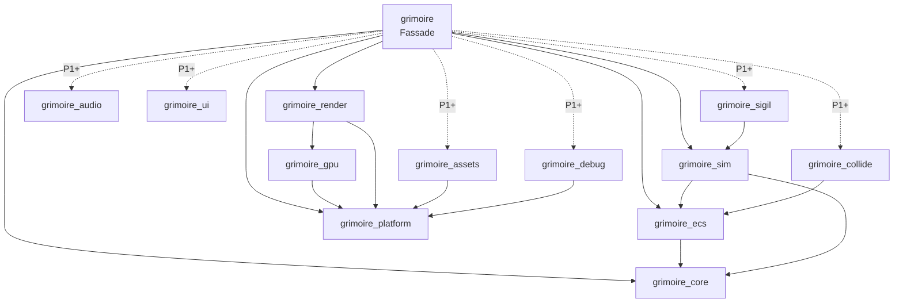

# Crate-Verträge — Phase P0

> **Agenten-Hinweis:** Dieses Dokument ist die verbindliche Schnittstellen-Spezifikation der
> Grimoire-Crates. Öffentliche APIs weichen nur mit Begründung im Commit und gleichzeitiger
> Aktualisierung dieses Dokuments ab. Anforderungs-Hintergrund: Spiel-Repo `docs/prd/0002`,
> `0013`, `0017`, `0018`; Grundsatzentscheidungen: Spiel-Repo `docs/adr/0002`–`0005`.

## 1. Schichten und erlaubte Abhängigkeiten



- Pfeile zeigen nur nach unten. Kein Crate kennt das Spiel (`fnp_*`).
- `winit`-Typen existieren nur in `grimoire_platform`; `wgpu`-Typen nur in `grimoire_gpu` und
  `grimoire_render` (Engine-ADR zur GPU-Kapselungsgrenze).
- `grimoire_core` ist Blatt-Crate ohne Engine-Abhängigkeiten.

## 2. Regeln für alle Crates

1. Code, Kommentare und Doc-Kommentare auf Englisch; Design-Dokumente auf Deutsch.
2. Jede öffentliche Einheit ist dokumentiert (`missing_docs`); Kommentare erklären Einschränkungen, nicht Offensichtliches.
3. Grün vor jedem Commit: `cargo fmt`, `cargo clippy -p <crate> --all-targets -- -D warnings`, `cargo test -p <crate>`.
4. Neue Drittabhängigkeiten nur über `[workspace.dependencies]` und mit Begründung im Commit.
5. `unsafe` nur mit lokalem `#[allow(unsafe_code)]`, `// SAFETY:`-Begründung und Test, der die Invariante prüft.
6. Fehler als `thiserror`-Enum pro Crate. Kein `unwrap`/`expect` in Bibliothekscode, außer bei bewiesener Invariante mit Kommentar.
7. Kein `todo!()`/`unimplemented!()` in abgeschlossenem Code (`clippy::todo`).
8. Commits: Conventional Commits (`feat(ecs): …`, `test(sim): …`), Englisch.

## 3. Determinismus-Regeln (Simulationsseite: `core`, `ecs`, `sim`, `collide`, `sigil`)

Erzwungen durch `clippy.toml` in diesen Crates, zusätzlich im Review geprüft:

- Keine `HashMap`/`HashSet` (Iterationsreihenfolge). Lookups über `TypeId` sind nur mit `BTreeMap` und nie iterierend für Hash/Ordnung erlaubt.
- Keine Wanduhr (`Instant::now`/`elapsed`, `SystemTime::now`/`elapsed`); Simulationszeit ist der Tick-Zähler.
- Keine Transzendentalfunktionen aus `std`, weder für `f32` noch für `f64` (`sin`, `cos`, `atan2`, `exp`, `powf`, `sinh`, `log10`, `cbrt`, …) — stattdessen `grimoire_core::math::dmath`. Kein `mul_add`, kein `powi` (laut `std`-Doku nicht deterministisch).
- Kein `f32::min`/`max` und kein `f64::min`/`max` (Nullvorzeichen bei `(+0.0, -0.0)` wechselt zwischen Debug und Release) — stattdessen `dmath::min`/`dmath::max`; `clamp` bleibt erlaubt.
- Keine Threads (`std::thread::spawn`, `thread::Builder::spawn`/`spawn_scoped`, `thread::scope` gesperrt), keine Adressen/`TypeId`s in Hashes oder Reihenfolgen.
- Die Sperren gelten für `--all-targets`, also auch in Tests und Benchmarks; bewusste Ausnahmen tragen `#[allow(clippy::disallowed_methods)]` mit Begründung.
- Jede Komponente und Ressource ist `Clone + StableHash`, damit Welten hashbar und snapshotbar sind.

Nur im Review prüfbar (Engine-ADR 0004):

- NaN gelangt nie in Simulationszustand. Code verzweigt nie auf Vorzeichen oder Payload eines möglichen NaN (`to_bits`, `total_cmp`, `is_sign_negative`, `copysign`) — beides ist plattform- und optimierungsabhängig.
- Clippy ignoriert nicht auflösbare Pfade in `clippy.toml` stillschweigend: Neue Einträge werden mit einer temporären Lint-Probe verifiziert; die fünf `clippy.toml` bleiben identisch.

## 4. `grimoire_core` — fertig

| Element | Vertrag |
|---------|---------|
| `StableHasher` | `new`, `with_seed`, `write_{u8…u64,i8…i64,usize,isize,bool,f32,f64,bytes,str}`, `finish` (setzt nicht zurück), `ALGORITHM_VERSION = 1`; `write_f32`/`write_f64` bitgenau, jedes NaN wird als kanonisches `0x7fc0_0000` bzw. `0x7ff8_0000_0000_0000` eingespeist; Version 1 eingefroren durch `tests/stable_hash_golden.rs` |
| `StableHash` | `fn stable_hash(&self, &mut StableHasher)`; Impls für Primitive, `str`, `String`, `()`, Slices (längenpräfixiert), Arrays, `Vec`, `Option`, Tupel bis 8, `&T`, `Box<T>`, `Vec2` |
| `hash_of(&T) -> u64` | Hash eines Wertes mit frischem Hasher |
| `impl_stable_hash!(Typ { feld, … })` | Makro für Structs |
| `math::dmath` | `sin cos tan asin acos atan atan2 exp ln powf hypot sqrt min max`, Konstanten `PI TAU FRAC_PI_2`; `min`/`max` liefern bei gleichen Operanden (auch `±0.0`) den ersten, NaN wie `std` |
| `Vec2` | `new splat from_angle dot perp_dot length(_squared) distance(_squared) normalize_or_zero perp angle rotate lerp to_array`, Operatoren `+ - * / neg` und Zuweisungsvarianten |

## 5. `grimoire_platform`

**Vorhandene Verträge (nicht ändern):** `PlatformWindow`, `WindowConfig`, `PhysicalSize`,
`PlatformEvent`, `RawInputEvent`, `KeyCode`, `MouseButton`, `Clock`, `SystemClock`, `ManualClock`,
`AppHandler`, `PlatformContext`, `AppResult`, `PlatformError`, `FileSystem`, `StdFileSystem`,
`MemoryFileSystem`, `run_desktop`, `run_headless`.

**Lebenszyklus:** `init` genau einmal (Desktop: nachdem das Fenster existiert) → Events stets vor dem
nächsten Frame → `frame` fortlaufend → `shutdown` genau einmal nach erfolgreichem `init`.
Schlägt `init` fehl, endet der Lauf mit `PlatformError::AppInit` ohne `shutdown`.
`CloseRequested` wird an die App zugestellt, danach endet die Schleife.

**Zu implementieren:**
- `run_desktop` mit `winit` 0.30 (`ApplicationHandler`): Fenster in `resumed` genau einmal erzeugen,
  als `Arc` in einer eigenen `PlatformWindow`-Implementierung kapseln; winit-Events auf
  `PlatformEvent` abbilden (`KeyCode` über physische Tasten); `frame` bei `RedrawRequested`,
  danach neuen Redraw anfordern (kontinuierliche Schleife); Fokusverlust melden; `exiting` → `shutdown`.
- `run_headless`: `ManualClock`, `window()` liefert `None`, genau `frames` Frames, früher Abbruch bei `request_exit`.
- `StdFileSystem::write_atomic`: Temp-Datei im Zielordner → schreiben → `sync_all` → `rename`
  (ersetzt auf allen Plattformen); Elternordner anlegen; Temp-Datei bei Fehler entfernen.
- `MemoryFileSystem`: vollständige Implementierung für Tests.
- Beispiel `examples/window.rs`: Fenster, loggt Events, `Escape` beendet.

## 6. `grimoire_gpu` und `grimoire_render`

`grimoire_gpu` ist in P0 frei gestaltbar, solange nur `grimoire_render` es nutzt. Pflicht:
Kontext für ein Fenster (`Arc<dyn PlatformWindow>`), Offscreen-Kontext ohne Fenster,
optionaler Software-Fallback, Surface-Resize und Umgang mit `Lost`/`Outdated`, RGBA-Readback.

**`grimoire_render` — vorhandene Verträge (nicht ändern):** `SpriteInstance` (40 Byte, `repr(C)`),
`shape::{CIRCLE, QUAD}`, `Camera2D` (+ `view_projection`, `screen_to_world`), `RenderFrame`,
`RenderStats`, `RendererConfig`, `RenderError`, `Renderer` (objektsicher), `NullRenderer`,
`WgpuRenderer::{new_for_window, new_offscreen, read_offscreen_rgba}`.

**Zu implementieren:** Instanzierter Sprite-Pass mit **einem** Draw-Call für alle Sprites;
WGSL-Shader mit kantengeglättetem Kreis (Signed Distance) und Rechteck, Rotation, Alpha-Blending;
wachsender Instanzpuffer ohne Neuallokation pro Frame; Kamera-Uniform; `resize` mit Nullgrößen;
Offscreen-Test (roter Kreis in der Mitte, Ecke = Clear-Farbe) der ohne GPU mit klarer Meldung
übersprungen wird; Beispiel `examples/instancing.rs` mit ≥ 10.000 bewegten Sprites und FPS im Fenstertitel.

## 7. `grimoire_ecs`

```rust
pub struct Entity;            // Copy, Eq, Ord, Hash, Debug, StableHash
                              // index() -> u32, generation() -> u32, to_bits() -> u64, from_bits(u64)
pub trait Component: 'static + Send + Sync + Clone + StableHash {}   // Blanket-Impl
pub trait Resource:  'static + Send + Sync + Clone + StableHash {}   // Blanket-Impl
pub trait Bundle;             // Tupel (C1,) bis (C1, …, C8)

impl World {
    pub fn new() -> Self;
    pub fn register_component<C: Component>(&mut self);   // idempotent, ComponentId in Registrierungsreihenfolge
    pub fn spawn<B: Bundle>(&mut self, bundle: B) -> Entity;
    pub fn despawn(&mut self, entity: Entity) -> bool;
    pub fn is_alive(&self, entity: Entity) -> bool;
    pub fn insert<C: Component>(&mut self, entity: Entity, component: C) -> Result<(), EcsError>;
    pub fn remove<C: Component>(&mut self, entity: Entity) -> Option<C>;
    pub fn get<C: Component>(&self, entity: Entity) -> Option<&C>;
    pub fn get_mut<C: Component>(&mut self, entity: Entity) -> Option<&mut C>;
    pub fn entity_count(&self) -> usize;
    pub fn query<Q: ReadOnlyQuery>(&self) -> /* Iterator<Item = Q::Item<'_>> */;   // z. B. (Entity, &Pos, &Vel)
    pub fn query_mut<Q: Query>(&mut self) -> /* Iterator<Item = Q::Item<'_>> */;   // z. B. (&mut Pos, &Vel)
    pub fn insert_resource<R: Resource>(&mut self, resource: R);
    pub fn resource<R: Resource>(&self) -> Option<&R>;
    pub fn resource_mut<R: Resource>(&mut self) -> Option<&mut R>;
    pub fn remove_resource<R: Resource>(&mut self) -> Option<R>;
    pub fn stable_hash(&self, hasher: &mut StableHasher);
    pub fn snapshot(&self) -> WorldSnapshot;              // WorldSnapshot: Clone
    pub fn restore(&mut self, snapshot: &WorldSnapshot);
}

pub struct CommandBuffer;     // new, spawn, despawn, insert, remove::<C>, is_empty, apply(&mut self, &mut World)
pub trait System { fn name(&self) -> &str; fn run(&mut self, world: &mut World); }
pub fn system_fn<F: FnMut(&mut World) + Send + 'static>(name: &'static str, f: F) -> impl System;
pub struct Schedule;          // new, add_system(impl System + 'static) -> &mut Self, run(&mut self, &mut World), system_names()
pub enum EcsError;            // mindestens NoSuchEntity(Entity)
```

**Semantik:**
- Iterationsreihenfolge deterministisch: Archetypen in Erzeugungsreihenfolge, darin dichte Reihenfolge;
  Despawn per Swap-Remove verändert sie, aber reproduzierbar.
- Doppelter mutabler Zugriff auf denselben Komponententyp in einer Query → Panic beim Erzeugen der Query mit klarer Meldung.
- `stable_hash` speist: Entity-Allokator (Generationen, Freiliste in Reihenfolge), je Archetyp die Komponenten-IDs,
  Entities und Komponentendaten in dichter Reihenfolge, Ressourcen in Registrierungsreihenfolge mit Präsenz-Tag.
  Typen werden über ihre Registrierungsnummer identifiziert, nie über `TypeId`.
- `restore` stellt den vollständigen Zustand her (inkl. Allokator und Ressourcen); danach ist
  `stable_hash` identisch zum Snapshot-Zeitpunkt und gleiche Operationen liefern gleiche Entity-IDs.
- Filter `With<T>`/`Without<T>` sind wünschenswert (Should).
- Leistung: Query über 10.000 Entities mit zwei Komponenten ohne Allokation pro Entity.

## 8. `grimoire_sim`

```rust
pub struct Tick(pub u64);                         // Resource: Index des laufenden Ticks (erster Schritt: 0)
pub struct SimSeed(pub u64);                      // Resource
pub struct FixedTimestep;                         // new(tick_rate_hz: u32) (Panic bei 0),
                                                  // with_max_ticks_per_frame(u32) (Default 8), tick_rate_hz(),
                                                  // tick_duration() -> Duration, advance(Duration) -> StepPlan,
                                                  // dropped_time() -> Duration, reset()
pub struct StepPlan { pub ticks: u32, pub alpha: f32 }   // alpha ∈ [0, 1): nur fürs Rendering
pub struct SimRng;                                // Clone, PartialEq, Debug, StableHash; eigener Algorithmus, dokumentiert
                                                  // new(seed), next_u32, next_u64, next_f32 ∈ [0,1),
                                                  // range_u32(low, high) (unverzerrt, high exklusiv), range_i32, range_f32, chance(p)
pub fn derive_rng(seed: u64, tick: u64, stream: u64) -> SimRng;   // reihenfolgeunabhängige Ströme je Tick
pub const MAX_INPUT_SLOTS: usize = 4;
pub struct InputFrame { pub axes: [i16; 4], pub buttons: u32 }    // Copy, Default, Eq, StableHash
                                                  // axis(i) -> f32 ∈ [-1, 1], is_pressed(bit: u8) -> bool
pub struct TickInput { pub slots: [InputFrame; MAX_INPUT_SLOTS] } // Copy, Default, Eq, StableHash, Resource
pub struct InputLog { pub seed: u64, pub tick_rate_hz: u32, pub frames: Vec<TickInput> }
                                                  // to_bytes() / from_bytes() -> Result<_, SimError>
pub struct Simulation;                            // new(seed), seed(), tick(), world(), world_mut(), schedule_mut(),
                                                  // step(&mut self, input: TickInput), state_hash() -> u64,
                                                  // snapshot() -> SimSnapshot, restore(&SimSnapshot)
pub fn replay(sim: &mut Simulation, log: &InputLog, hash_every: u64) -> Vec<(u64, u64)>;
pub enum SimError;
```

**Semantik:**
- `FixedTimestep` akkumuliert exakt ganzzahlig in Einheiten `Nanosekunden × tick_rate_hz`
  (ein Tick = 10⁹ Einheiten) — keine Drift. Mehr als `max_ticks_per_frame` Ticks werden verworfen und in `dropped_time` gezählt.
- `Simulation::new` legt `Tick(0)`, `SimSeed(seed)` und `TickInput::default()` als Ressourcen an.
  `step`: `TickInput`-Ressource setzen → Schedule ausführen → `Tick` erhöhen.
- `state_hash` = Hash über Tick, Seed und `World::stable_hash`.
- Achsen sind auf ±32767 normiert; `axis(i)` teilt durch `32767.0` (exakt, deterministisch).
- Replay-Binärformat: Magic `b"GRIMREPL"`, `u32` Version 1, danach Little-Endian-Felder; fehlerhafte
  Eingaben liefern `SimError`, niemals Panic.

## 9. `grimoire` — Fassade (Integration nach dem Zusammenführen)

```rust
pub trait GamePlugin {
    fn name(&self) -> &str;
    fn build(&mut self, sim: &mut Simulation) {}                              // Komponenten, Systeme, Start-Entities
    fn extract(&mut self, world: &World, alpha: f32, frame: &mut RenderFrame) {}   // nur lesend
    fn on_frame(&mut self, stats: &FrameStats) {}                             // reine Präsentation
}
pub struct App;              // App::new(WindowConfig) -> AppBuilder
pub struct AppBuilder;       // seed, tick_rate, input_map, renderer_config, plugin,
                             // run() -> Result<(), GrimoireError>,
                             // run_headless(ticks, &mut dyn FnMut(u64) -> TickInput) -> HeadlessReport
pub struct InputMap;         // Tasten → Achsen/Buttons; Default: WASD + Pfeiltasten → Achsen 0/1
pub struct FrameStats;       // frame, sim_tick, ticks_this_frame, alpha, fps, render: RenderStats
pub struct HeadlessReport;   // final_tick, final_hash, hashes: Vec<(u64, u64)>
```

## 10. Platzhalter

`grimoire_collide`, `grimoire_audio`, `grimoire_ui`, `grimoire_assets`, `grimoire_sigil`,
`grimoire_debug` enthalten in P0 nur ihre Crate-Dokumentation.
