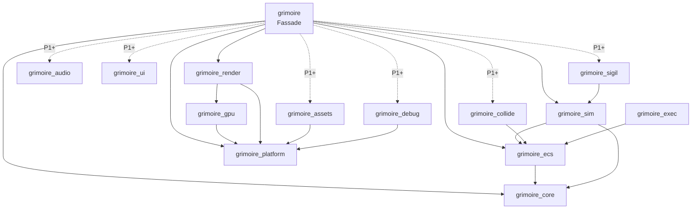

# Crate-Verträge — Phase P0

> **Agenten-Hinweis:** Dieses Dokument ist die verbindliche Schnittstellen-Spezifikation der
> Grimoire-Crates. Öffentliche APIs weichen nur mit Begründung im Commit und gleichzeitiger
> Aktualisierung dieses Dokuments ab. Anforderungs-Hintergrund: Spiel-Repo `docs/prd/0002`,
> `0013`, `0017`, `0018`; Grundsatzentscheidungen: Spiel-Repo `docs/adr/0002`–`0005`.

## 1. Schichten und erlaubte Abhängigkeiten



- Pfeile zeigen nur nach unten. Kein Crate kennt das Spiel (`fnp_*`).
- `winit`-Typen existieren nur in `grimoire_platform`; `wgpu`-Typen nur in `grimoire_gpu` und
  `grimoire_render` (Engine-ADR zur GPU-Kapselungsgrenze).
- `grimoire_core` ist Blatt-Crate ohne Engine-Abhängigkeiten.
- `grimoire_exec` liegt außerhalb der Determinismus-Menge und ist die einzige Thread-Quelle der Simulation
  (Engine-ADR-0006); keine Determinismus-Crate hängt von ihr ab. Spiele binden sie neben der Fassade ein,
  wenn sie mehrere Threads nutzen.

## 2. Regeln für alle Crates

1. Code, Kommentare und Doc-Kommentare auf Englisch; Design-Dokumente auf Deutsch.
2. Jede öffentliche Einheit ist dokumentiert (`missing_docs`); Kommentare erklären Einschränkungen, nicht Offensichtliches.
3. Grün vor jedem Commit: `cargo fmt`, `cargo clippy -p <crate> --all-targets -- -D warnings`, `cargo test -p <crate>`.
4. Neue Drittabhängigkeiten nur über `[workspace.dependencies]` und mit Begründung im Commit.
5. `unsafe` nur mit lokalem `#[allow(unsafe_code)]`, `// SAFETY:`-Begründung und Test, der die Invariante prüft.
6. Fehler als `thiserror`-Enum pro Crate. Kein `unwrap`/`expect` in Bibliothekscode, außer bei bewiesener Invariante mit Kommentar.
7. Kein `todo!()`/`unimplemented!()` in abgeschlossenem Code (`clippy::todo`).
8. Commits: Conventional Commits (`feat(ecs): …`, `test(sim): …`), Englisch.

## 3. Determinismus-Regeln (Simulationsseite: `core`, `ecs`, `sim`, `collide`, `sigil`; Fassade `grimoire`)

Erzwungen durch `clippy.toml` in diesen Crates, zusätzlich im Review geprüft. Die Fassade trägt dieselbe Datei,
weil ihre Hauptschleife, `InputMap::sample` und das Beispiel `sim_loop` (Vorlage für Spiele) `TickInput` und
Systeme in die Simulation speisen; ihre Wanduhr liest sie nur über `PlatformContext::clock`.

- Keine `HashMap`/`HashSet` (Iterationsreihenfolge). Lookups über `TypeId` sind nur mit `BTreeMap` und nie iterierend für Hash/Ordnung erlaubt.
- Keine Wanduhr (`Instant::now`/`elapsed`, `SystemTime::now`/`elapsed`); Simulationszeit ist der Tick-Zähler.
- Keine Transzendentalfunktionen aus `std`, weder für `f32` noch für `f64` (`sin`, `cos`, `atan2`, `exp`, `powf`, `sinh`, `log10`, `cbrt`, …) — stattdessen `grimoire_core::math::dmath`. Kein `mul_add`, kein `powi` (laut `std`-Doku nicht deterministisch).
- Kein `f32::min`/`max` und kein `f64::min`/`max` (Nullvorzeichen bei `(+0.0, -0.0)` wechselt zwischen Debug und Release) — stattdessen `dmath::min`/`dmath::max`; `clamp` bleibt erlaubt.
- Keine Threads in Determinismus-Crates (`std::thread::spawn`, `thread::Builder::spawn`/`spawn_scoped`, `thread::scope` gesperrt), keine Adressen/`TypeId`s in Hashes oder Reihenfolgen. **Einzige Thread-Quelle der Simulation** ist `grimoire_exec` (rayon, eigener Pool mit fester Thread-Anzahl, nie der globale Pool) hinter dem Trait `grimoire_ecs::Executor` (Engine-ADR-0006, Baustein 6). Keine Crate mit dieser `clippy.toml` hängt von `rayon`, `rayon-core` oder `grimoire_exec` ab — weder als normale noch als Build- oder Dev-Abhängigkeit. Der CI-Job `docs` prüft das mit `.github/scripts/check-thread-source.sh` (`cargo tree -e normal,build,dev --target all` je Crate mit `clippy.toml`, Positivkontrolle an `grimoire_exec`, Identität der `clippy.toml`).
- Die Sperren gelten für `--all-targets`, also auch in Tests und Benchmarks; bewusste Ausnahmen tragen `#[allow(clippy::disallowed_methods)]` mit Begründung.
- Jede Komponente und Ressource ist `Clone + StableHash`, damit Welten hashbar und snapshotbar sind.
- **Ausführungsunabhängigkeit:** Kein Zustand und kein Hash hängt von Executor, Thread-Anzahl, ausführendem Thread oder Fertigstellungsreihenfolge ab. `Executor::threads()` dient nur der Diagnose. Das folgt aus §7 (unveränderliche Welt je Stufe, Anwendung der Befehlspuffer in Listenreihenfolge, feste Blöcke) und wird vom Hash-Gate (§8) geprüft.
- **Reduktionen** über datenparallele Blöcke (Summen, Min/Max, gesammelte Ereignisse, Befehlspuffer) werden auf dem aufrufenden Thread in Blockreihenfolge gefaltet, innerhalb eines Blocks in dichter Reihenfolge; Assoziativität wird nie vorausgesetzt (Engine-ADR-0004). Eine bestehende Faltung über eine ganze Query wird nicht durch Blöcke ersetzt, weil sich ihre Klammerung und damit der Hash ändert.
- **Zufall** in parallelen Systemen und Blöcken nur über `derive_rng` mit fest pro System vergebenem Strom bzw. `derive_block_rng` mit dem Blockindex (§8); ein gemeinsam fortgeschalteter Generator ist dort verboten.

Nur im Review prüfbar (Engine-ADR 0004):

- NaN gelangt nie in Simulationszustand. Code verzweigt nie auf Vorzeichen oder Payload eines möglichen NaN (`to_bits`, `total_cmp`, `is_sign_negative`, `copysign`) — beides ist plattform- und optimierungsabhängig.
  Debug-Builds prüfen das Verbot an jedem Hash-Punkt zusätzlich zur Laufzeit: `Simulation::state_hash` bricht mit Panic samt Tick ab, wenn der gehashte Zustand ein NaN enthält (`StableHasher::saw_nan`). Golden-Tests und `replay`-Checkpoints schlagen damit an. Release-Builds und NaN, das vor dem nächsten Hash wieder verschwindet, bleiben Review-Aufgabe.
- Clippy ignoriert nicht auflösbare Pfade in `clippy.toml` stillschweigend: Neue Einträge werden mit einer temporären Lint-Probe verifiziert; die sechs `clippy.toml` (fünf Simulations-Crates und Fassade) bleiben identisch.
- Parallele Systeme und Block-Closures verändern keinen Simulationszustand über innere Veränderlichkeit (`Mutex`, `RwLock`, Atomics, `OnceLock`, `Cell`); Komponenten und Ressourcen enthalten keine. Diagnose ohne Wirkung auf den Zustand ist erlaubt.
- Deklarationen sind vollständig und nicht übermäßig: Eine fehlende fällt nur im Debug-Build oder im Hash-Gate auf, eine überflüssige Schreib- oder Strukturdeklaration zerlegt Stufen unnötig.

## 4. `grimoire_core` — fertig

| Element | Vertrag |
|---------|---------|
| `StableHasher` | `new`, `with_seed`, `write_{u8…u64,i8…i64,usize,isize,bool,f32,f64,bytes,str}`, `finish` (setzt nicht zurück), `ALGORITHM_VERSION = 1`; `write_f32`/`write_f64` bitgenau, jedes NaN wird als kanonisches `0x7fc0_0000` bzw. `0x7ff8_0000_0000_0000` eingespeist; `saw_nan()` meldet, ob ein NaN eingespeist wurde (nicht Teil des Hashes, von `PartialEq` ignoriert); Version 1 eingefroren durch `tests/stable_hash_golden.rs` |
| `StableHash` | `fn stable_hash(&self, &mut StableHasher)`; Impls für Primitive, `str`, `String`, `()`, Slices (längenpräfixiert), Arrays, `Vec`, `Option`, Tupel bis 8, `&T`, `Box<T>`, `Vec2` |
| `hash_of(&T) -> u64` | Hash eines Wertes mit frischem Hasher |
| `impl_stable_hash!(Typ { feld, … })` | Makro für Structs |
| `math::dmath` | `sin cos tan asin acos atan atan2 exp ln powf hypot sqrt min max`, Konstanten `PI TAU FRAC_PI_2`; `min`/`max` liefern bei gleichen Operanden (auch `±0.0`) den ersten, NaN wie `std` |
| `Vec2` | Konstanten `ZERO ONE X Y`; `new splat from_angle dot perp_dot length(_squared) distance(_squared) normalize_or_zero perp angle rotate lerp to_array`, Operatoren `+ - * / neg` und Zuweisungsvarianten |

## 5. `grimoire_platform`

**Vorhandene Verträge (nicht ändern):** `PlatformWindow`, `WindowConfig`, `PhysicalSize`,
`PlatformEvent`, `RawInputEvent`, `KeyCode`, `MouseButton`, `Clock`, `SystemClock`, `ManualClock`,
`AppHandler`, `PlatformContext`, `AppResult`, `PlatformError`, `FileSystem`, `StdFileSystem`,
`MemoryFileSystem`, `run_desktop`, `run_headless`.

**Re-Export `raw_window_handle` (SemVer-Kopplung):** `grimoire_platform` re-exportiert `pub use raw_window_handle;`
(Version 0.6), weil `PlatformWindow: HasWindowHandle + HasDisplayHandle` die Traits in der öffentlichen API verlangt.
Über `grimoire::platform` und `PlatformWindow` im Prelude der Fassade gehört `raw-window-handle` damit zur
SemVer-Oberfläche von `grimoire_platform` und `grimoire`: Ein Wechsel auf eine inkompatible Version (0.7) ist für
beide ein Breaking Change.

**Fensterplatzierung (Ergänzung P0):** `WindowConfig` hat zusätzlich `monitor: MonitorChoice`
(`Default`, `Primary`, `Secondary` = erster nicht-primärer Monitor, `Index(n)`; nicht verfügbare
Wahl → Betriebssystem platziert) und `focus_on_open: bool` (`false` = Fenster öffnet ohne den Fokus
zu übernehmen). Das Fenster wird auf dem gewählten Monitor zentriert. Für Entwicklung und Tests
überschreiben die Umgebungsvariablen `GRIMOIRE_WINDOW_MONITOR` (`default|primary|secondary|<index>`)
und `GRIMOIRE_WINDOW_FOCUS` (`0|1|false|true`) die Konfiguration jedes Programms. Konvention für
lokale Fenster-Läufe auf dem Entwicklungsrechner: `GRIMOIRE_WINDOW_MONITOR=secondary` und
`GRIMOIRE_WINDOW_FOCUS=0`.

**Frame-Taktung (Ergänzung P0):** `PlatformEvent::Occluded(bool)` meldet, dass das Fenster vollständig
verdeckt ist bzw. wieder sichtbar wird (nicht unter Windows und Wayland; ein minimiertes Fenster meldet dort
ein leeres `Resized`). `PlatformContext::frame_not_presented()` (Standard-Implementierung ohne Wirkung) meldet
dem Runner einen Frame, der nichts präsentiert hat. Der Desktop-Runner fordert nach jedem Frame sofort den
nächsten an und überlässt die Taktung der Präsentation (vsync). Solange das Fenster verdeckt ist oder eine
leere Zeichenfläche hat, sowie ab drei nicht präsentierten Frames in Folge, fordert er den nächsten Frame erst
nach 100 ms an (`ControlFlow::WaitUntil`), statt einen Kern auszulasten; `frame` läuft in diesem Takt weiter.
Sobald das Fenster wieder sichtbar ist oder ein Frame präsentiert, gilt wieder volle Geschwindigkeit.
`run_headless` ignoriert die Meldung.

**Lebenszyklus:** `init` genau einmal (Desktop: nachdem das Fenster existiert) → Events stets vor dem
nächsten Frame → `frame` fortlaufend → `shutdown` genau einmal nach erfolgreichem `init`.
Schlägt `init` fehl, endet der Lauf mit `PlatformError::AppInit` ohne `shutdown`.
Schließt der Nutzer das Fenster, wird `CloseRequested` an die App zugestellt, danach endet die Schleife.

**Beenden unter macOS (Ergänzung P0):** Das Standardmenü von winit 0.30 schickt bei „Beenden" (Cmd+Q)
`terminate:` an AppKit. winit beendet die Schleife dann in `applicationWillTerminate:` (`exiting` →
`shutdown`), danach ruft AppKit `exit()` auf. `run_desktop` kehrt in diesem Fall nicht zurück, `CloseRequested`
wird nicht zugestellt, Destruktoren von App, Renderer und Plugins laufen nicht, und Code nach dem Aufruf entfällt.
`AppHandler::shutdown` ist deshalb der einzige Haken, der bei jedem geordneten Ende der Schleife läuft (auch nach
Cmd+Q); Fehler darin werden geloggt, weil niemand einen Rückgabewert liest. Beendet das Betriebssystem den Prozess
selbst (Sitzungsende unter Windows, `SIGTERM` oder `SIGINT`, Strg+C in einer Konsole), läuft `shutdown` nicht:
winit 0.30.13 behandelt weder `WM_ENDSESSION` noch Signale.

**Umgesetzt:**
- `run_desktop` mit `winit` 0.30 (`ApplicationHandler`): Fenster in `resumed` genau einmal erzeugen,
  als `Arc` in einer eigenen `PlatformWindow`-Implementierung kapseln; winit-Events auf
  `PlatformEvent` abbilden (`KeyCode` über physische Tasten); `frame` bei `RedrawRequested`,
  danach neuen Redraw anfordern (kontinuierliche Schleife); Fokusverlust melden; `exiting` → `shutdown`.
- `run_headless`: `ManualClock`, `window()` liefert `None`, genau `frames` Frames, früher Abbruch bei `request_exit`.
- `StdFileSystem::write_atomic`: Temp-Datei im Zielordner → schreiben → `sync_all` → `rename`
  (ersetzt auf allen Plattformen); Elternordner anlegen; Temp-Datei bei Fehler entfernen.
- `MemoryFileSystem`: vollständige Implementierung für Tests.
- Beispiel `examples/window.rs`: Fenster, loggt Events, `Escape` beendet.

## 6. `grimoire_gpu` und `grimoire_render`

`grimoire_gpu` ist in P0 frei gestaltbar, solange nur `grimoire_render` es nutzt. Pflicht:
Kontext für ein Fenster (`Arc<dyn PlatformWindow>`), Offscreen-Kontext ohne Fenster,
optionaler Software-Fallback, Surface-Resize und Umgang mit `Lost`/`Outdated`, RGBA-Readback.

**Software-Adapter erzwingen (Ergänzung P0):** `GRIMOIRE_GPU_ADAPTER=software` (oder `cpu`)
beschränkt jede Kontext-Instanz auf das Backend mit dem CPU-Adapter der Plattform (Windows: DX12 →
WARP, Linux: Vulkan → lavapipe) und akzeptiert ausschließlich einen Adapter vom Typ CPU; sonst
`GpuError::NoAdapter`. Damit laufen Render-Tests auf dem Entwicklungsrechner, ohne die Hardware-GPU
zu belasten. `auto` (Standard) folgt `ContextOptions`.

**`grimoire_render` — vorhandene Verträge (nicht ändern):** `SpriteInstance` (40 Byte, `repr(C)`),
`shape::{CIRCLE, QUAD}`, `Camera2D` (+ `view_projection`, `screen_to_world`), `RenderFrame`,
`RenderStats`, `RendererConfig`, `RenderError`, `Renderer` (objektsicher), `NullRenderer`,
`WgpuRenderer::{new_for_window, new_offscreen, read_offscreen_rgba}`.

**Umgesetzt:** Instanzierter Sprite-Pass mit **einem** Draw-Call für alle Sprites;
WGSL-Shader mit kantengeglättetem Kreis (Signed Distance) und Rechteck, Rotation, Alpha-Blending;
wachsender Instanzpuffer ohne Neuallokation pro Frame; Kamera-Uniform; `resize` mit Nullgrößen;
Offscreen-Test (roter Kreis in der Mitte, Ecke = Clear-Farbe) der ohne GPU mit klarer Meldung
übersprungen wird; Beispiel `examples/instancing.rs` mit ≥ 10.000 bewegten Sprites und FPS im Fenstertitel.

**Fehlgeschlagenes `resize` (Ergänzung P0):** Lehnt `wgpu` die neue Größe ab (etwa über
`max_texture_dimension_2d` des Geräts oder bei Speichermangel), behält `WgpuRenderer` den Fehler: Jeder folgende
`render`-Aufruf liefert ihn als `RenderError::OutOfMemory` bzw. `RenderError::Backend` (nie als `SurfaceLost`),
bis ein weiteres `resize` ihn ersetzt; eine Nullgröße löscht ihn, eine gültige Größe konfiguriert neu. Die
Fassade beendet den Lauf damit wie bei jedem anderen Render-Fehler, statt dauerhaft ein schwarzes Fenster
zu zeigen. Bewusst kein Wiederholen mit auf das Gerätelimit begrenzter Größe: Eine Surface, die kleiner als das
Fenster ist, würde je Backend unterschiedlich skaliert oder verworfen und den Fehler nur verdecken. Der Vertrag
von `Renderer::resize` verlangt allgemein, dass unbrauchbare Größen als Fehler aus `render` kommen. Geprüft durch
den Offscreen-Test `failed_resize_is_returned_from_every_render_until_a_resize_succeeds`.

**GPU-Tests ohne Adapter (Ergänzung P0):** Die Meldung beim Überspringen ist eine GitHub-Actions-Warnung
(`::warning::`), die direkt auf stdout geschrieben wird, damit die Ausgabeerfassung von libtest sie nicht
verschluckt. Mit `GRIMOIRE_REQUIRE_GPU_ADAPTER=1` (oder `true`) scheitern die Tests stattdessen. Die CI setzt
die Variable unter Windows (WARP) und Linux (lavapipe); macOS-Runner dürfen ohne Metal überspringen. Unter Windows
und Linux läuft außerdem ein zweiter Schritt `cargo test --workspace --test offscreen` mit
`GRIMOIRE_GPU_ADAPTER=software`, der den erzwungenen CPU-Adapter der lokalen Testläufe belegt; `--workspace`
statt `-p grimoire_render` hält die Feature-Auflösung gleich, sodass der Schritt die Artefakte des Testschritts
wiederverwendet.

## 7. `grimoire_ecs`

```rust
pub struct Entity;            // Copy, Eq, Ord (Index vor Generation), Hash, Debug, Display, StableHash
                              // index() -> u32, generation() -> u32, to_bits() -> u64, from_bits(u64)
pub trait Component: 'static + Send + Sync + Clone + StableHash {}   // Blanket-Impl
pub trait Resource:  'static + Send + Sync + Clone + StableHash {}   // Blanket-Impl
pub trait Bundle;             // versiegelt; () und Tupel (C1,) bis (C1, …, C8)
pub trait Query { type Item<'w>; }   // versiegelt; Element oder Tupel bis 8 aus:
                              // Entity, &T, &mut T, Option<&T>, Option<&mut T>, With<T>, Without<T> (Item = ())
pub trait ReadOnlyQuery: Query {}    // ohne &mut T / Option<&mut T>
pub struct With<T>; pub struct Without<T>;
pub struct QueryIter<'w, Q>;  // Iterator<Item = Q::Item<'w>>
pub struct QueryIterMut<'w, Q>;

impl World {                  // zusätzlich: Default, Debug, impl StableHash
    pub fn new() -> Self;
    pub fn register_component<C: Component>(&mut self);   // idempotent, ComponentId in Registrierungsreihenfolge
    pub fn spawn<B: Bundle>(&mut self, bundle: B) -> Entity;
    pub fn despawn(&mut self, entity: Entity) -> bool;
    pub fn is_alive(&self, entity: Entity) -> bool;
    pub fn insert<C: Component>(&mut self, entity: Entity, component: C) -> Result<(), EcsError>;
    pub fn remove<C: Component>(&mut self, entity: Entity) -> Option<C>;
    pub fn get<C: Component>(&self, entity: Entity) -> Option<&C>;
    pub fn get_mut<C: Component>(&mut self, entity: Entity) -> Option<&mut C>;
    pub fn entity_count(&self) -> usize;
    pub fn query<Q: ReadOnlyQuery>(&self) -> QueryIter<'_, Q>;      // z. B. (Entity, &Pos, &Vel)
    pub fn query_mut<Q: Query>(&mut self) -> QueryIterMut<'_, Q>;   // z. B. (&mut Pos, &Vel)
    pub fn insert_resource<R: Resource>(&mut self, resource: R);
    pub fn resource<R: Resource>(&self) -> Option<&R>;
    pub fn resource_mut<R: Resource>(&mut self) -> Option<&mut R>;
    pub fn remove_resource<R: Resource>(&mut self) -> Option<R>;
    pub fn stable_hash(&self, hasher: &mut StableHasher);
    pub fn snapshot(&self) -> WorldSnapshot;              // WorldSnapshot: Clone
    pub fn restore(&mut self, snapshot: &WorldSnapshot);
}

pub struct CommandBuffer;     // new, spawn(B) -> (), despawn, insert, remove::<C>, len, is_empty,
                              // apply(&mut self, &mut World) (leert den Puffer); Default, Debug
pub trait System { fn name(&self) -> &str; fn run(&mut self, world: &mut World); }
pub fn system_fn<F: FnMut(&mut World) + Send + 'static>(name: &'static str, f: F) -> impl System;
pub struct Schedule;          // new, add_system(impl System + 'static) -> &mut Self, run(&mut self, &mut World),
                              // system_names() -> Vec<&str>, len, is_empty; Default, Debug
pub enum EcsError;            // #[non_exhaustive]; NoSuchEntity(Entity); Display + Error

pub struct Access;            // Clone, Debug, Default, Eq; Builder (nimmt und liefert Self): new(), read::<C: Component>(),
                              // write::<C>(), read_resource::<R: Resource>(), write_resource::<R>(), structural()
pub trait ParallelSystem: Send {
    fn name(&self) -> &str;
    fn access(&self) -> Access;                                        // genau einmal von add_parallel_system gelesen
    fn run(&mut self, world: &World, commands: &mut CommandBuffer);
}
pub fn parallel_system_fn<F: FnMut(&World, &mut CommandBuffer) + Send + 'static>(name: &'static str, access: Access, f: F)
    -> impl ParallelSystem;
pub enum StageMode { Grouped /* Default */, Isolated }   // Copy, Eq, Debug
pub struct Stage<'s> { pub exclusive: bool, pub systems: Vec<&'s str>, pub reason: String }  // #[non_exhaustive]; Clone, Eq, Debug, Display
// Schedule zusätzlich: add_parallel_system(impl ParallelSystem + 'static) -> &mut Self,
//                      set_stage_mode(StageMode) -> &mut Self, stage_mode() -> StageMode, stages() -> Vec<Stage<'_>>
pub trait Executor: Send + Sync {
    fn threads(&self) -> usize;
    fn run(&self, tasks: &mut [&mut (dyn FnMut() + Send)]);
}
pub struct SequentialExecutor;  // Default, Clone, Copy, Debug; threads() == 1; Indexreihenfolge auf dem aufrufenden Thread
pub struct PermutedExecutor;    // new(seed: u64), reversed(); Debug; threads() == 1; Test-Executor
pub const QUERY_BLOCK_SIZE: usize = 1024;
pub struct QueryBlock<'w, Q>;   // Iterator<Item = Q::Item<'w>>; index(), len(), is_empty()
// World zusätzlich: set_executor(Arc<dyn Executor>), executor() -> &dyn Executor,
//   par_blocks<Q: ReadOnlyQuery, T: Send>(&self, impl Fn(QueryBlock<'_, Q>) -> T + Sync) -> Vec<T>,
//   par_blocks_mut<Q: Query, T: Send>(&mut self, impl Fn(QueryBlock<'_, Q>) -> T + Sync) -> Vec<T>
// CommandBuffer zusätzlich: set::<C>(Entity, C), insert_resource::<R>(R), remove_resource::<R>(), append(&mut CommandBuffer)
```

**Semantik:**
- Iterationsreihenfolge deterministisch: Archetypen in Erzeugungsreihenfolge, darin dichte Reihenfolge;
  Despawn per Swap-Remove verändert sie, aber reproduzierbar.
- Doppelter mutabler Zugriff auf denselben Komponententyp in einer Query → Panic beim Erzeugen der Query mit klarer Meldung.
  Ebenso gleichzeitiger mutabler und lesender Zugriff (z. B. `(&mut Pos, &Pos)`); mehrfaches Lesen ist erlaubt.
- Entity-Allokator: freie Slots werden in Freigabereihenfolge wiederverwendet (FIFO, ältester zuerst), mit um 1
  erhöhter Generation; ein Slot, dessen Generation `u32::MAX` überschreiten würde, wird stillgelegt.
- `spawn` mit doppeltem Komponententyp im Bundle → Panic, bevor sich die Welt ändert. `CommandBuffer::spawn` prüft
  das schon beim Aufzeichnen (gleiche Meldung, Puffer unverändert), damit `apply` nie mittendrin abbricht.
  Entfernen der letzten Komponente lässt die Entity im komponentenlosen Archetyp am Leben.
- `stable_hash` speist in dieser Reihenfolge (jede Anzahl als `usize`):
  1. Entity-Allokator: Slot-Anzahl; je Slot Generation (`u32`) und Lebend-Flag (`bool`); Länge der Freiliste,
     dann ihre Slot-Indizes (`u32`) in Wiederverwendungsreihenfolge.
  2. Anzahl registrierter Komponententypen.
  3. Anzahl der Archetypen, dann je Archetyp in Erzeugungsreihenfolge: Anzahl und aufsteigende Komponenten-IDs
     (`u32`); Anzahl und Bits (`u64`) der Entities in dichter Reihenfolge; danach je Spalte in aufsteigender
     ID-Reihenfolge die Komponentenwerte in dichter Reihenfolge.
  4. Anzahl der Ressourcen-Slots, dann je Slot in Registrierungsreihenfolge ein Präsenz-Tag (`u8`, 0 oder 1),
     bei 1 gefolgt vom Wert (ein entfernter Typ behält seinen Slot).

  Typen werden über ihre Registrierungsnummer identifiziert, nie über `TypeId`.
- `restore` stellt den vollständigen Zustand her (inkl. Allokator, Registries und Ressourcen); danach ist
  `stable_hash` identisch zum Snapshot-Zeitpunkt und gleiche Operationen liefern gleiche Entity-IDs.
- `CommandBuffer::apply` wendet Befehle in Aufzeichnungsreihenfolge an; Befehle auf nicht lebende Entities
  werden übersprungen.
- Filter `With<T>`/`Without<T>` sind als Tupel-Elemente mit `Item = ()` umgesetzt.
- Leistung: Query über 10.000 Entities mit zwei Komponenten ohne Allokation pro Entity.
- **Zugriffsdeklaration:** Exklusive Systeme (`System`, `system_fn`) haben keine Deklaration und laufen je in einer eigenen Stufe mit `&mut World`, wie in P0. Parallele Systeme deklarieren Lesezugriffe (`read`, `read_resource`), verzögerte Schreibzugriffe (`write` für `CommandBuffer::set`, `write_resource` für `insert_resource`/`remove_resource`) und ob sie Strukturbefehle aufzeichnen (`structural` für `spawn`, `despawn`, `insert`, `remove`). `write` schließt `read` nicht ein. Das Element `Entity`, die Filter `With`/`Without`, `is_alive`, `entity_count` und `executor` brauchen keine Deklaration. `add_parallel_system` löst die Deklaration in schedule-lokale Registrierungsnummern auf (je eine Folge für Komponenten und Ressourcen, vergeben in Reihenfolge der ersten Deklaration); `TypeId` dient nur als `BTreeMap`-Schlüssel. Dabei wird die Welt weder gelesen noch verändert.
- **Stufen:** Der Schedule zerlegt die Systemliste allein aus Liste, Deklarationen und `StageMode` in Stufen und sortiert nie um. Ein exklusives System bildet eine eigene Stufe. Ein paralleles System tritt der offenen parallelen Stufe genau dann bei, wenn es keine Komponente und keine Ressource liest, die ein früheres System dieser Stufe schreibt, und kein früheres System der Stufe `structural` deklariert; sonst beginnt eine neue Stufe. Schreib/Schreib und früheres Lesen/späteres Schreiben trennen nicht. `StageMode::Isolated` legt jedes System in eine eigene Stufe; das ist die Referenzsemantik (jeder Puffer direkt nach seinem System angewendet), und `Grouped` (Standard) ergibt bit-identische Zustände. `stages()` liefert die Aufteilung samt Grund des Stufenbeginns (`first stage`, `follows an exclusive system`, ``reads component `T`, written by `a` ``, ``reads resource `R`, written by `a` ``, `` `a` records structural commands ``, `isolated stage mode`; Typnamen nur zur Diagnose).
- **Ausführung einer parallelen Stufe:** Alle Systeme der Stufe erhalten dieselbe `&World` und je einen eigenen, vom Schedule gehaltenen und wiederverwendeten `CommandBuffer`; sie laufen über `world.executor()`, eine Stufe mit einem System direkt auf dem aufrufenden Thread. Während der Stufe ändert sich die Welt nicht. Erst wenn alle Aufgaben beendet sind, werden die Puffer in Listenreihenfolge angewendet, jeder in Aufzeichnungsreihenfolge — nie in Fertigstellungsreihenfolge. Befehle werden erst nach der Stufe sichtbar, auch für das aufzeichnende System. Ein Schedule nur aus exklusiven Systemen verhält sich exakt wie in P0.
- **Befehle:** `set::<C>` ersetzt den vorhandenen Wert einer lebenden Entity und verschiebt nie zwischen Archetypen; tote Ziele oder Entities ohne `C` werden übersprungen. `insert_resource`/`remove_resource` entsprechen den `World`-Methoden. `append` hängt die Befehle eines anderen Puffers in dessen Reihenfolge an und leert ihn.
- **Send-Grenze:** Parallele Systeme sind `Send`; Block-Closures sind `Fn + Sync`, Blockergebnisse `Send`. Exklusive Systeme brauchen weiterhin kein `Send`; `Schedule` bleibt `!Send`.
- **Executor:** `run` führt jede Aufgabe genau einmal aus und kehrt erst zurück, wenn alle beendet sind; Reihenfolge, Gleichzeitigkeit und Thread sind unbestimmt. Ergebnisse führt `grimoire_ecs` nach Aufgabenindex zusammen, nie der Executor. Aufgaben von `grimoire_ecs` fangen ihre Panics selbst; ein Executor verschluckt nie einen Panic; verschachtelte Aufrufe aus einer Aufgabe dürfen nicht verklemmen. Der Executor gehört zur `World`, ist aber kein Simulationszustand: nicht im Hash, nicht im Snapshot, `restore` behält den aktuellen. Standard ist `SequentialExecutor`. `PermutedExecutor` führt auf einem Thread in einer je Aufruf aus Seed und Aufrufzähler abgeleiteten Permutation aus (`reversed`: rückwärts) und dient Tests.
- **Datenparallele Queries:** `par_blocks`/`par_blocks_mut` zerlegen die Query in Blöcke: passende, nicht leere Archetypen in Erzeugungsreihenfolge, darin ab Zeile 0 aufeinanderfolgende Abschnitte von `QUERY_BLOCK_SIZE = 1024` Zeilen in dichter Reihenfolge (der letzte Abschnitt eines Archetyps ist kürzer); Blöcke überspannen nie zwei Archetypen. Blockindizes zählen ab 0 lückenlos in dieser Reihenfolge. Grenzen hängen nie von Thread-Anzahl oder Executor ab. Ergebnis `i` gehört zu Block `i`. Veränderliche Blöcke sind disjunkte Unter-Slices der Spalten (`split_at_mut`), ohne `unsafe`. Aliasing-Regeln wie bei `query`/`query_mut` (Panic beim Erzeugen). Queries mit höchstens einem Block laufen ohne Executor. `QUERY_BLOCK_SIZE` und die Blockregel sind Vertragsbestandteil (Wert vorläufig bis zum P1-Bench); eine Änderung erneuert reduktions- und blockzufallsabhängige Goldens.
- **Panic:** Panict ein System einer parallelen Stufe, laufen die übrigen Aufgaben zu Ende; dann werden alle Puffer der Stufe verworfen und der Panic mit dem kleinsten Listenindex weitergereicht. Kein Befehl der Stufe ist angewendet, die Welt ist im Zustand vor der Stufe; frühere Stufen des Ticks bleiben angewendet, der interne Zustand der Systeme ist unbestimmt. Bei Blöcken wird der Panic mit dem kleinsten Blockindex weitergereicht, nachdem alle Blöcke beendet sind; bei `par_blocks_mut` können andere Blöcke ihre Zeilen schon verändert haben. Panics exklusiver Systeme und während der Befehlsanwendung sind nicht transaktional; danach ist die Welt nur per `restore` weiterverwendbar.
- **Debug-Prüfung** (nur mit `debug_assertions`, in Release ohne Code): Innerhalb eines parallelen Systems und seiner Blöcke (auch auf Worker-Threads) bricht mit Panic samt Systemnamen ab: `query`/`par_blocks` mit einem nicht per `read` deklarierten Element `&T`/`Option<&T>`, `get::<C>` ohne `read::<C>`, `resource::<R>` ohne `read_resource::<R>`, `stable_hash`/`snapshot` (ganze Welt). Nach dem Lauf des Systems und vor jeder Anwendung prüft der Schedule dessen Puffer, auch angehängte Befehle: `spawn`/`despawn`/`insert`/`remove` ohne `structural`, `set::<C>` ohne `write::<C>`, `insert_resource`/`remove_resource::<R>` ohne `write_resource::<R>`. Meldung z. B. ``system `census` reads component `game::Velocity` without declaring it (Access::read, World::query)``. Exklusive Systeme werden nicht geprüft.
- **Leistung:** Ein Tick eines Schedules nur aus exklusiven Systemen allokiert nicht. Eine parallele Stufe mit mehreren Systemen allokiert je Tick zweimal; `par_blocks*` allokiert je Aufruf abhängig von der Blockanzahl, nie je Entity.

## 8. `grimoire_sim`

```rust
pub struct Tick(pub u64);                         // Resource: Index des laufenden Ticks (erster Schritt: 0)
pub struct SimSeed(pub u64);                      // Resource
                                                  // beide: Copy, Default, Eq, Ord, Hash, Debug, StableHash
pub struct FixedTimestep;                         // new(tick_rate_hz: u32) (Panic bei 0),
                                                  // with_max_ticks_per_frame(u32) (Default 8, Panic bei 0),
                                                  // tick_rate_hz(), max_ticks_per_frame(),
                                                  // tick_duration() -> Duration (auf ns abgeschnitten),
                                                  // advance(Duration) -> StepPlan, dropped_time() -> Duration, reset()
                                                  // Clone, Debug, Eq
pub struct StepPlan { pub ticks: u32, pub alpha: f32 }   // alpha ∈ [0, 1): nur fürs Rendering; Copy, Default, Debug
pub struct SimRng;                                // Clone, Eq, Debug, StableHash; ALGORITHM_VERSION = 1
                                                  // new(seed), next_u32, next_u64, next_f32 ∈ [0,1),
                                                  // range_u32(low, high) (unverzerrt, high exklusiv), range_i32, range_f32, chance(p)
pub fn derive_rng(seed: u64, tick: u64, stream: u64) -> SimRng;   // reihenfolgeunabhängige Ströme je Tick
pub const fn derive_block_rng(seed: u64, tick: u64, stream: u64, block: u64) -> SimRng;   // Strom je datenparallelem Block
pub const MAX_INPUT_SLOTS: usize = 4;
pub struct InputFrame { pub axes: [i16; 4], pub buttons: u32 }    // Copy, Default, Eq, Debug, StableHash
                                                  // axis(i) -> f32 ∈ [-1, 1], is_pressed(bit: u8) -> bool
pub struct TickInput { pub slots: [InputFrame; MAX_INPUT_SLOTS] } // Copy, Default, Eq, Debug, StableHash, Resource
pub struct InputLog { pub seed: u64, pub tick_rate_hz: u32, pub frames: Vec<TickInput> }
                                                  // MAGIC, FORMAT_VERSION, to_bytes() -> Vec<u8> (Panic bei tick_rate_hz 0),
                                                  // from_bytes(&[u8]) -> Result<InputLog, SimError>; Clone, Eq, Debug
pub struct Simulation;                            // new(seed), seed(), tick(), world(), world_mut(), schedule_mut(),
                                                  // step(&mut self, input: TickInput), state_hash() -> u64,
                                                  // snapshot() -> SimSnapshot, restore(&SimSnapshot); Debug
pub struct SimSnapshot;                           // Clone, Debug; tick(), seed()
pub fn replay(sim: &mut Simulation, log: &InputLog, hash_every: u64) -> Vec<(u64, u64)>;
pub enum SimError;                                // #[non_exhaustive], thiserror: UnexpectedEnd { offset, needed, available },
                                                  // BadMagic, UnsupportedVersion(u32), InvalidTickRate,
                                                  // FrameDataLength { frames, remaining }
```

**Semantik:**
- `FixedTimestep` akkumuliert exakt ganzzahlig in Einheiten `Nanosekunden × tick_rate_hz`
  (ein Tick = 10⁹ Einheiten, intern `u128`, sättigend) — keine Drift. Mehr als `max_ticks_per_frame` fällige
  ganze Ticks werden verworfen und in `dropped_time` gezählt (exakt summiert, erst bei der Abfrage auf ns
  abgeschnitten, sättigt bei `Duration::MAX`); der Bruchteil bleibt erhalten. Die Tick-Zahl ist nur ohne
  Kappung (kein Frame über `max_ticks_per_frame`) unabhängig von der Aufteilung der Frame-Zeiten. `alpha` = Bruchteil / 10⁹, auf den größten `f32` unter 1 begrenzt.
- `SimRng` Version 1: PCG32 XSH-RR 64/32 (O'Neill, Referenz `pcg32_random_r`). `new(seed)` setzt
  `initstate = splitmix64(seed)`, `initseq = splitmix64(seed + γ)` und seedet wie `pcg32_srandom_r`.
  `next_u64` = `(next_u32 << 32) | next_u32`; `next_f32` = obere 24 Bits × 2⁻²⁴; `range_u32`/`range_i32` nach
  Lemire (Multiplikation mit Verwerfen); `range_f32` liefert nie `high`; `chance(p)` = `next_f32() < p` und
  verbraucht immer genau einen `next_u32`. Leere oder ungültige Bereiche (`low >= high`, nicht endliche
  Spannweite) → Panic.
- `derive_rng(seed, tick, stream)` = `SimRng::new(splitmix64(splitmix64(splitmix64(seed) ^ tick) ^ stream))`,
  reine Funktion der Argumente.
- `derive_block_rng(seed, tick, stream, block)` = `derive_rng(seed, tick, splitmix64(splitmix64(stream) ^ block))`, reine Funktion der Argumente; neue Ableitung innerhalb von `ALGORITHM_VERSION = 1`, keine bestehende Ausgabe ändert sich.
- **Ströme:** Jedes System, das Zufall zieht, nutzt eine feste, als `const` im definierenden Crate dokumentierte Strom-Nummer; datenparallele Blöcke ziehen ausschließlich aus `derive_block_rng(seed, tick, stream, block.index() as u64)` und schalten den Generator in dichter Reihenfolge fort. Vorläufig (PO-Bestätigung ausstehend): Engine-Crates vergeben Ströme mit gesetztem Bit 63, Spiele Ströme ohne.
- `Simulation::new` legt `Tick(0)`, `SimSeed(seed)` und `TickInput::default()` als Ressourcen an.
  `step`: `Tick`, `SimSeed` und `TickInput` setzen → Schedule ausführen → Tick erhöhen und `Tick` erneut setzen.
  Tick und Seed gehören der Simulation; Änderungen durch Systeme werden überschrieben. Systeme halten
  simulationsrelevanten Zustand ausschließlich in der Welt (Closure-Zustand ist nicht snapshot-/hashbar).
- `state_hash` speist in einen frischen `StableHasher`: Tick (`u64`), Seed (`u64`), dann `World::stable_hash`.
  In Debug-Builds Panic `NaN in simulation state at tick <tick>`, wenn dabei ein NaN eingespeist wurde; der Hashwert
  selbst hängt davon nicht ab.
- `snapshot`/`restore` umfassen Welt, Tick und Seed, nicht den Schedule.
- `replay` führt je Frame einen `step` aus und notiert `(tick, state_hash)` nach jedem Schritt mit
  `tick % hash_every == 0` sowie immer den Endzustand (ohne Duplikat; `hash_every == 0` → nur Endzustand;
  leeres Log → aktueller Zustand). Der Seed wird nicht geprüft; der Aufrufer baut die Simulation mit `log.seed`.
- Achsen sind auf ±32767 normiert; `axis(i)` teilt durch `32767.0` (exakt, deterministisch), `-32768` ergibt
  `-1.0`. `axis(i >= 4)` → `0.0`, `is_pressed(bit >= 32)` → `false`, nie Panic.
- Replay-Binärformat Version 1, Little-Endian: Magic `b"GRIMREPL"` (8), Version `u32`, `seed: u64`,
  `tick_rate_hz: u32` (≠ 0), Frame-Anzahl `u64`, dann je Frame 4 Slots zu je 4 × `i16` Achsen + `u32` Buttons
  (48 Byte). Die Nutzlast muss exakt `Anzahl × 48` Byte lang sein (keine Rest-Bytes). Fehlerhafte Eingaben
  liefern `SimError`, niemals Panic; die Anzahl wird vor jeder Allokation gegen die Eingabelänge geprüft.
  `to_bytes` bricht bei `tick_rate_hz == 0` mit Panic ab, weil `from_bytes` ein solches Log nie laden könnte.
- Determinismus-Gate: `tests/determinism.rs` (≥ 2 000 Entities, 10 000 Ticks) mit goldenem Endhash, in CI auf
  Windows, Linux und macOS reproduziert; bei Abweichung listet die Meldung alle Checkpoint-Hashes, sodass der
  Vergleich mit einer grünen Plattform den ersten abweichenden Tick zeigt. Erneuerung nur bei bewusster Änderung von Szenario, Hash-Layout oder RNG-/Hash-Algorithmusversion.
- **`Simulation`:** `new` verwendet den sequentiellen Executor der Welt; die Thread-Anzahl wird über `world_mut().set_executor(..)` gewählt und von `restore` beibehalten. `step` führt den Schedule stufenweise mit diesem Executor aus; die Reihenfolge `Tick`/`SimSeed`/`TickInput` setzen → Schedule → Tick erhöhen bleibt. `state_hash`, `snapshot` und `replay` hängen nicht vom Executor ab. Nach einem Panic in `step` ist die Simulation nur per `restore` weiterverwendbar.
- **Hash-Gate** (Engine-ADR-0006, Baustein 7): `tests/determinism.rs` führt das P0-Szenario zusätzlich in paralleler Form aus (`steer`, `integrate` exklusiv mit `par_blocks_mut`; `census` und `agitate` als parallele Stufe; `spawn` als strukturelles paralleles System) — mit `SequentialExecutor`, `StageMode::Isolated`, `PermutedExecutor` (Seeds 1 und 2, rückwärts); jeder Checkpoint gleicht dem P0-Lauf und `GOLDEN_FINAL_HASH`. `tests/parallel_determinism.rs` (mehrgliedrige Stufen, verzögerte Schreibzugriffe, Blockzufall, `f32`-Reduktionen, Strukturgrenzen) hat den goldenen Endhash `GOLDEN_PARALLEL_FINAL_HASH`, gemessen mit `StageMode::Isolated` und `SequentialExecutor`, und eine eingefrorene Stufenaufteilung. `grimoire_exec/tests/hash_gate.rs` führt beide Szenarien und das Fassaden-Szenario mit Pools aus 1, 2 und N ≥ 3 Threads aus (`gate_executors`, N = 4 oder `GRIMOIRE_GATE_THREADS`). Alles läuft in der bestehenden Testmatrix auf Windows, Linux und macOS. Die Spiel-Harness folgt mit dem Pin auf den ersten Alpha-Tag. Ohne grünes Gate wird kein Release getaggt, das den parallelen Executor enthält.

## 9. `grimoire` — Fassade

Abhängigkeiten in P0: `grimoire_core`, `grimoire_ecs`, `grimoire_platform`, `grimoire_render`,
`grimoire_sim`; die P1+-Crates kommen hinzu, sobald sie eine API haben.

```rust
pub trait GamePlugin {
    fn name(&self) -> &str;
    fn build(&mut self, sim: &mut Simulation) {}                                  // Komponenten, Ressourcen, Systeme, Start-Entities
    fn extract(&mut self, world: &World, alpha: f32, frame: &mut RenderFrame) {}  // nur lesend
    fn on_frame(&mut self, stats: &FrameStats) {}                                 // reine Präsentation
    fn window_created(&mut self, window: &Arc<dyn PlatformWindow>) {}             // nur Desktop, z. B. für den Fenstertitel
    fn shutdown(&mut self) {}                                                     // Laufende; bei jedem geordneten Ende, nicht bei Prozessende durchs OS
}
pub struct App;              // App::new(WindowConfig) -> AppBuilder; Debug, Clone, Copy
pub struct AppBuilder;       // seed(u64) (Default 0), tick_rate(u32) (Default 60, Panic bei 0),
                             // max_ticks_per_frame(u32) (Default 8, Panic bei 0), hash_every(u64) (Default 60),
                             // input_map(InputMap), renderer_config(RendererConfig), plugin(impl GamePlugin + 'static),
                             // max_frames(u64), exit_key(KeyCode); Debug
                             // run(self) -> Result<(), GrimoireError>
                             // run_headless(self, ticks, &mut dyn FnMut(u64) -> TickInput) -> HeadlessReport
                             // run_headless_frames(self, frames, frame_delta: Duration) -> Result<LoopReport, GrimoireError>
                             // run_headless_frames_with_events(self, frames, frame_delta,
                             //     &mut dyn FnMut(u64, &mut Vec<PlatformEvent>)) -> Result<LoopReport, GrimoireError>
                             // AppBuilder zusätzlich: executor(Arc<dyn Executor>) -> Self (Default: SequentialExecutor der Welt)
pub const DEFAULT_TICK_RATE_HZ: u32 = 60; pub const DEFAULT_MAX_TICKS_PER_FRAME: u32 = 8;
pub const DEFAULT_HASH_EVERY: u64 = 60;
pub struct HeadlessReport;   // final_tick, final_hash, hashes: Vec<(u64, u64)>; Clone, Eq, Debug
pub struct LoopReport;       // frames, final_tick, final_hash, hashes: Vec<(u64, u64)>, dropped_time: Duration; Clone, Eq, Debug
pub struct FrameStats;       // frame, sim_tick, ticks_this_frame, alpha, frame_time, fps: f64, dropped_time,
                             // render: RenderStats; Copy, PartialEq, Debug
pub enum InputSource;        // Key(KeyCode), Mouse(MouseButton); Copy, Ord, Hash, Debug
pub enum InputAction;        // Button(u8), Axis { axis: usize, value: i16 }; Copy, Eq, Hash, Debug
pub struct InputState;       // new, apply(&RawInputEvent), release_all, clear_presses, is_held(InputSource),
                             // is_active(InputSource), is_empty; Clone, Eq, Default, Debug
pub struct InputMap;         // new (leer), Default (Preset), bind(source, action) -> &mut Self, with(source, action) -> Self,
                             // unbind(source), bindings() -> &[(InputSource, InputAction)], sample(&InputState) -> InputFrame
pub const AXIS_MAX: i16 = 32_767; pub const AXIS_COUNT: usize = 4; pub const BUTTON_COUNT: u8 = 32;
pub enum GrimoireError;      // #[non_exhaustive], thiserror: Platform(#[from] PlatformError), Render(#[from] RenderError)
pub mod prelude;             // App, AppBuilder, GamePlugin, FrameStats, GrimoireError, InputMap, InputSource, InputAction,
                             // World, Entity, CommandBuffer, Schedule, system_fn, Simulation, TickInput, InputFrame, Tick,
                             // SimSeed, SimRng, derive_rng, Vec2, dmath, StableHash, StableHasher, impl_stable_hash,
                             // RenderFrame, SpriteInstance, shape, Camera2D, RendererConfig, WindowConfig, KeyCode,
                             // MouseButton, PlatformWindow; zusätzlich Access, Executor, ParallelSystem, QueryBlock,
                             // SequentialExecutor, parallel_system_fn, derive_block_rng
pub use grimoire_{core, ecs, platform, render, sim} as {core, ecs, platform, render, sim};
```

**Hauptschleife** (ein Schleifentyp, generisch über `Renderer`; `run` mit `WgpuRenderer::new_for_window`,
`run_headless_frames` mit `NullRenderer` über `grimoire_platform::run_headless`):

- `init`: Renderer erzeugen (Fehler → Lauf endet mit `GrimoireError::Render`, `build` entfällt), dann
  `Simulation::new(seed)`, `build` je Plugin in Registrierungsreihenfolge, danach `window_created` je Plugin,
  sofern ein Fenster existiert. `max_frames(0)` beendet den Lauf direkt nach `init`.
- `event`: `Resized` → `Renderer::resize` (vor `init` ohne Wirkung); `Input` → `InputState` (ein Druck hält
  die Quelle und merkt sie vor, Loslassen beendet nur das Halten; Wiederhol-Events ändern nichts; `exit_key`
  beendet den Lauf); `Focused(false)` → alle gehaltenen Eingaben loslassen und vorgemerkte Drücke verwerfen
  (PRD-0013 Robustheit).
- `frame`: Delta aus `ctx.clock()` (einziger Uhrzugriff, außerhalb der Simulation) → `FixedTimestep::advance`;
  die `InputMap` wird einmal pro Frame abgetastet (gehaltene und vorgemerkte Quellen zählen) und für jeden
  fälligen Tick als Slot 0 eines `TickInput` (übrige Slots Default) an `Simulation::step` übergeben. Nur nach
  einem Frame mit mindestens einem Tick werden die vorgemerkten Drücke verworfen (`clear_presses`); ein Frame
  ohne Tick behält sie. Ein Tipp, der vor dem nächsten Tick schon wieder losgelassen ist, erreicht so alle Ticks
  des nächsten Frames mit Tick (PRD-0013 Latenz: Roh-Event → InputFrame des nächsten Sim-Ticks). Danach `RenderFrame::clear` (Kamera und Clear-Farbe
  bleiben), `extract` je Plugin mit `alpha`, `render`. `RenderError::SurfaceLost` → Frame gilt als gerendert mit
  `RenderStats::default()` und wird per `ctx.frame_not_presented()` gemeldet, nächster Frame versucht es erneut; jeder andere Render-Fehler wird geloggt und beendet
  den Lauf mit diesem Fehler (ohne `on_frame`). Dann `FrameStats` und `on_frame` je Plugin.
- `shutdown` (vom Runner genau einmal nach erfolgreichem `init`): `GamePlugin::shutdown` je Plugin genau einmal
  in Registrierungsreihenfolge, auch wenn ein Render-Fehler oder `max_frames(0)` den Lauf beendet hat. Konnte der
  Renderer nicht erzeugt werden, laufen weder `build` noch `shutdown`. Weil `run` unter macOS nach Cmd+Q nicht
  zurückkehrt (Abschnitt 5), ist das der einzige Haken für Arbeit am Laufende, der bei jedem geordneten Ende der
  Schleife läuft (nicht, wenn das Betriebssystem den Prozess beendet, siehe Abschnitt 5); Plugins loggen Fehler
  darin, statt sie zurückzugeben. `run_headless` ruft `shutdown` nie auf.
- `fps` = Frames / Dauer des letzten abgeschlossenen Messfensters von mindestens 1 s; `0.0` bis dahin.
- `frame` in `FrameStats` ist der 0-basierte Frame-Index, `sim_tick` der Tick-Zähler nach den Ticks des Frames.

**Executor** (Engine-ADR-0006):

- `run`, `run_headless` und `run_headless_frames*` setzen den Executor direkt nach `Simulation::new` per `world_mut().set_executor`, vor `build`. Die Fassade erzeugt keine Threads und hängt nicht von `grimoire_exec` ab; Spiele übergeben z. B. `Arc::new(grimoire_exec::ThreadPoolExecutor::new(4)?)` und binden dafür `grimoire_exec` neben der Fassade ein. Die Standard-Thread-Anzahl je Plattform bleibt eine Folge-Entscheidung.
- Gleicher Seed und gleiche Eingabe ergeben mit jedem Executor dieselben `hashes` (`tests/headless.rs` mit `PermutedExecutor`, `grimoire_exec/tests/hash_gate.rs` mit Pools).

**Headless:**
- `run_headless` baut die Simulation wie `init` (ohne Plattform und Renderer), ruft je Tick
  `input(sim.tick())` und `step` auf; `extract`/`on_frame` laufen nie.
- `hashes` (beide Berichte) folgen der `replay`-Semantik: `(tick, state_hash)` nach jedem Tick mit
  `tick % hash_every == 0`, zuletzt immer der Endzustand ohne Duplikat. Der Desktop-Lauf zeichnet keine Hashes auf.
- `run_headless_frames_with_events` stellt vor Frame `n` (0-basiert) die vom Skript gelieferten Events in
  Reihenfolge zu; fordert ein Event das Ende an, entfällt der Frame (wie auf dem Desktop).
- Gleicher Seed und gleiche Eingabe je Tick ergeben in `run_headless` und in der Frame-Schleife dieselben Hashes,
  auch bei mehreren Ticks pro Frame und wechselnder Eingabe samt Tipps (`tests/headless.rs`).

**InputMap-Preset** (`InputMap::default`): `D`/`ArrowRight` → Achse 0 `+32767`, `A`/`ArrowLeft` → Achse 0
`-32767`, `W`/`ArrowUp` → Achse 1 `+32767` (Y nach oben positiv), `S`/`ArrowDown` → Achse 1 `-32767`,
`Space` → Button 0, `ShiftLeft` → Button 1, linke Maustaste → Button 2. `sample` summiert die Beiträge aktiver
Quellen (gehalten oder vorgemerkt, `InputState::is_active`) je Achse (in `i32`) und begrenzt auf `±32767`;
Buttons werden verodert. Diagonalen werden nicht normalisiert. Die Zielachsen 2 und 3 bleiben in P0 0
(Mauszielen braucht die Kamera, kommt mit P1). `bind` mit Button-Bit `>= 32` oder Achse `>= 4` → Panic.

**Bekannte Grenzen in P0:** Plugins können das Programm nicht selbst beenden (nur `max_frames`, `exit_key`,
Fenster schließen). Der echte Fensterpfad (`run` mit winit-Fenster und wgpu-Surface) ist mangels Fenster in
Tests nicht zur Laufzeit geprüft; die Weiterleitung von `Resized` an `Renderer::resize` und die Behandlung von
`SurfaceLost` prüfen Unit-Tests der Hauptschleife mit einem Test-Renderer.

**Bewusste Einengung von PRD-0002 FR-14 in P0:** FR-14 nennt die Plugin-Phasen init, fixed_update, render_extract
und shutdown. P0 liefert `build` (init), `extract` (render_extract), `on_frame`, `window_created` und `shutdown`;
`fixed_update` fehlt, und Plugins erhalten nach `build` weder `&mut Simulation` noch das `TickInput` eines Ticks.
Folgen: Die Frame-Schleife zeichnet kein `InputLog` auf (`LoopReport` enthält keine Eingaben), ein Fensterlauf ist
daher nicht als Replay speicherbar (PRD-0002 FR-07, PRD-0013 FR-02/US-03); reproduzierbar ist nur `run_headless` mit
seiner Eingabequelle. Rewind über `Simulation::snapshot`/`restore` (FR-06) ist aus der Fassade nicht steuerbar.
Geplant (Signaturen nicht bindend) sind Default-Methoden, die bestehende Plugins nicht brechen: ein Hook nach jedem
`step` in beiden Schleifen mit Simulation und `TickInput` (fixed_update) und eine optionale Eingabeaufzeichnung (etwa `AppBuilder::record_input` mit `LoopReport::input_log: Option<InputLog>`) samt
Test, der das Log per `replay` gegen `hashes` prüft. Sie kommen, sobald ein Fensterlauf als Replay gespeichert
werden soll, spätestens mit dem Rewind-Spike in P2 (PRD-0002 OF-2.3).

## 10. `grimoire_exec`

```rust
pub struct ThreadPoolExecutor;   // new(threads: usize) -> Result<Self, ExecError>; Debug; impl Executor
pub enum ExecError;              // #[non_exhaustive], thiserror: ZeroThreads, Pool(String)
pub const GATE_THREADS_ENV: &str = "GRIMOIRE_GATE_THREADS";
pub fn gate_executors() -> Vec<(String, Arc<dyn Executor>)>;   // Pools mit 1, 2 und N Threads (N = 4 oder Umgebung, ≥ 3)
```

- Einzige Thread-Quelle der Simulation (§3); außerhalb der Determinismus-Menge, ohne `clippy.toml`; Abhängigkeiten `grimoire_ecs`, `rayon`, `thiserror`. rayon-Typen erscheinen nicht in der API.
- `new` baut einen eigenen Pool mit genau `threads` Workern (`grimoire-sim-{i}`), nie den globalen. `run` nutzt `ThreadPool::install` mit `par_iter_mut().with_max_len(1)`; der aufrufende Thread wartet; verschachtelte Aufrufe aus Workern desselben Pools laufen direkt.
- `gate_executors` ist ein Test-Helfer (Panic bei ungültiger Umgebungsvariable oder Pool-Fehler) für Engine-Gate und Spiel-Harness.

## 11. Platzhalter

`grimoire_collide`, `grimoire_audio`, `grimoire_ui`, `grimoire_assets`, `grimoire_sigil`,
`grimoire_debug` enthalten in P0 nur ihre Crate-Dokumentation.
